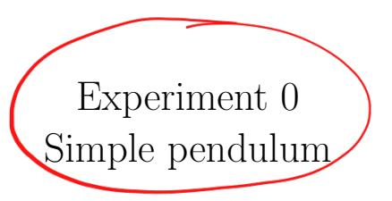
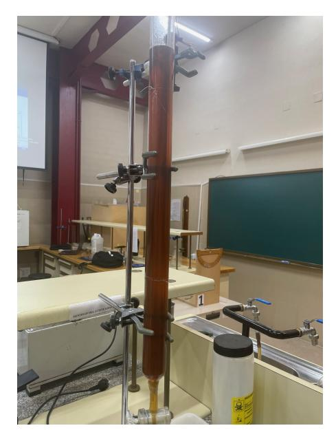
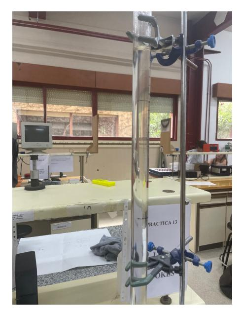
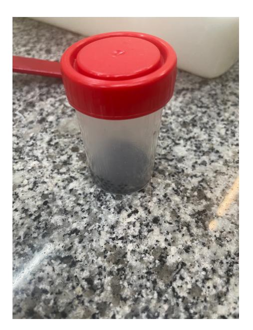
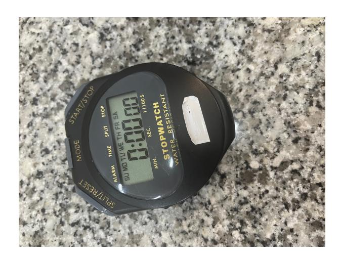
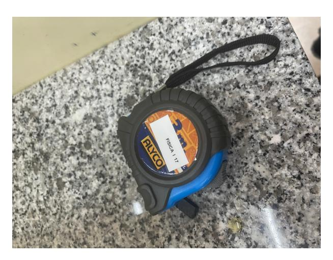
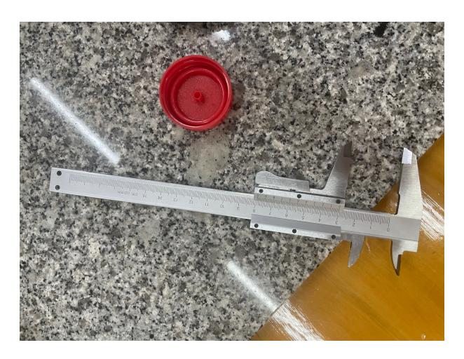
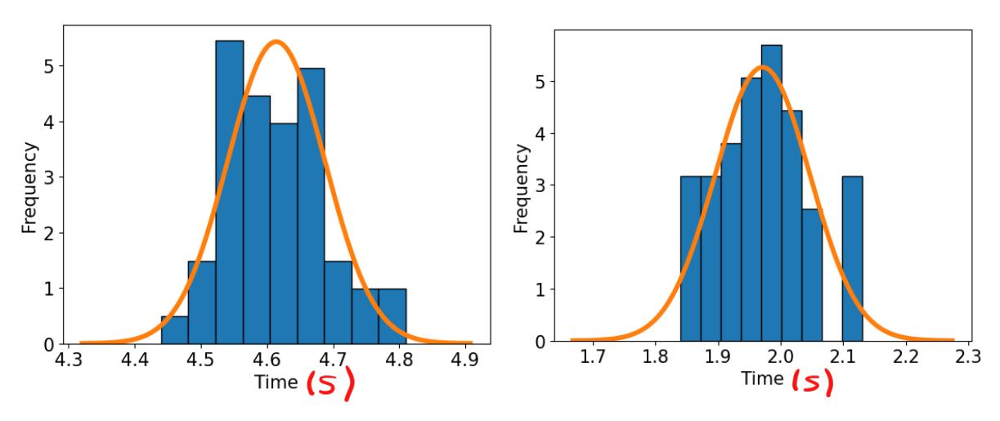

Andr´es Vinuesa Espinosa and Jose Mar´ıa Mart´ınez Herrada Group A22

> Laboratory session 14/05/2024 Report submission 20/05/2025

#### Abstract

This experiment studied the motion of small spheres through viscous fluids to determine the viscosity coefficient using Stokes' law. Steel balls were dropped in glycerin and lead balls in motor oil, and their terminal velocity was measured. Using these data and applying empirical corrections, the viscosities and drag coefficients of both fluids were calculated. The results were compared with theoretical values, confirming the model's validity under laminar flow conditions.

## Contents

| 1 | Theoretical Introduction            | 2 |  |  |  |  |
|---|-------------------------------------|---|--|--|--|--|
|   | 1.1 Navier-Stokes Equations   | 2 |  |  |  |  |
|   | 1.2 The Reynolds Number       | 2 |  |  |  |  |
|   | 1.3 Viscosity measurement     | 2 |  |  |  |  |
|   | 1.4 Stokes Law                | 3 |  |  |  |  |
| 2 | Materials and Methods 4          |   |  |  |  |  |
|   | 2.1 Materials                 | 4 |  |  |  |  |
|   | 2.2 Preliminary Measures      | 6 |  |  |  |  |
|   | 2.3 Limiting velocity         | 6 |  |  |  |  |
|   | 2.4 Viscosity coefficient     | 6 |  |  |  |  |
| 3 | Results and discussion 6         |   |  |  |  |  |
|   | 3.1 Preliminary Measurements  | 6 |  |  |  |  |
|   | 3.2 Limit Velocity            | 7 |  |  |  |  |
|   | 3.3 Viscosity Coefficient     | 8 |  |  |  |  |
| 4 | Conclusions                         | 8 |  |  |  |  |

## 1 Theoretical Introduction

#### 1.1 Navier-Stokes Equations

It is well known that the behavior of a fluid is in general given by the Navier-Stokes equations, named after the scientists who discovered them Clade-Louis Navier and George Gabriel Stokes. These equations, which we will not state here because of their very high complexity, in fact, have not been solved analytically. Because of the attractiveness of a possible analytical solution, which would increase our knowledge of fluids, which is essential for our daily life, since to build vehicles such as airplanes, we must understand how they interact with the fluid that is the air, or how microorganisms move inside the human body, so the resolution of these equations is considered a problem of the millennium, which carries a prize of one million dollars for the one who manages to solve them.

#### 1.2 The Reynolds Number

In order to understand how the Navier-Stokes equations are related to the phenomenon we are going to study, we must introduce the concept of the Reynolds number, invented by Stokes in 1851, [\[1\]](#page-10-0) although it was Reynolds who extended its use and therefore bears his name. It turns out that any fluid can have many properties depending on how it flows through a medium, but to define the Reynolds number we will focus on two: Inertial forces are those that are proportional to the mass and acceleration and represent the inertia of the fluid to follow its path. On the other hand, there are the viscous forces, which depend on how viscous the fluid is, and oppose the inertial forces. Namely, the Reynolds number is defined as: [\[2\]](#page-10-1)

$$Re = \frac{\rho v D}{\eta} \quad \bullet \tag{1}$$

In the equation [1](#page-1-4) rho represents the density of the fluid, u the velocity, D the diameter of the fluid, and η the viscosity coefficient. Although it is true that the values of the Reynolds number vary depending on the medium in which the fluid is moving, we can make a number of general considerations. If this is less than 1, it means that the fluid is moving in laminar flow, it behaves as if it were formed by thin sheets as the viscous forces (denominator) predominate in a very noticeable way in front of the inertial forces (numerator), this will be the case that we will study in this experience. If the Reynolds number is between values close to 1, it is said that the fluid is in a transition regime, which is characterized by the presence of time-varying undulations, finally, if the Reynolds number is much greater than 1 we say that the fluid is in a turbulent regime, a very disorderly motion.

#### 1.3 Viscosity measurement

To determine the viscosity of a fluid, we will make use of Stokes' law. If we consider a smooth sphere, of mass m and diameter D, falling into a viscous fluid, the forces acting will be its weight mg, the hydrodynamic Archimedean thrust E, and the viscous drag force FD, from Newton's second law we obtain:

$$mg - E - F_D = ma. (2)$$

As the drag force is proportional to the velocity, at first the body will experience an initial net acceleration, but this will decrease over time until the weight force is fully compensated by the sum of the hydrostatic thrust and the drag force. At this equilibrium of forces its acceleration will be zero, and it will move with a constant velocity called the limit velocity. If δ is the density of the sphere and rho is the density of the liquid, the weight of the sphere and the hydrostatic thrust on it will be given by

$$mg = \frac{4}{3}\pi \left(\frac{D}{2}\right)^3 \delta g = \frac{\pi}{6}D^3 \delta g \tag{3}$$

$$E = \frac{4}{3}\pi \left(\frac{D}{2}\right)^3 \rho g = \frac{\pi}{6}D^3 \rho g \tag{4}$$

so that once the limiting velocity is reached, you have

$$mg = E + F_D,$$

$$\frac{\pi}{6}D^3\delta g = \frac{\pi}{6}D^3\rho g + 3\pi\eta Dv_{\lim},$$

from where

$$v_{\rm lim} = \frac{D^2(\delta - \rho)g}{18\eta}.$$
 (5)

The equation [5](#page-2-1) allows us to determine the coefficient of viscosity of a fluid from the measurement of the limiting velocity of small spheres falling through it, provided that R ≪ 1 is satisfied, in experimental conditions this equation must be corrected since we are assuming that the fluid has infinite extension, very far from what is the laboratory test tube. For this we will make the following empirical corrections, in addition to taking into account the temperature since the viscosity coefficient varies with this.

- Correction due to the finite length of the tube. The sphere formally tends to the limiting velocity value without reaching it. Under the conditions planned for the experiment, this correction can be neglected.
- Ladenburg correction. Because the influx of the tube walls results in a decrease of the limiting velocity of fall, if we call vm the experimentally measured velocity, the velocity corrected for the effect of the walls is

$$v_{\lim} = \left(1 + 2.4 \frac{D}{\phi}\right) v_m,\tag{6}$$

where phi is the inner diameter of the tube through which the sphere falls. The derivation can be found in [\[3\]](#page-10-2)

## 1.4 Stokes Law

It turns out, that if we consider that Re 1, i.e., for fluids in laminar regime, the equations can be simplified to obtain (in the case of a sphere, for other geometries it is somewhat more complicated)

$$F = 6\pi R\eta v, \tag{7}$$

. Where R, is the radius of the sphere and the rest of parameters mean the same as in the equation [1](#page-1-4) This force opposes the movement, and is caused almost exclusively by the forces of friction that exist between the before mentioned sheets of the fluid, we, will verify that diverse balls so much of steel as of lead, that fall in glycerin and in motor oil, respectively, present a force of friction that opposes to the fall, and that its value, is the one that the law of Stokes tells us in a theoretical way. For a body of any geometry, it has been shown by experimental data that this drag force is given by the equation.

$$F_D = C_D \left( \frac{1}{2} \rho v^2 \right) A$$
 Be careful! You are using R  $^{(8)}$ 

by the equation [1](#page-1-4) and the equation [7](#page-2-2) we obtain:

CD = 24 R (9)

which agrees exactly with experimental results if R fulfills the initial hypothesis

## 2 Materials and Methods

## 2.1 Materials

• Test tubes, filled with the test liquids (motor oil and glycerin, respectively): A couple of test tubes filled with both liquids for throwing the balls on it (Figure [1\)](#page-3-2).

Figure 1: The tubes with engine oil and glycerin of the laboratory.

• Steel and lead spheres: The balls we threw into the tubes with the liquids (the steel ones to the glycerin and the lead ones to the engine oil) (figure [2\)](#page-6-1).

Figure 2: The balls used in the laboratory.

• Chronometer: Used to measure the time the balls took to travel a certain distance inside the tube (figure [3\)](#page-4-0).

Figure 3: Chronometer of the laboratory.

• Measuring tape: Used to measure the distance of the tube that the ball was going to travel [\(4\)](#page-4-1).

Figure 4: Laboratory measuring tape.

• Palmer´s micrometer: Palmer micrometer used to measure the diameter of the tube (figure [5\)](#page-4-2).

Figure 5: The laboratory Palmer´s micrometer.

### 2.2 Preliminary Measures

Before we can determine the density of the two liquids we will use (motor oil and glycerin) we must have the following data:

- The density delta and the diameter D of the spheres
- The density rho of the problem liquid
- The internal diameter phi of the test tube or tube
- The distance l between the marks of the test tube, in which it is supposed that the sphere has already reached the limiting velocity.

In our case, all these measurements except the length of the marks, and the internal diameter of the specimen, which was measured by means of a palmer, were supplied by the laboratory, so we will take these data without any associated uncertainty.

## 2.3 Limiting velocity

First we must measure and record the temperature of the liquid contained in the tube, and repeat it a few times throughout the experiment to ensure that it remains more or less constant, in our case we obtained 21ºC and 22ºC, over two hours. Before working with the spheres, they should be cleaned and dried, once this is done, they should be dropped a short distance over the sphere of the test tube, away from the walls, and the transit time between the two marks should be measured.

For motor oil we will use lead spheres and steel spheres for glycerin. For statistical reasons we repeat the operation 50 times for each liquid, then once we obtain the mean value of the transit times we calculate the limiting velocity vm, and apply the Ladenburg correction, to obtain the corrected limit velocity vlim

## 2.4 Viscosity coefficient

Using the equation [5](#page-2-1) we calculate the limit velocity of both liquids which will later be compared with their theoretical values, although we do not know from where these liquids have been obtained, therefore we will have to use a standard value since we do not have one supplied by the manufacturer, which is usually more accurate. Using the equation ?? using vlim as v,we will check that the starting hypothesis is correct, i.e. R < 1. Finally we will calculate the value of the drag coefficient given by

$$C_d = \frac{4}{3} \frac{D}{v_{lim}^2} g \left( \frac{\delta}{\rho} - 1 \right) \tag{10}$$

## 3 Results and discussion

#### 3.1 Preliminary Measurements

We have started by measuring the data about the balls, the tubes and the liquid.

The mass and diameter of the balls are given to us as data in the laboratory so they have no uncertainty, which means that the density which is calculated by those two values has no uncertainty either.

The same happens with the density of both liquids that are given to us, so there are no uncertainty.

So the measurements for the liquids and their tubes are in table [1](#page-6-2) and the measurements for the balls are in table [2](#page-6-1)

| Liquid     | (kg/m3 ρ ) | L (m)  | u(L) (m) | ϕ (mm) | u(ϕ) (mm) |
|------------|------------------|--------|----------|-----------|-----------|
| Glycerin   | 1260             | 0.2170 | 0.0030   | 2.710     | 0.014     |
| Engine oil | 891              | 0.3000 | 0.0030   | 3.510     | 0.014     |

Table 1: The density of the liquids (ρ) and the length the balls descended (L) and the inner diameter (ϕ) of the tubes.

| Material | m (g)  | D (m)  | (kg/m3 δ ) |
|----------|--------|--------|------------------|
| Steel    | 0.0326 | 0.002  | 7782             |
| Lead     | 0.139  | 0.0027 | 12719.01         |

Table 2: The material, mass (m), diameter (D) and density (δ) of the balls used.

## 3.2 Limit Velocity

In this part we will measure the time it takes for each ball to travel the distance L specified in table [1](#page-6-2) for its liquid, the glycerin for the steel ball and engine oil for the lead one.

After that we will calculate the measured limit fall velocity vm and then we will calculate the corrected limit velocity vlim using equation [5.](#page-2-1)

It is worth noting that the temperature was 21.5º for the entire practice and it did not vary.

| Material | t (s) | u(t) (s) | vm (m/s) | u(vm) (m/s) | vlim (m/s) | u(vlim (m/s) |
|----------|-------|----------|-------------|-------------|---------------|-----------------|
| Steel    | 4.610 | 0.011    | 0.04712     | 0.00064     | 0.05550       | 0.00080         |
| Lead     | 1.964 | 0.012    | 0.1525      | 0.0017      | 0.1528        | 0.0017          |

Table 3: The time (t), the limit fall velocity (vm) and the corrected limit velocity vlim for both liquids at a temperature of 21.5º

In table [3](#page-6-3) you can see the mean time and both limit velocities, the measured and the corrected one.

The most noticeable part about the table is that both limit velocities, the measured one and the corrected one for the lead ball are almost the same, which means that the measurements taken are really precise.

Now we will make a histogram for the time measured for the ball and see how the frequency of data vary.

Figure 6: Histograms of the time measured for both type of balls. Being the left one for the steel ball and the glycerin and the right one for the lead ball and the engine oil.

We can see at plain sight that both graphs are a normal distribution which is the most common graph that could be a histogram like this one. It is true that there are some measurements that surpass the curve but that is owing to the lack of measurements taken, so those imperfections are completely normal for just 50 measurements.

## 3.3 Viscosity Coefficient

In this final part, we will calculate the viscosity coefficient, the Reynold number and the drag coefficient for both liquids.

| Liquid     | η (Pa s) | u(η) (Pa s) | R      | u(R)   | Cliquid | u(Cliquid |
|------------|-------------|-------------|--------|--------|---------|-----------|
| Glycerin   | 0.256094000 | 0.000000033 | 0.4640 | 0.0074 | 44.0    | 1.2       |
| Engine Oil | 0.3072930   | 0.0000020   | 1.194  | 0.014  | 20.10   | 0.45      |

Table 4: The viscosity (η), the Reynolds Number (R) and the drag coefficient Cliquid with their respective uncertainties for both liquids.

You can see in the table [4](#page-7-2) the values for the viscosity, the Reynold number and the drag coefficient for both liquids and everything seems normal until you see the Reynold number of the engine oil which is 1.194 and to validate Stoke´s Law it had to be lower than 1. However it seems that there must be a problem somewhere else, because we were told in the laboratory that it was completely and strangely normal that result in the engine oil.

4 Conclusions

- • In the preliminary measurements, the mass and diameter of the balls, as well as the density of the liquids, were provided by the laboratory and considered exact, implying no associated uncertainty. Only the measured quantities such as the tube length and inner diameter contributed to the uncertainty in the derived values.
- In the limit velocity section, we measured the time it took for each ball to travel a known distance in its corresponding liquid (glycerin for steel and engine oil for lead). From this data, we calculated both the measured terminal velocity and the corrected terminal velocity. The corrected terminal velocity for the lead ball was nearly identical to the measured one, indicating high precision in the experimental measurements.
- A histogram of the measured times for both balls revealed a clear normal distribution. Although a few values slightly deviated from the expected curve, these deviations are typical due to the limited number of measurements (50), and the overall distribution confirmed the reliability of the data.
- In the final analysis, we calculated the viscosity coefficient, Reynolds number, and drag coefficient for both liquids. While most values were within the expected ranges, the Reynolds number for the engine oil slightly exceeded the theoretical limit (Re ¡ 1) required for Stokes' Law to be valid. However, this discrepancy was addressed in the lab session and was considered to be a common and acceptable anomaly for this type of experiment.

# Appendixes

## Calculation of Uncertainties

The measures of the mass and diameter of the balls and the density of the liquids are used are given to us in the laboratory those measurements have no uncertainties. And the density of the ball has no uncertainty neither as it is calculated by using the uncertainties of the mass and diameter which are 0.

#### • Type A Uncertainties

Since we have measured the time 50 times, it presents a type A uncertainty.

$$u_A(t) = \sqrt{\frac{1}{N(N-1)} \sum_{i=1}^{N} (t_i - \bar{t})^2},$$
(11)

#### • Type B Uncertainties

These type of uncertainties are tied to the resolution of the instruments.

$$u_B(x) = \frac{\delta}{\sqrt{12}},\tag{12}$$

where the precision of the length is  $\delta_L 0.01$ m and the precision of the time is  $\delta_t = 0.01$ s.

## • Type C Uncertainties

These uncertainties are calculated with the other two uncertainties, being:

$$u_C(x) = \sqrt{u_A(x)^2 + u_B(x)^2},$$
 (13)

#### • Expanded Uncertainties

This uncertainty is calculated to overestimate the error.

$$U_C(x) = k_p u_C(x), (14)$$

where  $k_p$  is the coverage factor that is selected for convenience. We have chosen to use a 95% confidence interval as it is standard. Since we have 50-1 degrees of freedom, that would yield 49, so we have to take inf on the t student table, 2.0086

#### • Indirect Uncertainties

In addition to all the above, there are some uncertainties that are calculated with another the formula of the indirect uncertainties which is:

$$u_C(x) = \sqrt{\left(\frac{\partial x}{\partial x_1}\right)^2 u_c(x_1)^2 + \left(\frac{\partial x}{\partial x_2}\right)^2 u_c(x_2)^2 + \dots}$$
 (15)

- Uncertainty in the Measured Terminal Velocity:

$$U_v = \sqrt{\left(\frac{\partial v}{\partial x}\right)^2 u_C^2(x) + \left(\frac{\partial v}{\partial t}\right)^2 u_C^2(t)},\tag{16}$$

and if we simplify it we get:

$$U_v = \sqrt{\left(\frac{1}{t}\right)^2 u_C^2(x) + \left(\frac{-x}{t^2}\right)^2 u_C^2(t)}.$$
 (17)

- Uncertainty in the Corrected Terminal Velocity:

$$U_{v_{\text{lim}}} = \sqrt{\left(\frac{\partial v_{\text{lim}}}{\partial \phi}\right)^2 u_C^2(\phi) + \left(\frac{\partial v_{\text{lim}}}{\partial D}\right)^2 u_C^2(D) + \left(\frac{\partial v_{\text{lim}}}{\partial v}\right)^2 u_C^2(v)},$$
 (18)

and if we simplify it we get:

$$U_{v_{\text{lim}}} = \sqrt{\left(\frac{-2.4Dv}{\phi^2}\right)^2 u_C^2(\phi) + \left(\frac{-2.4v}{\phi}\right)^2 u_C^2(D) + \left(1 + \frac{2.4D}{\phi}\right)^2 u_C^2(v)}, \quad (19)$$

and as D has no uncertainty:

$$U_{v_{\text{lim}}} = \sqrt{\left(\frac{-2.4Dv}{\phi^2}\right)^2 u_C^2(\phi) + \left(1 + \frac{2.4D}{\phi}\right)^2 u_C^2(v)}.$$
 (20)

#### – Uncertainty in the Viscosity:

$$U_{\eta} = \sqrt{\left(\frac{\partial \eta}{\partial \delta}\right)^{2} u_{C}^{2}(\delta) + \left(\frac{\partial \eta}{\partial D}\right)^{2} u_{C}^{2}(D) + \left(\frac{\partial \eta}{\partial v_{\lim}}\right)^{2} u_{C}^{2}(v_{\lim})},$$
 (21)

and if we simplify it we get:

$$U_{\eta} = \sqrt{\left(\frac{D^2 g}{18v_{\text{lim}}}\right)^2 u_C^2(\delta) + \left(\frac{D(\delta - \rho)g}{9v_{\text{lim}}}\right)^2 u_C^2(D) + \left(\frac{-D^2(\delta - \rho)g}{18v_{\text{lim}}^2}\right)^2 u_C^2(v_{\text{lim}})},$$
(22)

and as D and δ have no uncertainties:

$$U_{\eta} = \sqrt{\left(\frac{-D^2(\delta - \rho)g}{18v_{\text{lim}}^2}\right)^2 u_C^2(v_{\text{lim}})}.$$
 (23)

### – Uncertainty in the Reynolds Number:

$$U_R = \sqrt{\left(\frac{\partial R}{\partial v_{\lim}}\right)^2 u_C^2(v_{\lim}) + \left(\frac{\partial R}{\partial D}\right)^2 u_C^2(D) + \left(\frac{\partial R}{\partial \eta}\right)^2 u_C^2(\eta)},\tag{24}$$

and if we simplify it we get:

$$U_R = \sqrt{\left(\frac{\rho D}{\eta}\right)^2 u_C^2(v_{\text{lim}}) + \left(\frac{\rho v_{\text{lim}}}{\eta}\right)^2 u_C^2(D) + \left(\frac{-\rho v_{\text{lim}}D}{\eta^2}\right)^2 u_C^2(\eta)}, \quad (25)$$

and as D has no uncertainty:

$$U_R = \sqrt{\left(\frac{\rho D}{\eta}\right)^2 u_C^2(v_{\text{lim}}) + \left(\frac{-\rho v_{\text{lim}} D}{\eta^2}\right)^2 u_C^2(\eta)}.$$
 (26)

#### – Uncertainty in the Drag Coefficient:

$$U_{C_D} = \sqrt{\left(\frac{\partial C_D}{\partial D}\right)^2 u_C^2(D) + \left(\frac{\partial C_D}{\partial v_{\lim}}\right)^2 u_C^2(v_{\lim}) + \left(\frac{\partial C_D}{\partial \delta}\right)^2 u_C^2(\delta)}, \tag{27}$$

and if we simplify it we get:

$$U_{C_D} = \sqrt{\left(\frac{4}{3}\frac{g}{v_{\lim}^2}\left(\frac{\delta}{\rho} - 1\right)\right)^2 u_C^2(D) + \left(\frac{-8}{3}\frac{Dg}{v_{\lim}^3}\left(\frac{\delta}{\rho} - 1\right)\right)^2 u_C^2(v_{\lim}) + \left(\frac{4}{3}\frac{Dg}{v_{\lim}^2\rho}\right)^2 u_C^2(\delta)},$$
(28)

and as D and δ have no uncertainties:

$$U_{C_D} = \sqrt{\left(\frac{-8}{3} \frac{Dg}{v_{\text{lim}}^3} \left(\frac{\delta}{\rho} - 1\right)\right)^2 u_C^2(v_{\text{lim}})}.$$
 (29)

# References

- [1] George Gabriel Stokes. "On the Effect of the Internal Friction of Fluids on the Motion of Pendulums". In: Transactions of the Cambridge Philosophical Society 9 (1851), pp. 8–106.
- [2] D. J. Tritton. Physical Fluid Dynamics. 2nd. Oxford: Oxford University Press, 1988. isbn: 978-0198544937.
- [3] R. Ladenburg. "Uber den Einfluß von W¨anden auf die Bewegung einer Kugel in einer ¨ reibenden Fl¨ussigkeit". German. In: Annalen der Physik 328.8 (1907), pp. 585–623. doi: [10.1002/andp.19073280805](https://doi.org/10.1002/andp.19073280805).