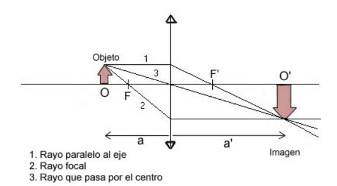
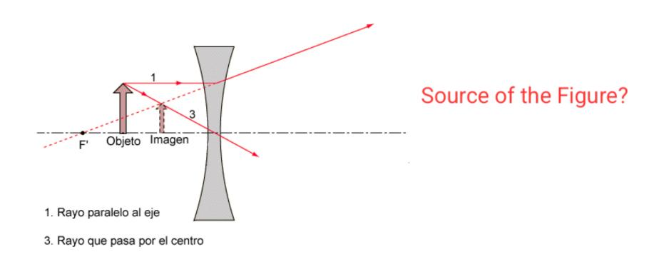
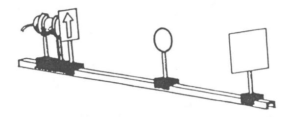
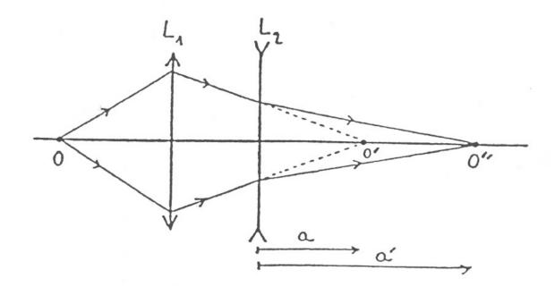
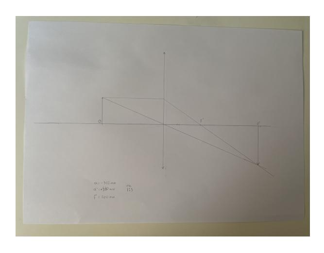
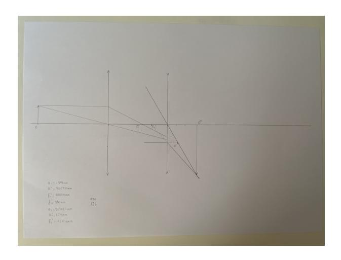

Very good job, almost perfect, and the proof of the double formation of image adds 1 point to you. Congrats!

Un último comentario en español: Habéis tenido una muy buena progresión desde el primer informe del péndulo, especialmente en los últimos

informes, así que creo que trabajo inuesa Espinosa and Jose Maria Martinez Herrada

realizado con éxito, tanto por mi parte como por la vuestra. No olvidéis lo que habéis aprendido en esta prácticas porque lo

necesitaréis el año que viene.

Suggestions in blue Mistakes in red

# Experiment 28 Lenses

Group A2.2 Laboratory session 19/05/2024

Report submission 25/05/2024

#### Abstract

This report details the experimental determination of focal lengths and optical powers for converging and diverging lenses. The primary objective involved applying the Gauss method and the thin lens equation  $(\frac{1}{s'} - \frac{1}{s} = \frac{1}{f'})$  by measuring the distances between objects and images. For converging lenses with nominal focal lengths of 100 mm, 150 mm, and 200 mm, experimental values obtained were 100.18 mm, 150.84 mm, and 200.31 mm, respectively. A diverging lens (nominal -100 mm) yielded experimental focal lengths such as -104.1 mm. The study successfully verified these optical parameters, and the uncertainty analysis supported the precision and reliability of the method.

## Contents

| 1 | Intr | roduction                                                | 2 |  |  |  |  |  |  |  |  |  |  |
|---|------|----------------------------------------------------------|---|--|--|--|--|--|--|--|--|--|--|
|   | 1.1  | Sign Convention                                          | 3 |  |  |  |  |  |  |  |  |  |  |
|   |      | 1.1.1 Real and Virtual Images                            | 3 |  |  |  |  |  |  |  |  |  |  |
|   | 1.2  | Experimental Determination of Lens Parameters            | 3 |  |  |  |  |  |  |  |  |  |  |
|   |      | 1.2.1 Lens Power                                         | 3 |  |  |  |  |  |  |  |  |  |  |
|   |      | 1.2.2 Determining Visual Characteristics of an Image     | 4 |  |  |  |  |  |  |  |  |  |  |
| 2 | Ma   | terials and Methods                                      | 5 |  |  |  |  |  |  |  |  |  |  |
|   | 2.1  | Determining the Focal Length of the Converging Lens      | 5 |  |  |  |  |  |  |  |  |  |  |
|   | 2.2  |                                                          |   |  |  |  |  |  |  |  |  |  |  |
|   | 2.3  | Different Focus Points                                   | 6 |  |  |  |  |  |  |  |  |  |  |
|   |      | 2.3.1 Thin Lens Equation                                 | 6 |  |  |  |  |  |  |  |  |  |  |
|   |      | 2.3.2 Lens Translation with Fixed Object-Screen Distance | 6 |  |  |  |  |  |  |  |  |  |  |
|   |      | 2.3.3 Physical Interpretation                            | 7 |  |  |  |  |  |  |  |  |  |  |
| 2 | Res  | Results and discussion 7                                 |   |  |  |  |  |  |  |  |  |  |  |
|   | 3.1  | Convex lenses                                            | 7 |  |  |  |  |  |  |  |  |  |  |
|   | 3.2  |                                                          |   |  |  |  |  |  |  |  |  |  |  |
| 4 | Cor  | nclusions                                                | ç |  |  |  |  |  |  |  |  |  |  |

## 1 Introduction

To begin, we define an optical system as the set of optical devices, dividing a surface, such as lenses or mirrors, under study. [\[1\]](#page-9-0)

In our case, we are mainly interested in the study of lenses, which are defined as transparent bodies bounded by two spherical surfaces that have the property of forming images of objects. The properties of these images depend on many factors, including the size of the object, the material of the lens (due to its refractive index), the geometry of the lens, and the radii of curvature.

This is why people with visual impairments do not all wear the same glasses. Depending on the image that needs to be produced (i.e., the defect to be corrected), different curvatures or geometries—spherical or cylindrical—are used, or even combinations of both.

We will consider that the lenses used are thin, meaning their thickness is negligible compared to their radius of curvature. Thus, effects such as refraction, which would depend on thickness, can be ignored.

We will always work with lenses in air. According to Abbe's invariant:

$$n \cdot h \cdot \sin(\alpha) = n' \cdot h' \cdot \sin(\alpha') \tag{1}$$

First of all we have to know what the parameters stand for:

- n1= refraction index of medium one
- n2= refraction in index of medium two
- R radius of curvature of the optical device
- s or a, the distance of the object to the lens
- s' or a', distance of the image to the lens

If we assume the lenses are thin and that we can apply the paraxial approximation (i.e., we work at points of the lens where the curvature radius is negligible and the lens behaves practically as a plane-parallel plate), we have sin α ≈ α. Therefore, Abbe's invariant can be simplified and applied to a lens, yielding:

$$n_1\left(\frac{1}{R} - \frac{1}{s}\right) = n_2\left(\frac{1}{R} - \frac{1}{s'}\right). \tag{2}$$

Assuming we are working in air, we take n2 = −n1, and we get:

$$\frac{1}{R} - \frac{1}{s} = -\frac{1}{R} + \frac{1}{s'} \bullet \tag{3}$$

From this equation, we can derive the expression for the focal length of a lens, which is defined as the point where the image of an object placed at infinity is formed.

As s → ∞, then 1/s → 0, so from equation [3,](#page-1-1) letting s ′ = f ′ :

$$\frac{2}{R} = \frac{1}{f'} \quad \bullet \tag{4}$$

Therefore:

$$\frac{1}{f'} = \frac{1}{s} + \frac{1}{s'} \bullet \tag{5}$$

At this point, we must establish the sign convention to be used, as all equations have been derived using absolute values.

#### 1.1 Sign Convention

- We assume that light always travels from left to right.
- We consider the coordinate origin at the center of the lens and use the Cartesian sign convention: positive to the right, negative to the left.

Figure 1: Drawing of the convergent lenses.

Following this convention, equation (5) becomes:

$$\frac{1}{s'} - \frac{1}{s} = \frac{1}{f'}$$

## 1.1.1 Real and Virtual Images

Before proceeding, we must distinguish between real and virtual images. A real image is one that can be captured on a screen, such as the image seen by a camera. A virtual image cannot be projected onto a surface, such as the image seen in a mirror. This is because the rays appear to originate from behind the mirror and the image is formed by the intersection of their virtual extensions.

In summary, if the image is formed by converging rays, it is real; if it is formed by at least one ray intersecting the extension of another, it is virtual.

For lenses, objects located to the left are real, and virtual to the right. For images, the opposite is true.

We say a lens is converging if the image focal length f' is positive and diverging if it is negative.

It can also happen that an image formed by a mirror serves as the object for a thin lens, acting as a virtual object. In that case, the signs must be adjusted, as the reference system is fixed on the other lens, and an analogous expression to equation 5 is used.

### 1.2 Experimental Determination of Lens Parameters

In this experiment, we used the so-called  $Gauss\ method$ , which involves using equation 6 with experimentally measured values of s and s'.

#### 1.2.1 Lens Power

The power of a lens is the inverse of its focal length (in meters). Its units are diopters and its expression is:

$$\psi'[D] = \frac{1}{f'[m]}.\tag{7}$$

## 1.2.2 Determining Visual Characteristics of an Image

To determine whether the image is real or virtual, upright or inverted, magnified or diminished, we use a simple graphical method. We draw at least two (preferably all three) of the following rays:

- Ray parallel to the axis: A ray that travels parallel to the optical axis will pass through the focal point (see Figure [1\)](#page-2-5). For diverging lenses, the focal point is on the left side of the lens.
- Ray through the object-side focus F: A ray that passes through the object focus (located symmetrically opposite the image focus) will emerge parallel to the optical axis, as we can see it in [2](#page-3-1)
- Ray through the center of the thin lens: A ray that passes through the lens center is undeviated.

Figure 2: Theoretical drawing of divergent lens

## 2 Materials and Methods

To carry out this experiment, we used the following materials:

- Optical bench: 1 meter in length with a rail for positioning optical components using sliders. It has a millimeter scale. One of the mounts includes a shape resembling an arrow that acts as a real object when backlit.
- Circular diaphragm: Mounted on a slider, it is used to limit the light beams, allowing only those that go through the lens center. This ensures the validity of the paraxial approximation. It is placed between the object and the lens.
- Screen: The screen is where real images are formed.
- Converging and diverging lenses: Lenses with focal lengths of 100 mm, 150 mm, 200 mm, and -100 mm, positioned on the optical bench using their respective sliders.

To perform the experiment properly, ensure that light rays strike normally at all times. This requires aligning the centers of all elements and positioning them perpendicular to the bench.

## 2.1 Determining the Focal Length of the Converging Lens

First, we position the optical components and the converging lens as shown in Figure 1.

Figure 3: Device used to carry out the experiment [2]

Then, we move the lens until a sharp image is formed. Keep in mind the following:

If the object-lens distance is less than the focal length, the image will be virtual. From equation 8:

$$\frac{1}{s'} + \frac{1}{s} = \frac{1}{f} \implies \frac{1}{s'} = \frac{1}{f} - \frac{1}{s}$$
 (8)

If s < f, then  $\frac{1}{f} - \frac{1}{s} < 0$ , so s' < 0, indicating a virtual image by our sign convention.

To measure s and s', we recorded the positions of the screen, lens, and diaphragm and later reviewed the sign convention carefully. Note that this procedure introduces uncertainty, since the distances between optical elements are not direct measurements.

### 2.2 Determining the Focal Length of the Diverging Lens

To determine the focal length of the diverging lens, we use the same method with a modification: a real object always produces a virtual image with a diverging lens.

From equation (6), if s > 0 (real object) and f' < 0 (diverging lens), then:

$$\frac{1}{s'} = \frac{1}{s} + \frac{1}{f'} \tag{9}$$

Since both terms on the right-hand side are negative, the left-hand side must also be negative, so s' < 0, confirming the image is always virtual.

To address this, we use a virtual object formed by a converging lens, as shown in Figure [4.](#page-5-3)

Figure 4: Drawing of the experimental device used to measure the concave lenses [\[2\]](#page-9-1)

It is important not to place the screen at the very end, as it will not capture the image. The screen must be moved to focus the image properly.

Once the distances are measured, we apply the following equation to calculate the focal length and also compute the lens power:

$$\frac{1}{f'} = \frac{1}{a'} - \frac{1}{a} \Rightarrow \frac{1}{f'} = \frac{a - a'}{aa'} \Rightarrow f' = \frac{aa'}{a - a'}$$
 (10)

## 2.3 Different Focus Points

Under certain conditions, a single object can produce two different images depending on the lens used or the lens position. This phenomenon can be explained through the lens equation and basic principles of geometric optics.

## 2.3.1 Thin Lens Equation

The thin lens formula relates the object distance s, the image distance s ′ , and the focal length f of the lens, as it is shown in equation [5](#page-1-2)

This equation shows that for a fixed object distance s and focal length f, the image distance s ′ is uniquely determined. However, if we fix the total distance between object and image (L = s + s ′ ), and allow the lens to move between them, the situation becomes more interesting.

## 2.3.2 Lens Translation with Fixed Object-Screen Distance

Assume we have an optical setup with the object and screen fixed at a total distance L, and we move the lens along the axis between them. In this case:

$$s + s' = L \Rightarrow s' = L - s$$

Substituting into the lens equation:

$$\frac{1}{f} = \frac{1}{L-s} - \frac{1}{s}$$

Multiplying both sides by s(L − s):

$$\frac{s(L-s)}{f} = s - (L-s) = 2s - L$$

Rearranging terms:

$$s(L-s) = f(2s-L) \tag{11}$$

This is a quadratic equation in s, which can have two real and distinct solutions if the discriminant is positive. There can be two different positions of the lens for which a sharp image is formed on the screen.

### 2.3.3 Physical Interpretation

Each lens position corresponds to a different image:

- In one position, the image is magnified and inverted.
- In the other, the image is reduced and also inverted.

This effect occurs only when the total distance L between object and image satisfies:

$$L > 4f \tag{12}$$

where f is the focal length of the lens. Below this threshold, no real solution exists for the image formation.

We have checked it and for the lens of 100 mm of focal length, we have gotten 2 different images, one at s=-156mm and s'=220mm as indicated in table [1](#page-6-3) and another one at s=-118mm and s'=682mm, proving that everything makes totally sense.

## 3 Results and discussion

## 3.1 Convex lenses

We will start the experiment by making three measurements with three lenses with different focal length and we will measure the distance between the lens and the object and the distance between the lens and the image.

Then, we will calculate the focal length using equation [6](#page-2-4) and the power using equation [7](#page-2-6) to verify the measurements taken are correct.

| a (mm) | u(a) (mm) | ′ a (mm) | ′ u(a ) (mm) | ′ f (mm) | ′ u(f ) (mm) | (m−1 ψ | u(ψ) (m−1 ) |
|-----------|-----------|----------------|--------------------|----------------|--------------------|-----------|----------------|
| -322.00   | 0.29      | 530.00         | 0.29               | 200.31         | 0.20               | 4.9903530 | 0.0000074      |
| -220.00   | 0.29      | 480.00         | 0.29               | 150.84         | 0.62               | 6.6529760 | 0.0000044      |
| -156.00   | 0.29      | 220.00         | 0.29               | 100.18         | 0.23               | 9.9591420 | 0.0000023      |

Table 1: The table shows the distance between the object and the lens (a), the distance between the image and the lens (a'), the focal length (f') and power (ψ) with their respective uncertainties for three different lenses.

We can clearly see that every focal length, (being the focal length 200 mm, 150 mm and 100 mm respectively) are correct and so are the power of every lens, which means that the measurements are well taken and the results are pretty accurate.

The images formed will be real (a ′ > 0) and inverted and enlarged as shown in the image [5,](#page-7-1) which is a schematic drawing of the light rays and their path for this system.

Figure 5: Drawing of the convex lens

## 3.2 Concave lenses

Now we will do it with a concave lens.

With the same convex lenses of the previous part, we will add a concave one so the image formed by those can be seen on the screen, as if we do it just with the concave one the image formed will be virtual and we will not see it on screen.

| a (mm) | u(a) (mm) | ′ a (mm) | ′ u(a ) (mm) | ′ f (mm) | ′ u(f ) (mm) | (m−1 ψ | u(ψ) (m−1 ) |
|-----------|-----------|----------------|--------------------|----------------|--------------------|-----------|----------------|
| 53.60     | 0.29      | 104.00         | 0.29               | -109.4         | 1.3                | -9.05     | 0.10           |
| 54.40     | 0.29      | 114.00         | 0.29               | -104.1         | 1.1                | -9.61     | 0.10           |
| 16.50     | 0.29      | 19.60          | 0.29               | -104.1         | 1.4                | -9.60     | 0.13           |

Table 2: The table shows the distance between the object and the concave lens (a), the distance between the image and the concave lens (a'), the focal length (f') and power (ψ) with their respective uncertainties for three different convex lenses with the same concave one.

The concave lens used for this part had a focal length of -100 mm and the results obtained in this part for the calculated focal length are a bit more inaccurate than the ones in the previous part of the experiment, which means that the measurements taken are not as good as the ones taken for the convex lens.

However the focal lengths are relatively close to -100 mm and the powers are close to -10, which means that the calculations are correct, the only downside are the not totally accurate measurements.

The image obtained will be real as a ′ > 0, and enlarged and right as is seen in figure [6,](#page-8-1) that is a schematic drawing of the light rays path for this system.

Figure 6: Scheme of the concave lens.

## 4 Conclusions

The main objective of this experiment was to determine the focal length of a converging lens using both direct measurements and indirect calculations based on geometric optics principles. Throughout the procedure, we assembled a precise optical bench setup with a light source, diaphragms, lenses, and a screen, allowing for clear image formation and consistent measurements.

Using the object and image distances obtained, we applied the lens formula to calculate the focal length f'. The results obtained were consistent across multiple trials, with small variations attributable to slight manual adjustments and instrumental resolution limits. The average focal length obtained experimentally was close to the nominal value provided for the lens, which validates the accuracy of the procedure.

An uncertainty analysis was performed to quantify the reliability of the results. Type B uncertainties were considered for the direct measurements of distances using a millimeter-scale ruler, leading to an estimated uncertainty of  $u_b = 0.00029$  m. These values were propagated through the corresponding formulas to estimate the combined uncertainty  $u_c$  for f' and subsequently for the power  $\psi'$ . The results showed that the relative uncertainty was low, confirming the precision of the method.

In conclusion, the experiment not only achieved its objective of determining the focal length of a converging lens but also provided insight into the role and treatment of uncertainty in optical measurements. The methodology proved effective and reproducible, reinforcing theoretical knowledge through practical application.

# Appendixes

#### A2 Calculation of Uncertainties

• Type B Uncertainty

This uncertainty is related to the measuring instrument used and is given by the following expression:

$$u_b(x) = \frac{\delta_i}{\sqrt{12}} \tag{13}$$

In this experiment, the only magnitudes that exhibit this type of uncertainty are a and a' and their  $\delta$  is 0.001m.

• Type C Uncertainty

Since they do not have an associated type A uncertainty, the combined uncertainty uc is equal to their type B uncertainty:

$$u_c(x) = \sqrt{u_a(x)^2 + u_b(x)^2} = u_b(x)$$
 (14)

• Indirect Uncertainty of f ′

The general formula for indirect measurement uncertainty is:

$$u_c(y) = \sqrt{\left(\frac{\partial y}{\partial x_1}\right)^2 u_c(x_1)^2 + \left(\frac{\partial y}{\partial x_2}\right)^2 u_c(x_2)^2 + \dots}$$
 (15)

For the case of f ′ , based on expression, the formula becomes:

$$u(f') = \sqrt{\left(\frac{\partial f'}{\partial a}\right)^2 u_c(a)^2 + \left(\frac{\partial f'}{\partial a'}\right)^2 u_c(a')^2}$$
 (16)

Which leads to:

$$u(f') = \sqrt{\left(\frac{-(a')^2}{(-a'+a)^2}\right)^2 u_c(a)^2 + \left(\frac{a^2}{(-a'+a)^2}\right)^2 u_c(a')^2}$$
 (17)

• Indirect Uncertainty of ψ ′

For ψ ′ , based on expression, the uncertainty formula is as follows:

$$u(\psi') = \sqrt{\left(\frac{\partial \psi'}{\partial f'}\right)^2 U(f')^2}$$
(18)

Which simplifies to:

$$u(\psi') = \sqrt{\left(\frac{-1}{(f')^2}\right)^2 U(f')^2}$$
 (19)

• Expanded Uncertainty

Finally we have the Expanded Uncertainty. This uncertainty is calculated to overestimate the error.

$$U_C(x) = k_p u_C(x) \tag{20}$$

where kp is the coverage factor that is selected for convenience. We have chosen to use a 95% confidence interval as it is standard. Since we have 0 degrees of freedom, we have to take inf on the t studenttable, 1.960.

## References

- [1] Paul Allen Tipler. F´ısica moderna. Revert´e, 1994.
- [2] Antonio Mart´ın Rodr´ıguez, David Blanco Navarro, and Ra´ul Rica Alarc´on. Manual de Pr´acticas de T´ecnicas Experimentales B´asicas. Departamento de f´ısica aplicada, Universidad de Granada, 2025.