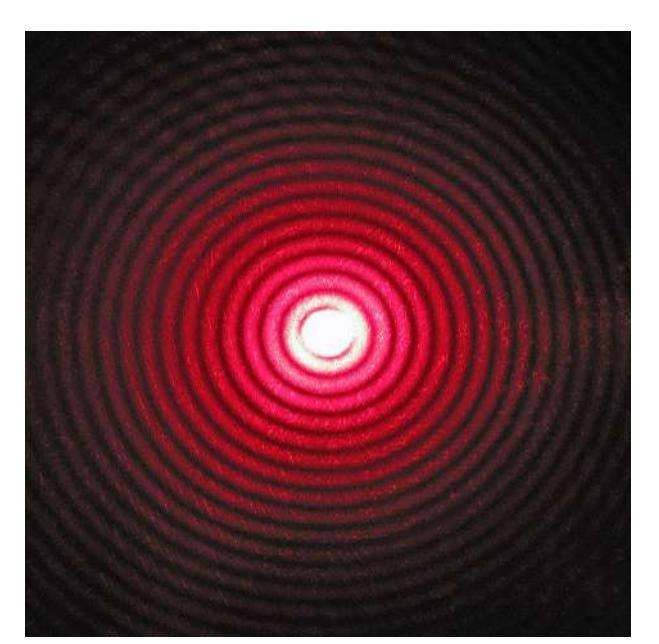
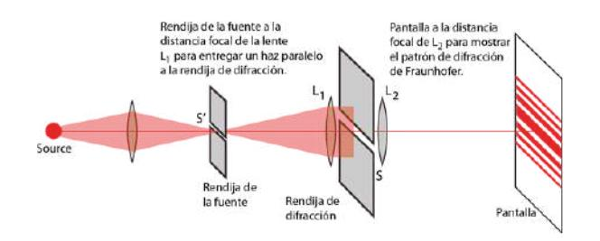
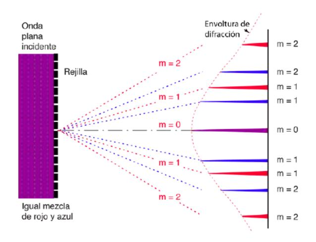
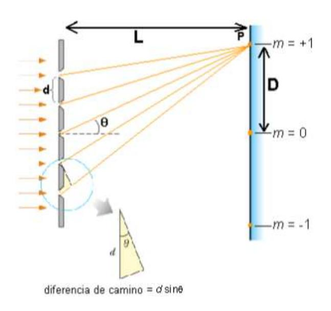
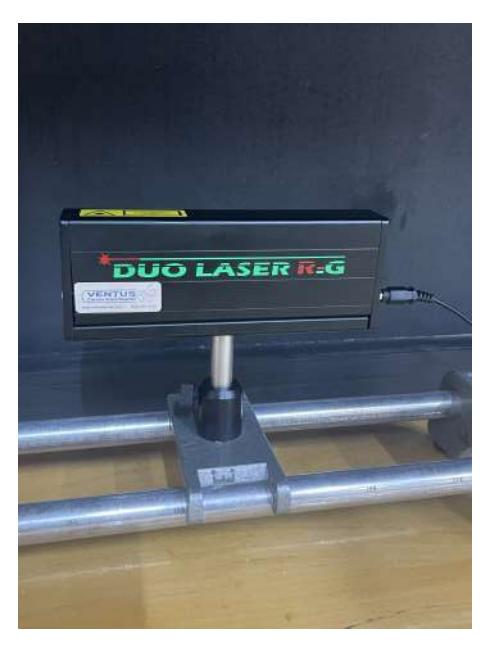
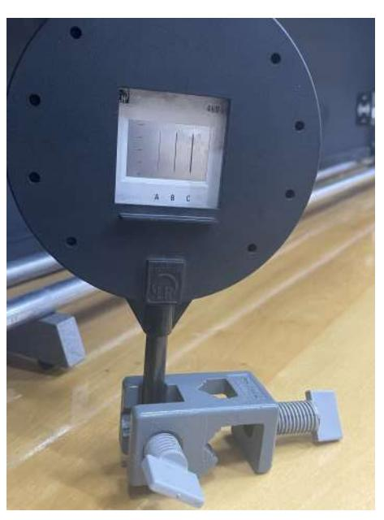
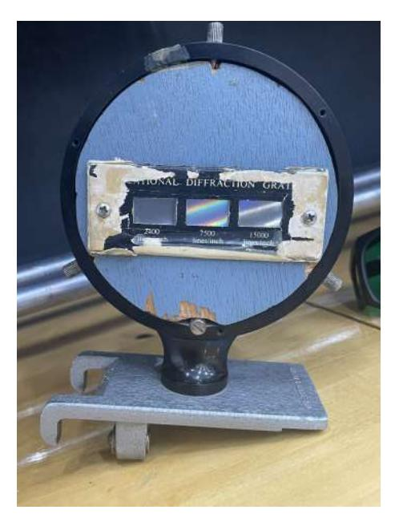
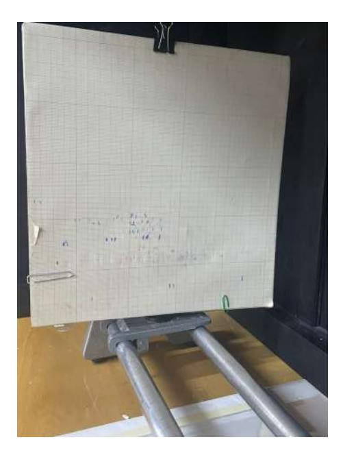
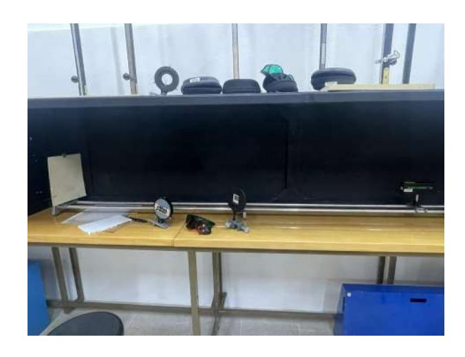

# Experiment 29 Fraunhaufer's Refraction

# Andr´es Vinuesa Espinosa and Jose Mar´ıa Mart´ınez Herrada Group A22

Laboratory session 31/03/2024 Report submission 06/04/2024

Abstract

Using two lasers of different colors, we have studied a series of slits and determined their width using trigonometric techniques of paraxial optics, and we have also experimentally verified the wavelength of both lasers.

# Contents

| 1 |                             | Introduction                               |        |  |  |  |  |
|---|-----------------------------|--------------------------------------------|--------|--|--|--|--|
|   | 1.1                         | A bit of history                        | 2 2 |  |  |  |  |
|   | 1.2                         | Fraunhofer diffraction                  | 3      |  |  |  |  |
|   |                             | 1.2.1 Diffraction through a slit     | 3      |  |  |  |  |
|   | 1.3                         | Diffraction by a diffraction grating    | 3      |  |  |  |  |
| 2 | Materials and Methods 4  |                                            |        |  |  |  |  |
|   | 2.1                         | Instrumentation                         | 4      |  |  |  |  |
|   | 2.2                         | Methods                                 | 7      |  |  |  |  |
|   |                             | 2.2.1 Calculating the angular width  | 7      |  |  |  |  |
|   |                             | 2.2.2 Calculating the wave length    | 7      |  |  |  |  |
| 3 | Results and discussion 8 |                                            |        |  |  |  |  |
|   | 3.1                         | Wave Length                             | 8      |  |  |  |  |
|   | 3.2                         | Angular width                           | 8      |  |  |  |  |
| 4 |                             | Conclusions                                | 9      |  |  |  |  |
|   | 4.1                         | Conclusion measuring the slits          | 9      |  |  |  |  |
|   | 4.2                         | Measuring the wave length               | 9      |  |  |  |  |

# 1.1 A bit of history

The term diffraction was coined by the Italian Francesco Maria Grimaldi [\[1\]](#page-9-0), from Latin diffringere, 'to break into pieces'. It is defined as the deflection of waves around an obstacle (in our case this wave will be light understood in the classical way, as shown in the subsequent figure [\[2\]](#page-9-1)).

Although this phenomenon was studied by great minds such as Newton, it was not until 1803, the year in which Thomas Young [\[3\]](#page-9-2) performed his famous experiment in which he demonstrated the interference of two interlaced gratings, demonstrating the wave nature of light.

Figure 1: Diffraction caused by a circular slit

The geometry of diffraction depends on the surface, those that produce symmetrical patterns are called optical surfaces [\[4\]](#page-9-3), these have the particularity of being symmetrical in length similar to the wavelength with which we work, that is why in our experiment we use slits of the thickness of millimeters.

This experiment was of great historical importance because it tipped the balance on the side of those who held that light is a wave, a fact that had already been theorized by Huygens a century earlier [\[5\]](#page-9-4) holding that light propagated by wave fronts, and that new fronts were created when the light "collided" with the slit, thus explaining diffraction.

Today, thanks to quantum mechanics,[\[6\]](#page-9-5) we know that light cannot be described by a classical point of view and we must leave behind the aforementioned concepts if we want to know its true nature. Although the paraxial approximation is not entirely correct, it describes efficiently the ocular phenomena on a macroscopic scale and is therefore suitable for this experiment, and also allows us to work satisfactorily with trigonometric techniques that have the advantage of being very easy to carry out in a laboratory.

Figure 2: Diffraction through a slit

#### 1.2 Fraunhofer diffraction

Within paraxial optics, we can consider Fraunhofer diffraction [df] or far-field diffraction, which is the one in which the distance to the screen is sufficiently large in relation to the observed phenomena to be considered infinite, it is on this phenomenon that we are going to base ourselves to simplify the calculations.

#### 1.2.1 Diffraction through a slit

To explain the first part of our experiment we need to understand what kind of diffraction we have in the framework of Fraunhofer optics. When a monochromatic light, i.e. one that has a fixed wavelength, passes through a slit, a rectangular star aperture, we obtain a series of bands, due to the phenomena explained above, in which the central one, which is twice as wide as the rest, stands out and is distributed with respect to it, as shown in figure [2.](#page-2-3) [\[4\]](#page-9-3) It is important to emphasize that there is a relationship between the angle it forms with the slit and its wavelength. Being θ the angle formed with the slit, λ the wavelength and thewidthof theslit.θ = 2λ a (1) This will be the equation we will use (albeit taking a small angle approximation, to calculate the grid width. Where d is the lattice constant which is determined by the manufacturer.

### 1.3 Diffraction by a diffraction grating

For the second part of our experiment, we use a diffraction grating, a device consisting of many slits (on the order of 5000) that are very small and equispaced. The light will fall on these slits and as shown in the figure, there will be points where the interference caused by the diffracted waves will be constructive, causing points of higher intensity. This condition is given by the equation, varying m, we can see the different maxima, although we will take the central one and m=1.

$$sin\theta = \frac{m\lambda}{d} \quad \bullet \tag{2}$$

The fact that the angle depends on the wavelength explains why we use monochromatic light, because if we use white light we would get the full spectrum, of which it is impossible to measure anything. We can also deduce that the distance between maxima is directly proportional to the number of gratings. In this equations D is the distance between maxima and L is the distance between the diffraction grating and the screen. Geometrically it follows: see [9](#page-6-3)

$$\sin \theta = \frac{D}{\sqrt{D^2 + L^2}} \, \bullet \tag{3}$$

Substituting 2 in [3](#page-2-4) we obtain:

$$\lambda = \frac{D}{sart P^2 + L^2 q} d$$
 (4)

Which will be the equation we will use to calculate the wavelength. Where the role of D will be taken by the width of the measured maximum, and L the distance from the grating to the role.

Figure 3: Diffraction by a diffraction grating

Figure 4: Geometric deduction for diffraction

# 2 Materials and Methods

#### 2.1 Instrumentation

The materials and instruments utilized in this study are listed below:

1. Laser device: A laser device with two different wavelengths (532 nm, the green one, and 635 nm, the red one), where the user can select the desired laser by pressing a switch. It is crucial to note that the choice of wavelength significantly affects the results, as each wavelength will yield different values for the measured quantities.

Figure 5: Laser Device used in the experiment

2. Set of three slits of different widths: Three different slits with different widths.

Figure 6: Laboratory set of slits

3. Three diffraction gratings: A little set of three diffraction gratings, the first one of 2400 lines/inch, the second one of 7500 lines/inch and the third one of 15000 lines/inch.

Figure 7: Laboratory diffraction gratings

4. Screen: A screen where the you were able to see the laser diffraction, with a millimeter paper on it for measuring the distance between maximum values.

Figure 8: The screen were the diffracted laser were measured

5. Optical Bench: To move the set of slits and the diffraction gratings the optical bench were used. In addition, it had measurements drawn on it, so no measuring tape was needed.

Figure 9: The complete device used for the experiment

### 2.2 Methods

#### 2.2.1 Calculating the angular width

The Fraunhofer approximation has an angular width θ on its central band. This angular width is the angle formed by the central band with respect to the slit.

To calculate θ, we measured the central band length when both the red and green lasers went through each one of the slits and with three different measurements, using the help of the optical bench.

The diffracted laser could be observed on the screen with millimeter paper and carefully and using protection glasses that were different for each laser, one of each color, we measured the data. Depending of the width of the paper, one should take care of the placement of the optical bench, given that if the grid was very close to the laser the width of the central band could be bigger than the width of the paper, making it more difficult to measure. The opposite happens if we put it far away, the width becomes smaller than the precision of the ruler, and makes it again practically impossible to measure and be prone to error.

One of us controlled the laser and the other one measured the central band.

Finally, after obtaining every value, we have calculated the angle using the equation [\(1\)](#page-2-5) and once we have the angle, we can calculate the width using the least squares method.

#### 2.2.2 Calculating the wave length

In this part the diffraction gratings are used for measuring the wave length. Both lasers go through the diffraction gratings in which the diffracted beam forms an angle θ with the incident beam, chosen in such a way that between two consecutive rays, there is a difference in optical path δ that is a multiple of the wave length λ. Notice that if the numbers of lines per unit of width are given in imperial units, they have to be converted to I.S units.

Then we measured the length of the central band for each laser and grating at three different distances, that were as close as possible to the screen because when we put the gratings further than 0.3 m the diffracted laser was off the screen and could not be measured, so we took the measures as close as possible to the screen.

We followed the same method as we did with the slits, one controlled the laser, one was close to the screen with glasses to protect the eyes, carefully taking the measures at the screen with a pen, then measuring the distance between the two marks.

After taking every measurement, we have to calculate λ using the equation [\(2\)](#page-2-6) and equation [\(3\)](#page-2-4), obtaining the equation [\(4\)](#page-2-7).

# 3 Results and discussion

# 3.1 Wave Length

Results of the red and green laser, for the distance between the central band and m=1

|                          | Grat A | Grat B | Grat C | UC(λ) |
|--------------------------|--------|--------|--------|-------|
| Green laser λ (nm) | 323.72 | 485.63 | 478.55 | 9.45  |
| Red laser λ (nm)   | 447.11 | 522.63 | 525.49 | 9.87  |

Table 1: The wave length λ for both laser at each grating, being the A the one with 2400 lines/inch, the B the 7500 lines/inch and the C the 15000 lines/inch, and the λ uncertainty.

> The mean λ value is 429.30 nm for the green laser and 498.408 nm for the red laser. If we compare the data with the real values which are 532 for the green laser and 635 nm for the red one, we can observe at plain sight that the results are significantly lower than the ones we should have obtained, having an error of 20.72% and 19.30% for the red and green laser respectively, being a meaningful error and more noticeable with small quantities like the wave length of a laser.

> This error is probably owing to the way the measures were taken, as we painted a little mark with a pen at the edges of the distance we were trying to measure, and probably it was not as precise as it would with other methods or with a thinner device for making the mark. At first we tried to made the marks with an automatic pencil, however it did not paint at the screen, so we had to made them with the pen as a final option. We also made an error in not establishing a criteria of which widths we were measuring, like the international agreement that exists while measuring a fluid in a tube. This lack of criteria may have caused part of the error. This error is specially more noticeable while measuring the green and red laser in the first grid, if one does reverse-engineering and calculates the distance, it yields almost the double of what we have measured, although the other errors could be attributed to the measurement system, we can't say that it is the case for this anomaly. It may have been caused by human error at the laboratory, as our methods we precise and correct

# 3.2 Angular width

Results for the width of the slits used.

|        | a(mm) | UC(a)(mm) |
|--------|-------|-----------|
| Slit A | 0.43  | 1,946     |
| Slit B | 0.25  | 1,944     |
| Slit C | 0.12  | 1,929     |

Table 2: The wave length λ for both laser at each grating, being the A the one with 2400 lines/inch, the B the 7500 lines/inch and the C the 15000 lines/inch, and the λ uncertainty.

We decided to perform a least squares adjust in order to better determine a, because the terms follow a linear relation to calculate the width and its uncertainty. Since we used tanθ ≃ θ We gave the following equation to our python program.

And where is the fit? 
$$\theta = \frac{1}{a} 2\lambda \tag{5}$$

This means that we obtained the inverse value, so to obtained the result we had to take the inverse of every parameter.

The least squares method gave us the following data:

8

In addition, your uncertainties are incredibly large compared to your main values, so you have not obtained much information. Uncertainties using direct calculations are around um

Si en el guion os dice que calculeis a usando la formula directamente, es porque es el mejor metodo y debeis hacerlo. Una vez tengais eso, os poneis creativos con la tarea extra. Os ha quedado una seccion freestyle

The reduced  $\chi^2$  is 20.83 for the left slit, 100.76 for the center slit and 473.37 for the right one; and the  $r^2$  is 0.56 for the left slit, 0.59 for the center slit and 0.42 for the right one. The  $\chi^2$  test doesn't provide much information since the small uncertainties may make it prone to error, where as the  $r^2$  test tell us that the model provides a much better fit for bigger values than smaller ones. As this model comes from a solidified theory in physics, this lack of correlation could come from the fact the the width of slit C is beyond the scope of our methods. Nevertheless, the interesting part of this are their uncertainties, that are a couple of magnitude order higher than the widths, meaning that the result may vary a lot, making it less relevant to practical appliances, although the bigger uncertainty may cause that the exact measurement is in range.

Very weird because two points determine a line univocally, so r2 should be exactly 1 and  $\chi^2=0$ . Maybe I am missing something

#### 4 Conclusions

Not bad conclusions at all, having into account your bad results

#### 4.1 Conclusion measuring the slits

This part of the experiment may be deemed as a success, as we obtained lengths that fit in the theory, and are of a reasonable value and order of magnitude. Nevertheless uncertainty is much bigger than the values, this means that the lack of precision in the result, is not due to human error, instead it is the fault of trying to measure such small value with approximation and imprecise methods. One deduces that if the experiment shall be repeated, one should have to use better measurement tools, with at least ten or one hundred times the precision of our ruler, in order to obtain a small uncertainty, as the one that we have obtained is so big that it prevents almost any practical appliance, we used the least squares and even with that, its uncertainty is humongous, and again, it is probably explained with the measures problem.

Not necessary, just follow the instructions in the manual!

# 4.2 Measuring the wave length

To conclude the report, the results, although a considerable error, are mathematically correct as the calculations and method used during the experiment were correct and have been reviewed multiple times to verify their validity.

The  $\lambda$  results are approximately 100 nm lower than they should. This case is worse than the first, because the uncertainty obtained is considerably low, this points to human error, specially in the first grid, given that the calculations were made according to a consensus theory, the only reasonable answer for the values obtained is due to an error at the time of measurements, given that we indeed suffer from poor eyesight as we both wear glasses.

The calculation of the width value was made with the least squares

I don't know even what to say beyond: Were you wearing them?

# **Appendixes**

#### Calculation of Uncertainties

As the report was being done some uncertainties were done: spacing

• Type A Uncertainties
Since we have only measured each quantity one time, none of them present a type A\nuncertainty, nonetheless, we would have used a t student distribution

$$u_A(x) = 0 (6)$$

• Type B Uncertainties

These type of uncertainties are tied to the resolution of the instruments.

$$u_B(x) = \frac{\delta}{\sqrt{12}} \tag{7}$$

where The precision of the optical bench is δL=0.01m and the precision of the milimetred is δD=0.001m (1mm)

• Type C Uncertainties

These uncertainties are calculated with the other two uncertainties, being:

$$u_C(x) = \sqrt{u_A(x)^2 + u_B(x)^2}$$
(8)

As there is no type A uncertainty in this experiment, we can simplify and obtain

$$u_C(x) = u_B(x) (9)$$

• Expanded Uncertainties

This uncertainty is calculated to overestimate the error.

$$U_C(x) = k_p u_C(x) (10)$$

where kp is the coverage factor that is selected for convenience. We have chosen to use a 95% confidence interval as it is standard. Since we have 1-1 degrees of freedom, that would yield 0, so we have to take inf on the t student table, 1.960

• Indirect Uncertainties

In addition to all the above, there are some uncertainties that are calculated with another the formula of the indirect uncertainties which is:

> UC(x) = s ∂x ∂x1 2 uc(x1) 2 + ∂x ∂x2 2 uc(x2) 2 + ...

So we can calculate the indirect uncertainty of the width of the grid, a:

$$U_{\mathbf{c}}(a) = \sqrt{\left(\frac{\partial a}{\partial \theta}\right)^2 u_c(\theta)^2 + \left(\frac{\partial a}{\partial \lambda}\right)^2 u_c(L)^2}$$
(12)

and simplifying:

$$U_{\mathcal{C}}(a) = \sqrt{\frac{1}{\theta^2} u_c(\lambda)^2 + \frac{\lambda^2}{\theta^4} u_c(\theta)^2 +}$$
(13)

We also need the uncertainty of λ, the wave length:

$$U_{\mathbf{C}}(\lambda) = \sqrt{\left(\frac{\partial \lambda}{\partial D}\right)^2 u_c(D)^2 + \left(\frac{\partial \lambda}{\partial L}\right)^2 u_c(L)^2}$$
(14)

and simplifying:

$$\mathcal{U}_{\mathbf{C}}(\lambda) = \sqrt{\left(\frac{dL^2}{(D^2 + L^2)\sqrt{D^2 + L^2}}\right)^2 u_c(D)^2 + \left(\frac{-dDL}{(D^2 + L^2)\sqrt{D^2 + L^2}}\right)^2 u_c(L)^2}$$
(15)

# References

- [1] Francesco Maria Grimaldi. Physico-mathesis de lumine, coloribus et iride. Victorii Benatii, 1966.
- [2] Stephen Parkinson. A treatise on optics. Macmillan and co, 1884.
- [3] Thomas Young. "II. The Bakerian Lecture. On the theory of light and colours". In: Philosophical transactions of the Royal Society of London 92 (1802), pp. 12–48.
- [4] Paul Allen Tipler. F´ısica moderna. Revert´e, 1994.
- [5] Christiaan Huygens. Oeuvres compl`etes de Christiaan Huygens. Vol. 4. M. Nijhoff, 1891.
- [6] RP Feynman. Feynman lectures on physics. Vol. 3. Quantum mechanics. Le cours de physique de Feynman. Vol. 3. Mecanique quantique. 1979.