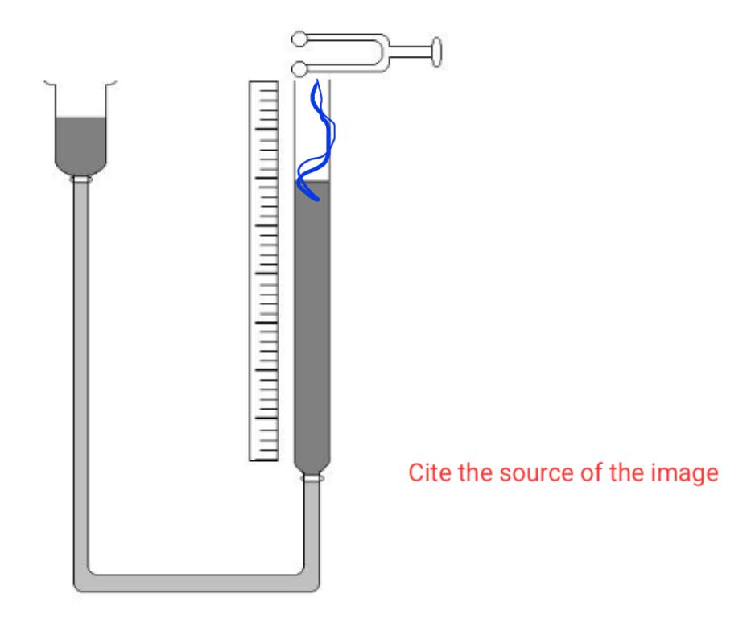
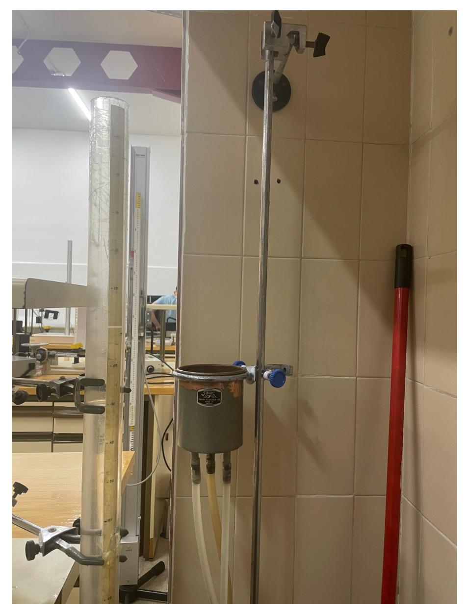
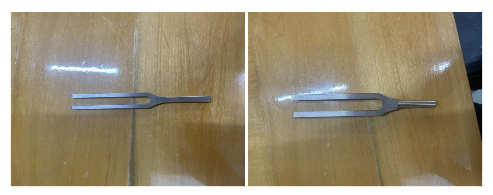
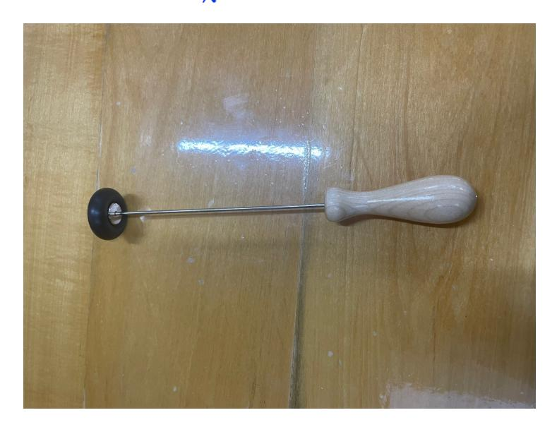
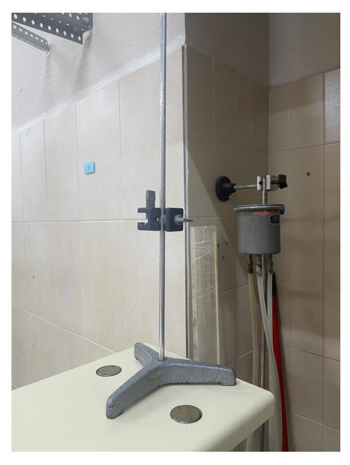

# Experiment 18 Speed of the sound in air

Andr´es Vinuesa Espinosa and Jose Mar´ıa Mart´ınez Herrada Group A2.2

> Laboratory session 07/04/2024 Report submission 13/04/2024

Abstract

Using a water-filled tube and several tuning forks, we determine the speed of sound in water as well as its adiabatic coefficient. These values are determined with high accuracy and contrasted with the current consensus.

## Contents

| 1 | Introduction                          | 2 |  |  |  |  |  |  |
|---|---------------------------------------|---|--|--|--|--|--|--|
|   | 1.1 Previous measurements       | 2 |  |  |  |  |  |  |
|   | 1.2 Theorical fundaments        | 2 |  |  |  |  |  |  |
|   | 1.2.1 Speed of the sound        | 2 |  |  |  |  |  |  |
|   | 1.2.2 Resonance                 | 3 |  |  |  |  |  |  |
|   | 1.3 Resonance Tube              | 4 |  |  |  |  |  |  |
| 2 | Materials and Methods                 | 4 |  |  |  |  |  |  |
|   | 2.1 Materials                   | 4 |  |  |  |  |  |  |
|   | 2.2 Methods                     | 7 |  |  |  |  |  |  |
|   | 2.2.1 Calculating the pression  | 7 |  |  |  |  |  |  |
| 3 | Results and discussion 8           |   |  |  |  |  |  |  |
| 4 | Conclusions                           | 8 |  |  |  |  |  |  |

### 1 Introduction

#### 1.1 Previous measurements

The problem of the speed of sound has been present in physics for hundreds of years, Sir Isaac Newton was already interested in it in 1687, we can see a rough estimate in Principia [1], which despite Newton's genius, had a 20 % error. It was Laplace in 1816 [2] who discovered that Newton's mistake had been to consider the expansion of air as an isothermal process instead of an adiabatic one.

About this time was where more accurate values were obtained, by means of firearms and triangulation, was William Derham [3] the first person to give a reasonable estimate, for the reverend measuring speed was a peculiar hobby that he combined with his work as rector of Upminster and theologian, he obtained a result of 1,072 Parisian feet, in units of the international system 348.4  $\frac{m}{s}$ .

Today this value has been accurately determined for standard conditions and at atmospheric accuracy with a value of  $340,197 \text{ m/}^{-1}$  [4]. This will be the value with which we contrast our findings to verify their veracity. Not milliseconds, but meters

### over seconds

#### 1.2 Theorical fundaments

## 1.2.1 Speed of the sound Complete and well explained theoretical section

We know that for each wave, (among them sound), it is true that

$$v = \lambda f \tag{1}$$

Where f is the frequency measured in Hz and  $\lambda$  is the wavelength measured in meters. Sound waves are mechanical waves, i.e. a disturbance of a material medium, in this case of the particles that form the air, and longitudinal, i.e. their displacement is parallel to that of the wave  $\chi[5]$ . If the medium in which the wave travels is a gas, as is our case, thermodynamics gives us the following equality, the demonstration can be found in [5]:

$$v = \sqrt{\frac{\beta}{\rho}}$$
 What is  $\rho$ ?

Where  $\beta$  is defined as the modulus of compressibility of the medium, which is defined as

In which P and V are the pressure and volume of the gas, the negative sign implies that  $\beta$  is a positive number. As mentioned in the previous section, we can consider the expansion and compression of air caused by sound as an adiabatic process, i.e. one that does not exchange heat with the surroundings. Moreover in most of the not very extreme situations the air behaves as an ideal gas, therefore we obtain

$$PV^{\gamma} = C \tag{4}$$

Where  $\gamma$  is called adiabatic coefficient and has a specific value for each gas, (it represents the quotient between the molar heats at constant pressure and volume  $\gamma = \frac{C_p}{C_v}$  he following relation is obtained.

$$\beta = \gamma P \tag{5}$$

If we combine the above equations and use the ideal gas equation and the definition of density  $\rho = \frac{nM}{V}$  we obtain

$$v = \sqrt{\frac{\gamma RT}{M}}$$
 (6)

Figure 1: Diagram of the experimental apparatus.

Where R is the constant of ideal gases, for which PV = nRT where n is the number of moles, its value in the international system is 8.314 8.314  $\frac{J}{mol*kelvin}$  M is the molecular mass of the gas, in the case of air being a composition of several molecules [6], it is usually taken  $M \approx 28.9 \frac{g}{mol}$ , likewise T is its absolute temperature.

It should be noted that for an ideal gas, its velocity in a medium only depends on its temperature, since all other variables are constants, either universal or specific to the gas or the material.

If we know the velocity of a gas in a medium at a certain temperature, we can easily calculate it for any, since we can make a quotient between the velocities obtaining

$$v = v_o \sqrt{\frac{T}{T_o}} (7)$$

#### 1.2.2 Resonance

If a sound source such as a tuning fork produces a vibration in a tube open at one end and closed at the other, the waves will be reflected at the closed end, and under certain circumstances will arrive as the new vibration of the tuning fork is produced. When two waves of the same characteristics (frequency, wavelength, amplitude) confined in a physical medium interfere with each other, what we call a standing wave is produced. This reflection produces a phase jump of  $\pi$ , resulting in an intensification of the measured sound, this phenomenon is known as "resonance".

The wave at the closed end forms a node, since the value of the position of the particles is always the same, at the open end will form a belly or an antinode, in which the value of the position oscillates between maximum and minimum. It follows that in general, the column of

air will go into resonance whenever its length is exactly an odd multiple of quarter wavelengths.

$$L = (2n - 1)\frac{\lambda}{4} \quad \bullet \tag{8}$$

Therefore the distance separating two consequent nodes will be half a wavelength. Since actually the position of the first belly does not coincide with the open end, but is at a certain distance e, outside it, therefore.

$$L_1 + e = \frac{\lambda}{4}$$
 (9)

$$L_2 + e = \frac{3\lambda}{4}$$

De tal forma que

$$\lambda = 2(L_2 - L_1) \tag{11}$$

$$e = \frac{L_2 - 3L_1}{2} (12)$$

Once the value of the wavelength is determined and the frequency of the tuning fork is known, using [1](#page-1-4) we obtain the speed of sound.

## 1.3 Resonance Tube

We have used a plastic tube of 1 m long and about 0.03m bottom diameter, placed as shown in the image (Figure [2\)](#page-4-0) and connected at the bottom end, with a water tank with adjustable height, to be able to vary the water level in the resonant tube. Instead of the tank, we connect a rubber tube to a faucet, inserting a T-wrench to empty it.

## 2 Materials and Methods

## 2.1 Materials

The materials and instruments utilized in this study are listed below:

• Vertical resonance tube provided with a suitable system for varying the level of water contained inside it: This tube has a cable connected to it to fill it up with water and a lever to let the water off the tube for hearing the waves maximums. It also has measurements printed on it and knowing where the waves hits its maximums.(Figure [2\)](#page-4-0)

Figure 2: The tube used in the laboratory with its system for varying the water quantity inside of it.

• Tuning fork: A couple of tuning forks with different frequency for having different waves length and making sure that the results obtained for the speed are correct, meaning they are the same.(Figure [3\)](#page-5-0)

Figure 3: Both tuning forks used for the experiment, being 480Hz and 440Hz, its respective frequencies.

• Rubber hammer: Used in the experiment for hitting the tuning fork to create the wave we had to measure its maximums.(Figure [4\)](#page-5-1)

Figure 4: The laboratory rubber hammer used in the experiment.

• Device for fixing the tuning fork: Used to fixing the tuning fork close to the tube and keeping it there without moving it.(Figure [5\)](#page-6-2)

Figure 5: The device we used for fixing the tuning fork.

#### 2.2 Methods

First, using the device [5](#page-6-2) we set the tuning fork frequency 440hz, then we raised the bucket with water to level the water in the tube to the top.

Then while I was watching to take measurements, the other one lowered the bucket little by little and was in charge of telling the other one when he heard the resonance, it may be that the values were less accurate than they should have been since this experiment is complicated to perform in conditions where the ambient noise is noticeable, such as in a crowded laboratory.

Once the approximate location of the point was determined we proceeded to determine it accurately, sometimes by raising and sometimes by lowering the water level, around the interval we had delimited.

This process had to be repeated for the second maximum, and again with another 480Hz tuning fork, although ideally if time is available it should be done with one more tuning fork, preferably with a high frequency one, since for low frequencies it could be the case that the wavelength would be longer than the length of the tube, making it impossible to calculate the second maximum.

It is worth mentioning that at the beginning we had some problems with the way we took the measurements, as we did not put the tuning fork on the device in Figure [5,](#page-6-2) we were holding it with the hand, which ends with some disastrous results. It was not until we were told how to do it that we did it the good way. Fortunately we did it quickly, and finally the results were pretty accurate this time.

#### 2.2.1 Calculating the pression

The air pressure varies depending on the location as well as the altitude, we obtained data of 706,31mmHg, for the mercury barometer, and 21,3ºC for the weather station of the airport of Granada. [\[7\]](#page-10-6)

#### 3 Results and discussion

The results for the  $\lambda$  and e for both frequencies used are shown in table 1.

| f (Hz) | $\lambda$ (m) | $U_C(\lambda)$ (m) | e (m) | $U_C(e)$ (m) |
|--------|---------------|--------------------|-------|--------------|
| 440    | 0.785         | 0.022              | 0.196 | 0.014        |
| 480    | 0.717         | 0.023              | 0.179 | 0.016        |

Table 1: Results for  $\lambda$  and e for both tuning forks with their respective uncertainties.

From here, we can calculate the speed of sound in the air using the equation 1 is 345.4  $\frac{m}{s}$  for 440 Hz with 9.6  $\frac{m}{s}$  uncertainty and 344.26  $\frac{m}{s}$ ,10.06  $\frac{m}{s}$  uncertainty. If we compare these results with the real value of the sound speed in the air at 21.3  $^{\circ}$ C which is 343  $\frac{m}{s}$  from [8], in comparison, our results are accurate and thus, the measurements precise.

We can see that both results are basically the same barely vary, which is due to the error we had taking the data.

Furthermore, we have calculated the characteristics of the air that are shown in table 2

| f (Hz) | $\gamma$ | $U_C(\gamma)$ | $\beta$ (Pa) | $U_C(\beta)$ (Pa) | $C_p\left(\frac{J}{molK}\right)$ | $U_C(C_p) \left(\frac{J}{mol K}\right)$ | $C_v \left( \frac{J}{molK} \right)$ | $U_C(C_v) \left(\frac{J}{molK}\right)$ |
|--------|----------|---------------|--------------|-------------------|----------------------------------|-----------------------------------------|-------------------------------------|----------------------------------------|
| 440    | 1.41     | 0.22          | 133000       | 20900             | 28. <b>7%</b>                    | 6. <b>4</b>                             | 20.4                                | 2.9                                    |
| 480    | 1.40     | 0.23          | 130000       | 22000             | 29.2                             | 6.1                                     | 20.8                                | 2.8                                    |

Table 2: Results for the adiabatic coefficient  $\gamma$ , the modulus of compressibility  $\beta$ , the molar heats at constant pressure and volume for air for both tuning forks with their respective uncertainties.

We can see that these values are pretty accurate if we compare them with the actual values for the air, which are 1.40 for the adiabatic coefficient  $\gamma$ , modulus of compressibility  $\beta$  is 142000 Pa,  $C_v$  is 20.79  $Jmol^{-1}k^{-1}$  and  $C_p$  is 29.13  $Jmol^{-1}k^{-1}$ , according to [5].

If we take our results with their uncertainties, every single value is in the range of the actual values of what we are measuring.

#### 4 Conclusions

To conclude the experiment, as it was declared through the report, the wave lengths obtained in the experiment for both frequencies furnishes us with a lot of physical information.

First of all, we have calculated the speed of sound in the air and the result is almost the same as the real value with both frequencies, varying just  $1\frac{m}{s}$  and  $2\frac{m}{s}$  for each tuning fork, and with the uncertainties the range of the speed fits the real value.

Then, the characteristics of the air have been calculated, the adiabatic coefficient is basically the same, both the molar heats at constant pressure and volume are meticulous, being almost the same for 480 Hz and varying a bit for the 440 Hz, and the modulus of compressibility is the characteristic that vary the most with 10000 Pa approximately, however it is in range including the uncertainty.

Therefore, we could classify the experiment as a success taking into account the veracious results and the problem we had at the beginning at the time of taking the measurements.

## Appendixes

### Calculation of Uncertainties

As the report was being done some uncertainties were done: spacing

#### • Type A Uncertainties

Since we have only measured each quantity one time, none of them present a type A uncertainty, nonetheless, we would have used a t student distribution

> You should have measured L1 and L2  $u_A(x) = 0$ at least 3 times for each frequency, so

#### • Type B Uncertainties

These type of uncertainties are tied to the resolution of the instruments.

$$u_B(x) = \frac{\delta}{\sqrt{12}} \tag{14}$$

where the precision of the length is  $\delta_L$ =0.001m and the precision of the pressure is  $\delta_P$ =0.05mmHg and the precision of the temperature is  $\delta_T$ =1K. It is important to have into account that since the frequency of the tuning fork is given by the manufacturer, we shall consider that the value doesn't have any uncertainty at all.

#### • Type C Uncertainties

These uncertainties are calculated with the other two uncertainties, being:

$$u_C(x) = \sqrt{u_A(x)^2 + u_B(x)^2}$$
(15)

As there is no type A uncertainty in this experiment, we can simplify and obtain

$$u_C(x) = u_B(x) \tag{16}$$

#### • Expanded Uncertainties

This uncertainty is calculated to overestimate the error.

$$U_C(x) = k_p u_C(x) \tag{17}$$

where  $k_p$  is the coverage factor that is selected for convenience. We have chosen to use a 95% confidence interval as it is standard. Since we have 5-1 degrees of freedom, that would yield 4, so we have to take inf on the t student table,  $\overline{2.776445}$ .

#### • Indirect Uncertainties

In addition to all the above, there are some uncertainties that are calculated with another the formula of the indirect uncertainties which is:

$$u_C(x) = \sqrt{\left(\frac{\partial x}{\partial x_1}\right)^2 u_c(x_1)^2 + \left(\frac{\partial x}{\partial x_2}\right)^2 u_c(x_2)^2 + \dots}$$
 (18)

So we can calculate the indirect uncertainty of  $\lambda$ :

$$u_C(\lambda) = \sqrt{\left(\frac{\partial \lambda}{\partial L_1}\right)^2 u_c(L_1)^2 + \left(\frac{\partial \lambda}{\partial L_2}\right)^2 u_c(L_2)^2}$$
 (19)

and simplifying:

$$u_C(\lambda) = \sqrt{4u_c(L_1)^2 + 4u_c(L_2)^2}$$
(20)

We also need the uncertainty of e:

$$u_C(e) = \sqrt{\left(\frac{\partial e}{\partial L_1}\right)^2 u_c(L_1)^2 + \left(\frac{\partial e}{\partial L_2}\right)^2 u_c(L_2)^2}$$
 (21)

and simplifying:

$$u_C(e) = \sqrt{\frac{9}{4}u_c(L_1)^2 + \frac{1}{4}u_c(L_2)^2}$$
 (22)

Then, the following uncertainty we are going to calculate is the speed of sound, v:

$$u_C(v) = \sqrt{\left(\frac{\partial v}{\partial \lambda}\right)^2 u_c(\lambda)^2 + \left(\frac{\partial v}{\partial f}\right)^2 u_c(f)^2} = f u_c(\lambda)$$
 (23)

Having obtained this result, we calculate the vo uncertainty:

$$u_C(v_o) = \sqrt{\left(\frac{\partial v_o}{\partial V}\right)^2 u_c(V)^2 + \left(\frac{\partial v_o}{\partial T}\right)^2 u_c(T)^2 + \left(\frac{\partial v_o}{\partial T_o}\right)^2 u_c(T_o)^2}$$
(24)

and simplifying:

$$u_C(v_o) = \sqrt{\frac{T_o}{T} u_c(V)^2 + \left(\frac{V T_o \sqrt{T}}{2T^2 \sqrt{T_o}}\right)^2 u_c(L_2)^2}$$
(25)

Now we have to calculate the uncertainties for the characteristics of the air, beginning with the adiabatic coefficient γ:

$$u_C(\gamma) = \sqrt{\left(\frac{\partial \gamma}{\partial v}\right)^2 u_c(v)^2 + \left(\frac{\partial \gamma}{\partial T}\right)^2 u_c(T)^2}$$
 (26)

and simplifying:

$$u_C(\gamma) = \sqrt{\left(\frac{2vM}{RT}\right)^2 u_c(v)^2 + \left(\frac{v^2M}{RT^2}\right)^2 u_c(T)^2}$$
 (27)

The following one will be the modulus of compressibility β:

$$u_C(\beta) = \sqrt{\left(\frac{\partial \beta}{\partial \gamma}\right)^2 u_c(\gamma)^2 + \left(\frac{\partial \beta}{\partial P}\right)^2 u_c(P)^2}$$
 (28)

and simplifying:

$$u_C(\beta) = \sqrt{P^2 u_c(\gamma)^2 + \gamma^2 u_c(P)^2}$$
 (29)

Finally, we need to calculate the uncertainties for Cv and Cp:

$$u_C(C_v) = \sqrt{\left(\frac{\partial C_v}{\partial \gamma}\right)^2 u_c(\gamma)^2}$$
(30)

and simplifying:

$$u_C(C_v) = \frac{R}{(\gamma - 1)^2} u_c(\gamma) \tag{31}$$

for the Cv, and

$$u_C(C_p) = \sqrt{\left(\frac{\partial C_p}{\partial \gamma}\right)^2 u_c(\gamma)^2 + \left(\frac{\partial C_p}{\partial C_v}\right)^2 u_c(C_v)^2}$$
(32)

and simplifying:

$$u_C(\mathcal{O}) = \sqrt{C_v^2 u_c(\gamma)^2 + \gamma^2 u_c(C_v)^2}$$
(33)

for the Cp.

## References

- [1] Isaac Newton. "Principia mathematica". In: Book III, Lemma V, Case 1.1687 (1934), p. 576.
- [2] Bernard S Finn. "Laplace and the speed of sound". In: Isis 55.1 (1964), pp. 7–19.
- [3] Thomas Barton Gabrielson. Background and Perspective: William Derham's de Moto Soni (on the Motion of Sound). Acoustical Society of America, 2009.
- [4] NASA Glenn Research Center. Speed of Sound. Ultimo acceso: 8 de abril de 2025. ´ url: <https://www.grc.nasa.gov/www/k-12/BGP/sound.html>.
- [5] Paul Allen Tipler and Gene Mosca. F´ısica per a la ci`encia i la tecnologia. Vol. 1: Mec`anica. Oscil· lacions i ones. Termodin`amica. Revert´e, 2020.
- [6] Peter Brimblecombe. Air composition and chemistry. Cambridge University Press, 1996.
- [7] AEMET. Datos de la estaci´on metereol´ogica de Granada. Ultimo acceso: 8 de abril de ´ 2025. url: [https://www.aemet.es/es/eltiempo/observacion/ultimosdatos?k=and&](https://www.aemet.es/es/eltiempo/observacion/ultimosdatos?k=and&l=5530E&w=0&datos=img&x=&f=presion) [l=5530E&w=0&datos=img&x=&f=presion](https://www.aemet.es/es/eltiempo/observacion/ultimosdatos?k=and&l=5530E&w=0&datos=img&x=&f=presion).
- [8] Hannah Pamula. Sound Speed Calculator. 2025. url: [https://www.omnicalculator.com/](https://www.omnicalculator.com/es/fisica/calculadora-de-la-velocidad-del-sonido) [es/fisica/calculadora-de-la-velocidad-del-sonido](https://www.omnicalculator.com/es/fisica/calculadora-de-la-velocidad-del-sonido) (visited on 2025).