# Experiment 20 Ohms Law

Andr´es Vinuesa Espinosa and Jos´e Mar´ıa Mart´ınez Herrada Group A11

> Laboratory session 25/04/2025 Report submission 06/05/2025

#### Abstract

In this experiment, using a series of numbered resistors and a breadboard, we successfully checked the real value of these, as well as the values of voltage and current for simple circuits as something more elaborate, ultimately with all the values already previously measured so we made a least squares adjustment in which we found that the relationship given by Ohm's law for resistance is indeed fulfilled.

Contents

| 1 | Introduction                       |        |  |  |  |  |
|---|------------------------------------|--------|--|--|--|--|
|   | 1.1 Theorical introduction   | 2 2 |  |  |  |  |
|   | 1.2 Ohmic Materials          | 2      |  |  |  |  |
|   | 1.3 Ohm's law calculation    | 3      |  |  |  |  |
| 2 | Materials and Methods              | 4      |  |  |  |  |
|   | 2.1 Materials                | 4      |  |  |  |  |
|   | 2.2 Methods                  | 6      |  |  |  |  |
| 3 | Results and discussion             | 7      |  |  |  |  |
|   | 3.1 Resistance measurements  | 7      |  |  |  |  |
|   | 3.2 Resistor systems         | 8      |  |  |  |  |
|   | 3.3 Voltage measurements     | 8      |  |  |  |  |
|   | 3.4 Checking Ohm's Law       | 9      |  |  |  |  |
| 4 | Conclusions                        | 10     |  |  |  |  |

#### 1 Introduction

#### 1.1 Theorical introduction

In order to understand the theoretical objective of the experiment we must know what exactly is the resistance of a circuit, for this we will need a little preamble of circuit theory. Empezamrmos saying that a conductor, in the case of our experiment, the own nicrom alloy of the resistors, is defined as that material that allows the passage of current through it, i.e. the electrons.

To be able to know what happens inside a conductor, we must first know the electric field inside it, for the concept of flow of a vector [1], a purely mathematical concept, is very useful. From Gauss's law, which is valid for any surface (even an imaginary one), we obtain:

$$\oint \vec{E} \cdot dS = \frac{q}{\epsilon_o}.$$
 (1) \cdot instead of \*

That is, the integral along a surface S, of the electric field  $\vec{E}$ , must be equal to the charge contained in that surface divided by the universal constant, whose value is approximately  $8 * \vec{U} = 10^{-12} \frac{F}{m}$  [2] It can be deduced from Gauss's law that the electric field inside a conductor in electrostatic equilibrium is 0, since all the charge resides on its surface.

However, in a circuit we have a current source that generates a displacement within the free charges of the circuit, causing a force in an ideal case of :  $q\vec{E}$ , however this force is much smaller in practice, because of the interactions of the free charges within the conductor with the metal ions.

In the ideal case, the electric potential in a conductor V, would be constant, however the fact that in practice it is not constant gives rise to the concept of resistance, which is defined as the quotient between the potential drop in the direction of the current and the intensity of the current.

$$R = \frac{V}{I}$$

In the SI system, the unit of resistance is the **ohm**  $\Omega$ , which is defined as:

$$1\Omega = 1V/A,\tag{3}$$

that is, one ohm is the quotient of one volt by one ampere. This name comes from the scientist who first formulated the law that bears his name, Georg Simon Ohm (Erlangen, Bavaria; March 16, 1789 – Munich, July 6, 1854).

Although this law was formulated two centuries ago, its results are consistent with modern theories based on quantum mechanics and Maxwell's electromagnetism. Interestingly, Ohm's law has been shown to hold even at the atomic scale [3], undoubtedly an anomaly in the history of physics.

#### 1.2 Ohmic Materials

That is, for an ohmic material, a straight line with slope R can be obtained when plotting voltage versus current. If the material does not have this characteristic, the result would be a curve depending on how R varies with I

The fact that our resistors are made of an ohmic material, in our case, and most commonly, a chromium-nickel alloy called nichrome, implies that we can apply a least-squares fit to verify Ohm's law.

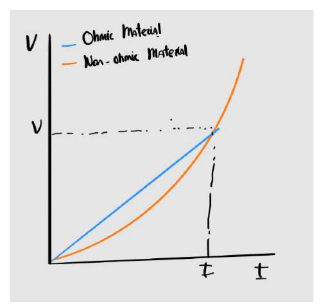

Figure 1: Resistance comparison between an ohmic material (blue) and a non-ohmic material (orange)

#### 1.3 Ohm's law calculation

Before proceeding to the theoretical explanation of the calculations, the following relations must be known, let us state Kirchoff's second law

$$\sum_{k=1}^{n} V_k = 0. (4)$$

That is, the sum of all voltage drops is equal to the supplied voltage, from this law we can obtain the following relations; For series resistors:

$$R_t = \sum_{k=1}^n R_k. (5)$$

The total resistance of the circuit section is equal to the sum of the individual resistors. For parallel resistors: This is usually represented schematically as can be seen in [2](#page-2-1)

$$R_t = \sum_{k=1}^n \frac{1}{R_k}.$$
 Figure 2 (6)

The total resistance is equal to the sum of the inverses of the individual resistances.

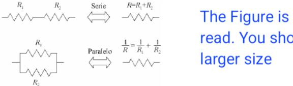

Figure 2: Schematic representation of series and parallel resistors

[\[4\]](#page-13-3) We noticed that we can combine series and parallel resistors in the following way for more elaborate circuits, as can be seen in the following figure.

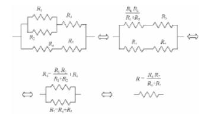

Figure 3: Diagram of the circuit used in the experiment, illustrating both series and parallel

## 2 Materials and Methods

#### 2.1 Materials

• Mounting Board To carry out this experimental test of Ohm's law, some system is needed to connect the circuits, in our case, we use a mounting board as shown in [4.](#page-3-2)

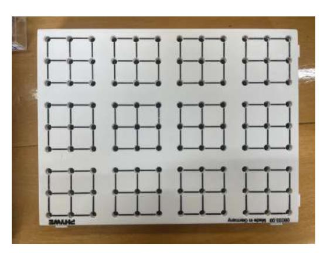

Figure 4: Mounting board used in the laboratory

• DC power supply Likewise, a direct current source will be required, as can be seen in [5,](#page-3-3) since although the results studied above are an ideal case, they are applicable to the direct current framework, however, for alternating current, the calculation is more complicated and does not provide any benefit for what we want to demonstrate.

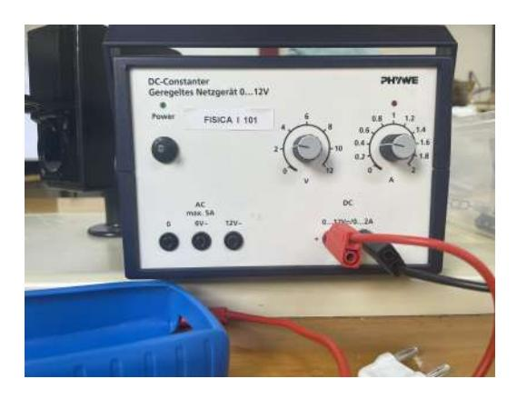

Figure 5: DC power supply used in the laboratory

The source does not need a very high voltage, it should not exceed 10 volts at any time during the experiment, although the most important thing is the range of variation, since what is really needed is to be able to take 10 voltages whose difference in value is considerably greater than the experimental error that may be associated with the measurement.

Although it is not of utmost importance for the experiment, we consider important to comment that the variation of the source we used was not entirely accurate, since the value marked by the wheel and the one marked by the multimeter were sometimes quite different. however, all the values that have been used for the calculations are those of the multimeter [6](#page-4-0) which as can be seen in the appendix of uncertainty is quite accurate.

• Multimeter However, you could use an ammeter or a voltmeter, although it is much more laborious because you have to take several measurements of different magnitudes sequentially, if you have several multimeters, you can speed up the process in some parts, we use the multimeter that you can see in [6](#page-4-0)

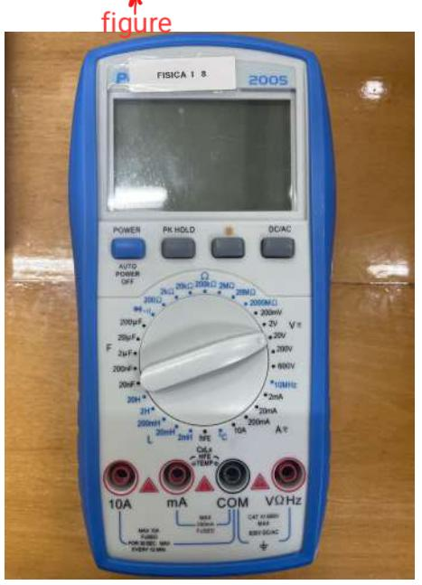

Figure 6: Polymeter used in the laboratory

• Resistors In addition we will need a series of five resistors [7](#page-4-1) whose value is considerably different, to be able to perform the least squares adjustment with acceptable accuracy, we use the ohms that can be seen in the box in which each resistor is, it is especially important the 1000 Ω, as it simplifies many calculations, and allows to check at a first glance if the ratios are correct.

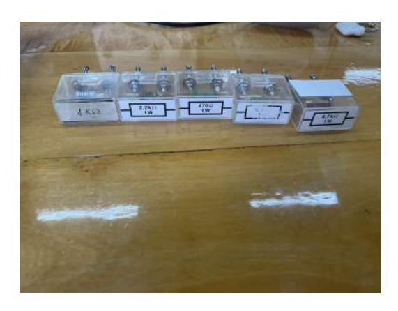

Figure 7: The 5 resistors we use in the laboratory

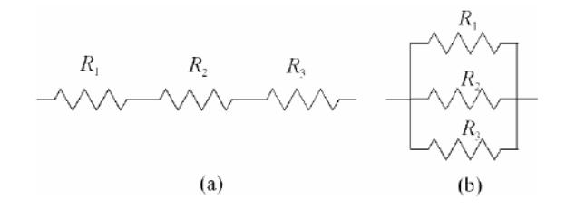

Figure 8: Assembly of resistors both in series and in parallel

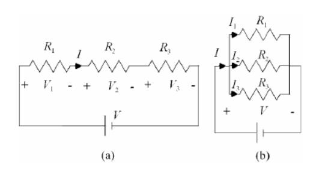

Figure 9: Circuit assembly for measuring voltages

### 2.2 Methods

First of all, five resistors should be chosen and their value should be compared with the manufacturer's reference with the multimeter, this will help us to calculate their error. Then the circuit should be assembled as shown in the following figure: This task is very easy if a mounting plate is used to carry out the instrumentation of the circuit, it must be remembered that although there is no risk of melting the fuse of the multimeter by measuring the resistance, we took only a scale value higher than the value of the resistance, varying it little by little to take care of the device. As much in the measurement of the resistances as of the currents it is necessary to verify that [4](#page-2-2) is verified, next, to measure the tensions a similar system will be carried out as it is shown in the following diagram: In the first instance we implement the diagram a. In the same way it must be verified that for the grouping in series it is satisfied that: In order to further reassure the measures of the ressistors, we did a mixed circuit including all the resistances.

$$V = V_1 + V_2 + V_3, (7)$$

$$V = V_1 + V_2 + V_3, \tag{8}$$

and that, In addition, it must also be verified in the same way that:

$$\frac{V}{R} = \frac{V_1}{R_1} + \frac{V_2}{R_2} + \frac{V_3}{R_3} \tag{9}$$

Next, we build the circuit shown in Figure b of the diagram and verify that the following holds:

$$I = I_1 + I_2 + I_3, (10)$$

and that the relationship for the resistances is the same as in [5.](#page-2-3) It must also be verified that:

$$V = V_1 = V_2 = V_3 (11)$$

In order to obtain more accurate measurements we did the following circuit where all the resistences are involved

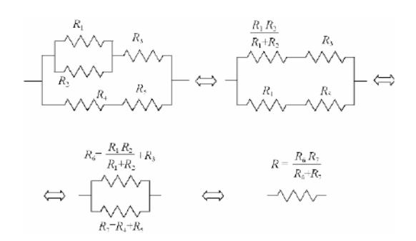

Figure 10: Mixed circuit used to further measure the resistences

Finally, we verify Ohm's law. We assemble the following circuit with each of the resistors:

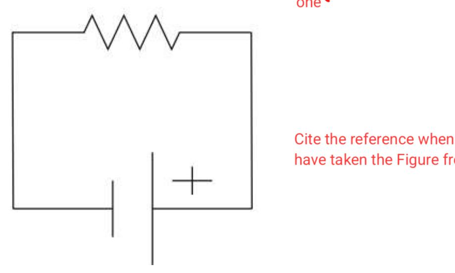

Figure 11: Circuit used to verify Ohm's law

This is checked using a least squares fit. Using two multimeters, we record the values of current and voltage. Since the resistors are made of nichrome, an ohmic material, Ohm's law [2](#page-1-3) should be satisfied. This will be verified using a least-squares fit.

## 3 Results and discussion

#### 3.1 Resistance measurements

This first part of the experiment consisted on putting a tag (R1-R5) to each resistor and measure each resistance value with the multimeter and compare it with the theoretical value to verify they were correct.

To measure it we have used a range of 2000Ω for R1 and R2 and 20000Ω for the other three.

| Resistance | Theoretical value (Ω) | Theoretical uc(R) (Ω) | Value R (Ω) | uc(R) (Ω) |
|------------|-----------------------|--------------------------|-------------|-----------|
| R1         | 470                   | 24                       | 468.0       | 8.7       |
| R2         | 1000                  | 50                       | 1000        | 13        |
| R3         | 2200                  | 110                      | 2170        | 47        |
| R4         | 3300                  | 165                      | 3250        | 56        |
| R5         | 4700                  | 235                      | 4740        | 68        |

Table 1: Both values, the theoretical one and measured one for each resistor with their respective uncertainties.

We can see without any difficulty at [1](#page-7-2) that the measured values and the theoretical values are basically the same and considering their respective uncertainties we prove that everything is correct.

#### 3.2 Resistor systems

To continue the experiment, we have had to measure the values of the total resistance in a parallel and a series system with the resistors R1, R2 and R3 [2](#page-2-1) and the a mixed system with every resistor [3](#page-3-4) and compare the measured values with the theoretical ones. With a range of 2000Ω for the parallel system and 20000Ω for the other two.

| R System              | Theoretical R (Ω) | Theoretical uc(R) (Ω) | R (Ω) | uc(R) (Ω) |
|-----------------------|-------------------|--------------------------|-------|-----------|
| Series: R1-R2-R3      | 3670              | 50                       | 3640  | 34        |
| Parallel: R1-R2-R3    | 250.0             | 9.3                      | 278.0 | 7.2       |
| Mixed: R1-R2-R3-R4-R5 | 1916              | 95.8                     | 1901  | 45        |

Table 2: Both values, the theoretical one and measured one for each resistance system for resistors 1, 2 and 3 with their respective uncertainties.

The results are the same as in the previous part, being both results the theoretical and measured almost equal.

### 3.3 Voltage measurements

Now, we will measure the voltage and the intensity for both systems the series and parallel and for each resistor

| Circuit  | Vt(V )   | V1(V )   | V2(V )   | V3(V )   |
|----------|-------------|-------------|-------------|-------------|
| Series   | 1.980±0.058 | 0.250±0.031 | 0.540±0.033 | 1.180±0.036 |
| Parallel | 1.980±0.040 | 1.980±0.040 | 1.980±0.040 | 1.980±0.040 |

Table 3: Voltage measured values for both series and parallel and each resistor at both systems.

We can clearly see in table [3](#page-7-3) that everything stands for what we are proving for both systems as the equations mentioned before (equations [8](#page-5-1) [11\)](#page-5-2) due to the equality of the values for the parallel system and the fact that the sum of the series one is the total one.

| I3(mA)      | I2(mA)      | I1(mA)      | It(mA)      | Circuit  |  |
|-------------|-------------|-------------|-------------|----------|--|
| 0.590±0.035 | 0.590±0.035 | 0.590±0.035 | 0.590±0.035 | Series   |  |
| 0.900±0.037 | 1.95±0.046  | 4.100±0.063 | 6.80±0.31   | Parallel |  |
|             |             |             |             |          |  |

Table 4: Intensity measured values for both series and parallel and each resistor at both systems.

In addition we have measured the current for checking the equation [2](#page-1-3) in table [4.](#page-7-4) Furthermore, we can see that the current measure makes sense as is the same for every resistor at series and for parallel is the total current is the sum of the current of every resistor as is established in equation [10.](#page-5-3)

| Circuit  | V /Rt(mA)   | V /R1(mA)   | V /R2(mA)   | V /R3(mA)     |
|----------|-------------|-------------|-------------|---------------|
| Series   | 0.540±0.017 | 0.530±0.068 | 0.540±0.034 | 0.5400±0.0204 |
| Parallel | 7.10±0.13   | 4.23±0.12   | 2.000±0.048 | 0.910±0.027   |

Table 5: Values for V/R for both series and parallel and each resistor at both systems.

Finally, to finalize this part of the experiment, we have calculated the value of V/R to see if it matches with the measured current.

The results are shown in tabl[e5](#page-8-1) and at plain sight you can see that the results are basically the same for both. You can see a tiny variance probably owing to the cables or a small imperfection of the material used to do the experiment.

#### 3.4 Checking Ohm's Law

Finally for checking Ohm´s Law [2,](#page-1-3) we will take the resistor R2(1000Ω) and with the power supply we have given it 10 different voltages and measured both the voltages and the intensities with the multimeter.

Once we have every measurement, we will apply the least squared method to obtain a graph that must include a straight line if it has been done correctly.

| I (mA) | u(I) (mA) | V (V) | u(V) (V) |
|--------|-----------|-------|----------|
| 9.840  | 0.109     | 9.800 | 0.079    |
| 8.380  | 0.097     | 8.380 | 0.072    |
| 7.070  | 0.087     | 7.070 | 0.065    |
| 6.350  | 0.081     | 6.350 | 0.062    |
| 5.910  | 0.077     | 5.910 | 0.060    |
| 4.930  | 0.069     | 4.930 | 0.055    |
| 3.820  | 0.061     | 3.820 | 0.049    |
| 2.460  | 0.050     | 2.460 | 0.042    |
| 1.190  | 0.040     | 1.190 | 0.036    |
| 0.0200 | 0.0302    | 0.020 | 0.0301   |

Table 6: Voltage and intensity measured values for the resistor R2(1000Ω).

Representing the data in table [6](#page-8-2) with the least squares method we obtain the figure [12.](#page-9-1)

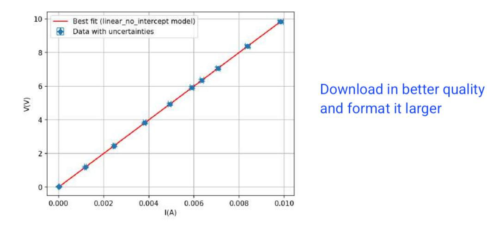

Figure 12: Graphic of the least squared method for 10 different voltages and intensities for the same resistor.

Just by looking at the table [6](#page-8-2) and the graph [12,](#page-9-1) it is clear that it is correct as the result is a straight line which means that Ohm's Law [2](#page-1-3) is correct.

We obtain that the fitted a obtained is 1000.0 ± 3.5 which is the value of the resistance R2 proving even more the veracity of Ohm's Law.

## 4 Conclusions

To conclude the experiment, we will make a quick recapitulation of every phase of it.

The results obtained throughout the experiment strongly confirm the validity of Ohm's Law and the expected behavior of resistors in series, parallel, and mixed configurations.

The measured resistance values for individual resistors closely match the theoretical values within their respective uncertainties, validating the precision of both the components and the methods used.

In the series and parallel systems, both the measured and theoretical total resistances show strong agreement. Voltage and current distributions align with theoretical expectations: in the series configuration, voltage divides while current remains constant; in parallel, voltage remains the same across all branches, and current divides proportionally based on resistance.

Furthermore, current values calculated using equation [2](#page-1-3) match well with the measured currents, with only minor deviations likely due to cable resistance or measurement uncertainties. Finally, the linear relationship between voltage and current for resistor R2 confirmed Ohm's Law through a least-squares fit, yielding a resistance value of 1000.03.5Ω, which aligns perfectly with its nominal value.

Overall, the experiment realized was a considerable success in demonstrating and verifying the fundamental principles of electric circuits.

## Appendixes

#### Calculation of Uncertainties

| 3.1. DC Vol | la | u | t |
|-------------|----|---|---|
|-------------|----|---|---|

| Range  | Resolution | Accuracy      |  |
|--------|------------|---------------|--|
| 200 mV | 0.1 mV     | ±0,5% + 3dgt. |  |
| 2 V    | 0.001 V    |               |  |
| 20 V   | 0.01 V     |               |  |
| 200 V  | 0.1 V      |               |  |
| 1000 V | 1 V        | ±1,0% + 5dgt. |  |

| Range  | Resolution | Load Voltage | Accuracy        |  |
|--------|------------|--------------|-----------------|--|
| 2 mA   | 0.001mA    | 104mV/µA     | ± 0,8% + 3 dgt. |  |
| 20 mA  | 0.01mA     | 12.3mV/µA    |                 |  |
| 200 mA | 0.1mA      | 3.97mV/µA    | ± 1,2% + 4 dgt. |  |
| 10 A   | 0.01A      | 265mV/A      | ± 2,0% + 5 dgt. |  |

| Resis |  |
|-------|--|
|       |  |

| Range   | Resolution | Short Circuit current (ca.) | Open Circuit Voltage | Accuracy                        |
|---------|------------|-----------------------------|----------------------------|---------------------------------|
| 200 Ω   | 0,1Ω       | 0,4 mA                      | ca. 0,5V                   | ± 0,8% + 5 dat.              |
| 2 kΩ    | 1Ω         | 100 μΑ                      |                            |                                 |
| 20 kΩ   | 10 Ω       | 48 µA                       |                            | + 0.00/                         |
| 200 kΩ  | 100 Ω      | 5,5 µA                      |                            | ± 0,8% + 3 dgt.              |
| 2 ΜΩ    | 1 kΩ       | 0,5 µA                      |                            | + 5 agr.                        |
| 20 MΩ   | 10 kΩ      | 0,05 μΑ                     |                            | ± 1,0% +15 dgt.              |
| 2000 ΜΩ | 1 ΜΩ       | 0,2 μΑ                      |                            | ± [5,0% (rdg10) +20 dgt.] |

Figure 13: Multimeter PeakTech 2005 specifications

Before starting with the calculations, it is important to clarify that only two types of errors have been used in this experiment: type B uncertainty (instrumental), as shown in the previously presented table in figure [13,](#page-10-0) and uncertainties from indirect measurements, which will be explained later. This is because it was not necessary to repeat the measurements multiple times, so n=1, and it would not make sense to use type A errors or coverage factors.

The first error that needed to be calculated was that of the resistors in table using two different full-scale ranges: both 2000Ω and 20000Ω.

The type B error in the first case is calculated as follows:

$$u(R) = R \cdot \frac{0.8}{100} + 3 \Omega \quad \text{(for the 2000 } \Omega \text{ scale)}$$
 (12)

$$u(R) = R \cdot \frac{0.8}{100} + 30 \ \Omega \quad \text{(for the 20000 } \Omega \text{ scale)}$$
 (13)

For the series and parallel system we have to calculate indirect uncertainties as shown in equation [14.](#page-10-1)

$$u_C(x) = \sqrt{\left(\frac{\partial x}{\partial x_1}\right)^2 u_C(x_1)^2 + \left(\frac{\partial x}{\partial x_2}\right)^2 u_C(x_2)^2 + \dots}$$
 (14)

For the series system:

$$u_C(R_T) = \sqrt{u(R_1)^2 + u(R_2)^2 + u(R_3)^2}$$
(15)

This follows from the fact that for resistors in series, the total resistance is simply [5.](#page-2-3)

And for the parallel 6:

$$u_C(R_T) = \sqrt{\left(\frac{\partial R_T}{\partial R_1}\right)^2 u(R_1)^2 + \left(\frac{\partial R_T}{\partial R_2}\right)^2 u(R_2)^2 + \left(\frac{\partial R_T}{\partial R_3}\right)^2 u(R_3)^2}$$
(16)

Computing the partial derivatives and simplifying:

$$u_C(R_T) = \sqrt{\left(\frac{(R_2^2 R_3^2)}{(R)^2}\right)^2 u(R_1)^2 + \left(\frac{(R_1^2 R_3^2)}{(R)^2}\right)^2 u(R_2)^2 + \left(\frac{(R_1^2 R_2^2)}{(R)^2}\right)^2 u(R_3)^2}$$
(17)

Being  $R = R_2R_3 + R_1R_3 + R_1R_2$ 

In the case of the voltage we will use the equation 18 for the individual resistors according to 13.

$$u(V) = V \cdot \frac{0.5}{100} + 0.03 \text{ V}$$
 (18)

When analyzing the voltages in each circuit, the propagation of uncertainty depends on the formula used for the total voltage:

• In the **parallel circuit**, the total voltage is simply one of the measured voltages (as all branches share the same potential difference). This, according to equation 11, no additional calculations are needed, and the uncertainty is equal to the uncertainty of the directly measured voltage:

$$u(V) = u(V_i)$$

• In the **series circuit**, the total voltage is the sum of the individual voltages, as described in equation 8. Therefore, the uncertainty is calculated using standard propagation of uncertainty:

$$u_C(V) = \sqrt{\left(\frac{\partial V}{\partial V_1}\right)^2 u(V_1)^2 + \left(\frac{\partial V}{\partial V_2}\right)^2 u(V_2)^2 + \left(\frac{\partial V}{\partial V_3}\right)^2 u(V_3)^2}$$
(19)

Since the total voltage is 8, this simplifies the uncertainty to:

But you forgort to calculate V1+V2+V3 and its uncertainty (20)

$$u_C(V) = \sqrt{u(V_1)^2 + u(V_2)^2 + u(V_3)^2}$$

We will make the same procedure with the intensities I:

$$u(I) = I \cdot \frac{0.8}{100} + 0.03 \text{ A} \tag{21}$$

When analyzing the intensities in each circuit, as happens with the voltages, the propagation of uncertainty depends on the formula used for the total voltage:

• Series Circuit: In a series configuration, the current through each component is the same as is specified in equation. This uncertainty is simply the uncertainty in any of the individual measurements:

$$u(I) = u(I_i)$$

• Parallel Circuit: In a parallel circuit, the total current is the sum of the individual branch currents 10. Therefore, uncertainty is propagated according to:

$$u_C(I)=\sqrt{u(I_1)^2+u(I_2)^2+u(I_3)^2}$$
 You alse forgort to calculate I1+I2+I3 and its uncertainty

For  $\frac{V}{R_1}$ ,  $\frac{V}{R_2}$ , and  $\frac{V}{R_3}$ , the uncertainty is calculated using the following propagation formula:

$$u_C\left(\frac{V}{R}\right) = \sqrt{\left(\frac{\partial(V/R)}{\partial V}\right)^2 u_C(V)^2 + \left(\frac{\partial(V/R)}{\partial R}\right)^2 u_C(R)^2}$$
 (23)

We have:

$$u_C\left(\frac{V}{R}\right) = \sqrt{\left(\frac{1}{R}\right)^2 u_C(V)^2 + \left(\frac{V}{R^2}\right)^2 u_C(R)^2}$$
(24)

- Series Circuit: Since the total voltage is calculated using the sum of the individual voltages, the total  $\frac{V}{R}$  is obtained directly from the total values. Therefore, no further uncertainty propagation is necessary.
- Parallel Circuit: The total  $\frac{V}{R}$  is calculated based on equation 9, combining the individual contributions. Thus, the uncertainty must be propagated as:

$$u_C\left(\frac{V}{R_t}\right) = \sqrt{\left(u_C\left(\frac{V}{R_1}\right)^2 + u_C\left(\frac{V}{R_2}\right)^2 + u_C\left(\frac{V}{R_3}\right)^2}$$
 (25)

Fitting Procedures

The fitting appendix should contain a discussion about the goodness of the fit. You can also remove it and include the discussion just after the fit figure. The resistance values obtained through the least squares fitting method follow a chi-squared.

The resistance values obtained through the least squares fitting method follow a chi-squared ( $\chi^2$ ) distribution, which is defined as follows:

$$\chi^2 = \sum_{i=1}^n \left( \frac{y_i - ax_i}{\sigma_i} \right)^2 \tag{26}$$

Here, n is the number of data points used to compute the current I, which in this case is n = 10, since the voltage V was varied 10 times.

With this, the python program we used minimizes this function such that:

$$\frac{\partial \chi^2}{\partial a} = 0 \tag{27}$$

By taking the derivative of the chi-squared function with respect to a and setting it to zero, we obtain:

$$-2\sum_{i=1}^{n} \frac{x_i}{\sigma_i^2} (y_i - ax_i) = 0$$
 (28)

This simplifies to:

$$\sum_{i=1}^{n} \frac{x_i y_i}{\sigma_i^2} = a \sum_{i=1}^{n} \frac{x_i^2}{\sigma_i^2}$$
 (29)

Solving for a yields:

$$a = \frac{\sum_{i=1}^{n} \frac{x_i y_i}{\sigma_i^2}}{\sum_{i=1}^{n} \frac{x_i^2}{\sigma_i^2}}$$
(30)

To calculate the uncertainty in a, denoted as  $\Delta a$ , we use the following expression:

$$\Delta a = \sqrt{\sum_{i=1}^{n} \left(\frac{\partial a}{\partial y_i}\right)^2 \cdot \frac{\Delta y_i^2}{\sigma_i^2}}$$
 (31)

## References

- [1] Harry Moritz Schey. "Div, grad, curl, and all that". In: Div (1973).
- [2] 2018 CODATA Value: vacuum electric permittivity.
- [3] B. Weber et al. "Ohm's law survives to the Atomic Scale". In: Science 335.6064 (Jan. 2012), pp. 64–67. doi: [10.1126/science.1214319](https://doi.org/10.1126/science.1214319).
- [4] Antonio Mart´ın Rodr´ıguez, David Blanco Navarro, and Ra´ul Rica Alarc´on. Manual de Pr´acticas de T´ecnicas Experimentales B´asicas. Departamento de f´ısica aplicada, Universidad de Granada, 2025.