# Experiment 24 The oscilloscope

Andr´es Vinuesa Espinosa and Jos´e Mar´ıa Mart´ınez Herrada Group A22

> Laboratory session 28/04/2025 Report submission 08/04/2024

#### Abstract

This report explores the behavior of periodic electrical signals using a digital oscilloscope. Basic waveform measurements were conducted for sine, square, and ramp signals across multiple frequencies. An RC series circuit was then analyzed to determine voltage attenuation and phase shift, which were compared with theoretical models using least squares fitting. The resulting correlation coefficients (r 2 ≈ 0.62) indicated a statistically significant relationship. Finally, Lissajous figures were generated to visualize frequency ratios and phase differences. Overall, the experimental results aligned well with theory, validating the oscilloscope's utility in signal analysis.

# Contents

| 1 | Introduction               |                       |                                    |        |  |  |  |  |  |
|---|----------------------------|-----------------------|------------------------------------|--------|--|--|--|--|--|
|   | 1.1                        |                       | What is an oscilloscope?        | 1      |  |  |  |  |  |
|   | 1.2                        |                       | History of the oscilloscope     | 2      |  |  |  |  |  |
| 2 | Materials and Methods 3 |                       |                                    |        |  |  |  |  |  |
|   | 2.1                        | Materials             |                                    | 3      |  |  |  |  |  |
|   | 2.2                        | Methods               |                                    | 5      |  |  |  |  |  |
|   |                            | 2.2.1                 | Basic measures in X-T mode      | 5      |  |  |  |  |  |
|   |                            | 2.2.2                 | RC Circuit serie                | 5      |  |  |  |  |  |
|   |                            | 2.2.3                 | Lissajous figures               | 6      |  |  |  |  |  |
| 3 | Results and discussion     |                       |                                    |        |  |  |  |  |  |
|   | 3.1                        |                       | Basic measurements in X-T mode  | 7 7 |  |  |  |  |  |
|   | 3.2                        | Series RC circuit  |                                    |        |  |  |  |  |  |
|   | 3.3                        | Lissajous figures  |                                    |        |  |  |  |  |  |
| 4 |                            | Conclusions           |                                    | 13     |  |  |  |  |  |

### 1 Introduction

### 1.1 What is an oscilloscope?

An oscilloscope is an instrument for displaying electrical signals [\[1\]](#page-14-0) that vary over time, the vertical axis, called Y represents the voltage, while the horizontal axis, called X, represents the time. It is widely used in signal electronics, to see the evolution of the signals present in circuits, A simple example is the alternating current, since it varies with time in a sinusoidal way Some of

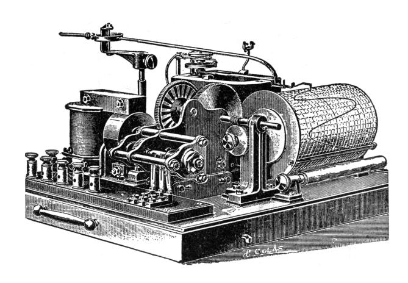

Figure 1: Hospitalier Ondograph, courtesy of [\[3\]](#page-14-1)

its utilities are to determine the period and voltage of a signal, indirectly determine its frequency and noise, as well as locate noise in the signal and its time variation.

Due to their wide versatility, oscilloscopes are used in a large number of fields, if we have a suitable transducer, we can obtain values of heart rate or sound power.

It should be noted that there are two types of oscilloscopes: analog and digital, while the former work directly with the applied signal, and amplify it and deflect a beam of electrons. However, digital oscilloscopes use an analog-to-digital converter (ADC) to store the input signal and then reconstruct this information.

Analog oscilloscopes have the advantage of better displaying rapid signal variations, while digital oscilloscopes perform better for displaying and studying non-repetitive events, such as voltage spikes. [\[2\]](#page-14-2)

#### 1.2 History of the oscilloscope

The first attempt to try to visualize the variation of an electromagnetic signal was the laborious process of noting the voltage or current of a rotor, with measurements taken by a galvanometer. [\[3\]](#page-14-1)

This process was automated with a machine that performed this process by drawing these graphs mechanically, however this process was not done directly, since the wave varied much faster than the mechanical parts of the oscilloscope could move, so the drawing that was made was an average of different wave intervals. The Hospitalier Ondograph, based on this method, is famous and can be seen in the following figure:

Later, in order to improve the efficiency of the mechanical part of the device, a mirror with an infinite mass that could move at speeds comparable to the wave was implemented, the term "Oscillograph" was coined by Andr´e Brondel in 1893. [\[4\]](#page-14-3).

Certainly the turning point in the history of the oscilloscope came with the invention of the cathode ray tube, at the end of the 19th century, which is a subject that we will not describe in detail due to its great length.

However, it should be noted that they were invented to study electrons, the particles that compose them. It was through a brilliant experiment with cathode rays that the British physicist J.J. Thomson discovered that these were exclusively composed of a new particle of opposite charge to that of the already known proton. [\[5\]](#page-14-4).

In the cathode ray tube a small beam of electrons is emitted at a hot cathode and accelerated towards an anode, which has a tiny hole through which the beam passes, forming a beam of electrons. Then this negatively charged beam is passed through a pair of plates, which are perpendicular to it, called horizontal (H) and vertical (V) deflectors, these plates produce an electric field transverse to the propagation of the beam and deflect it depending on the intensity

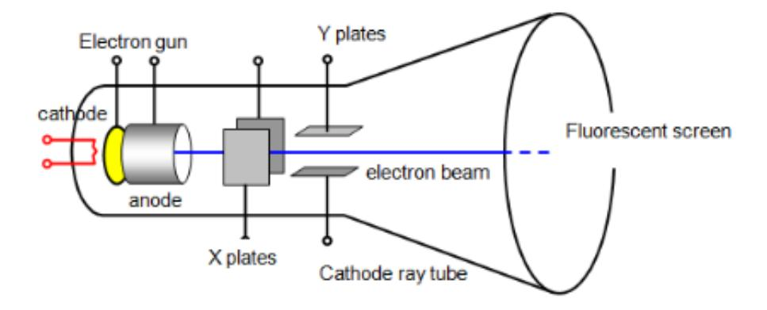

Figure 2: Diagram of cathode ray tube courtesy of [\[7\]](#page-14-5).

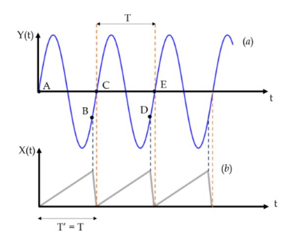

Figure 3: Effects on the signal caused by both amplifiers, courtesy of [\[7\]](#page-14-5).

of the field, this allows to display the signals on a frequent screen, this being the principle used by televisions until the 90s. [\[6\]](#page-14-6)

This image on the fluorescent screen must be frozen, normally this is achieved with a vertical amplifier that makes this beam deflection visible to the human eye, then, a horizontal beam deflection is achieved by a sweep generator that is generally called a time base, which produces sawtooth tensions that move the beam horizontally. This system is much more complex, but for the sake of clarity and not to lengthen this paper, we will not go into details. In this experiment we use a digital oscilloscope which, as we have stated before, is very useful to visualize short duration events.

### 2 Materials and Methods

### 2.1 Materials

- Oscilloscope: Used seeing the wave form with all its attributes (Figure [4\)](#page-3-0).
- Function generator: Used for giving the waves their properties and choosing the wave form you wanted (Figure [5\)](#page-3-1).
- Resistor: Used for giving a resistance to the system in the second part (Figure [6\)](#page-4-3).
- Capacitor: Used for giving a capacity unit to the system (Figure [6\)](#page-4-3).

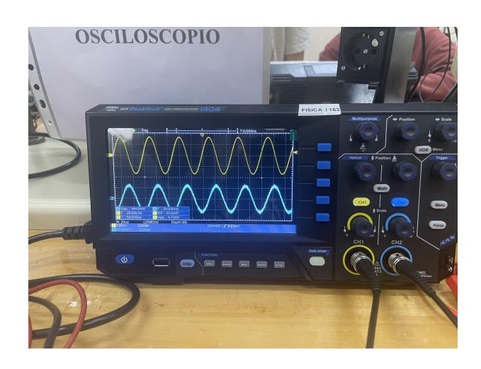

Figure 4: Oscilloscope used in the laboratory

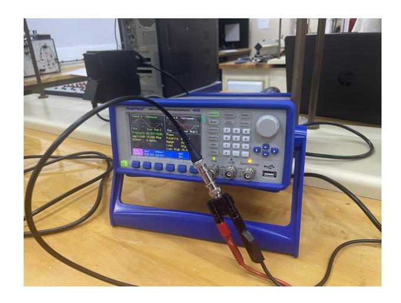

Figure 5: Function generator used in the laboratory

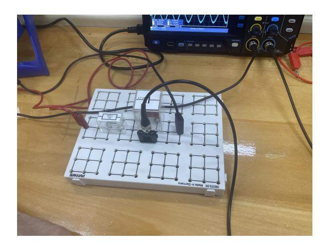

Figure 6: The resistor, capacitor and breadboard used in the laboratory.

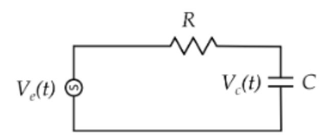

Figure 7: RC circuit, courtesy of the course textbook

• Breadboard: Used for creating the system for measuring the voltage in part two of the experiment (Figure [6\)](#page-4-3).

#### 2.2 Methods

#### 2.2.1 Basic measures in X-T mode

Previously to measure the signals of a circuit, to familiarize ourselves with the oscilloscope we visualize a signal obtained directly from the generator, as this visualization depends on the time, the oscilloscope will work in X-T mode To do this we must connect one end of a BNC cable to channel 1 of the oscilloscope, and then the other end to the output channel of the generator. Once this is done, we turn on the generator and select the amplitude and output frequency that we want, if the oscilloscope allows it, we choose the autoset mode, which adjusts the scale of the oscilloscope graph algorithmically, to allow us to visualize the signal well, if not, it can be adjusted by hand until the signal fits well on the screen. Note: In our case, the measurements worked better and were more stable when we displayed more than one wave section at a time, i.e. we saw the wave over an entire period, so we will always work in this mode. Once this is done, our oscilloscope screen will display values for the amplitude and the period, with this period, the frequency will be calculated and compared with the value selected in the generator.

#### 2.2.2 RC Circuit serie

Secondly, we will do some less trivial tests with the circuit shown in the following figure, following the international convention for its elements. This circuit, being working in alternating current, i.e., sinusoidal, will have an input voltage given by the following equation:

$$V_e(t) = V_e cos(2\pi f t) \tag{1}$$

The terminal voltage of the condenser will be affected by a phase shift, so that its expression will be

$$V_c(T) = V_c \cos(2\pi f t + \phi) \tag{2}$$

Where Vc is;

$$V_c = \frac{V_e}{\sqrt{1 + (2\pi f)^2 R^2 C^2}} \tag{3}$$

y el desfase ϕ viene dado por:

$$\phi = -\arctan(2\pi fRC) \tag{4}$$

Once the circuit is assembled, connect one of the BNC outputs of the T-type adapter, located on the CHA output of the signal generator, to channel 1 (CH1) of the oscilloscope to measure

$$V_e(t)$$

. Then, adapt the banana cables to channel 2 (CH2) of the oscilloscope and connect them to the capacitor terminals to measure

$$V_c(t)$$

Then, we will activate the two signals to obtain simultaneous bad voltages, we will use the autoset to display the graph, and we will test several different amplitudes Using the horizontal control we will adjust the time scale to display several periods. Once all the sequences have been recorded, we will determine the numerical values of Vc and ϕ and frequency f of the generated signal.

#### 2.2.3 Lissajous figures

When two perpendicular harmonic motions are superimposed at the same point, and we superimpose both motion graphs, we can observe figures of high visual appeal, as we vary the frequency and phase of both motions. This can be seen with the oscilloscope as follows. First we can select two sinusoidal voltages, in two different channels, we use any one as a reference, and we operate as in the previous section, depending on the ratio between the oscilloscope signals we will obtain the following figures, as shown in the following figure:

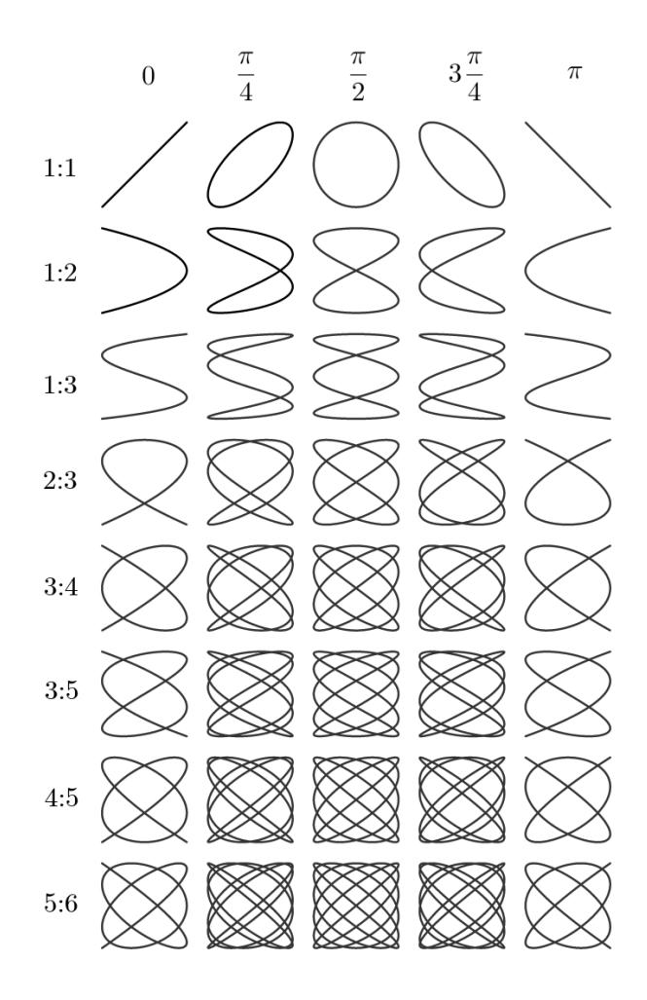

Figure 8: Lissajous figures by [\[8\]](#page-14-7)

### 3 Results and discussion

### 3.1 Basic measurements in X-T mode

We have started the experiment by making three different wave forms, a sine, a square and pos ris ramp for three different frequencies and voltages, which is shown in table [1.](#page-6-2)

| Wave form    | f (Hz) | u(f) (Hz) | Vpp (V) | u(Vpp) (V) |
|--------------|-----------|-----------|------------|------------|
| sine         | 50.000    | 0.060     | 2.0000     | 0.0050     |
| squares      | 50.000    | 0.060     | 2.0000     | 0.0050     |
| pos ris ramp | 50.000    | 0.060     | 2.0000     | 0.0050     |
| sine         | 100.00    | 0.11      | 2.0000     | 0.0050     |
| squares      | 100.00    | 0.11      | 2.0000     | 0.0050     |
| pos ris ramp | 100.00    | 0.11      | 2.0000     | 0.0020     |
| sine         | 600.00    | 0.80      | 9.000      | 0.020      |
| squares      | 600.00    | 0.80      | 9.000      | 0.020      |
| pos ris ramp | 600.00    | 0.80      | 9.000      | 0.020      |

Table 1: Frequency and Voltage for three different wave forms.

Now the different waves formed are shown in the following pictures.

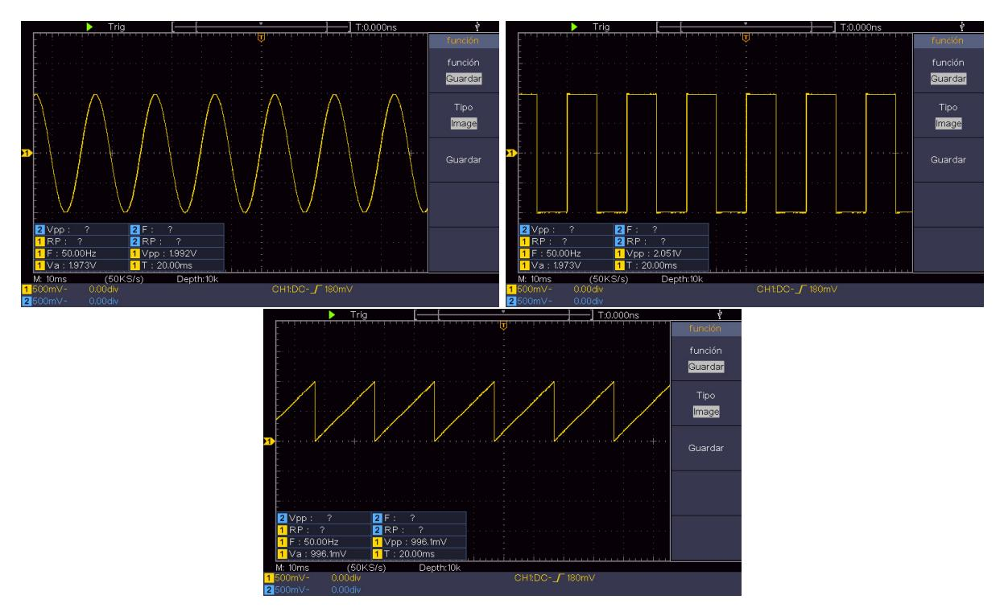

Figure 9: Images of the wave formed with 50 Hz and 2V with waves form of a sine, a square and pos ris ramp.

Starting in figure [9](#page-7-0) The waves have a voltage of 2V and a frequency of 50 Hz. It is worth mentioning that if you look at the pos ris ramp wave, the Vpp is approximately half of the voltage we gave it. This is owing to the configuration of the oscilloscope, that something is wrong configured and it appeared like half the voltage it should be, however is 2V like the other ones.

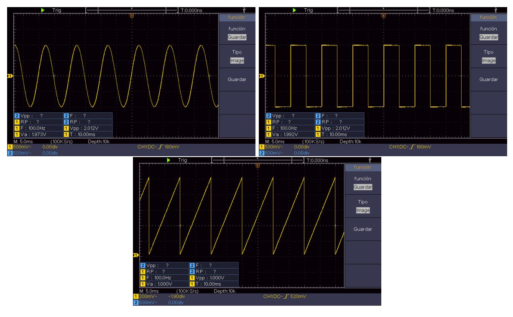

Figure 10: Images of the wave formed with 100 Hz and 2V with waves form of a sine, a square and pos ris ramp.

In figure [10](#page-7-1) the waves formed have a frequency of 100 Hz and a voltage of 2V, and the pos ris ramp Vpp has the same problem than in the last case for the same reason.

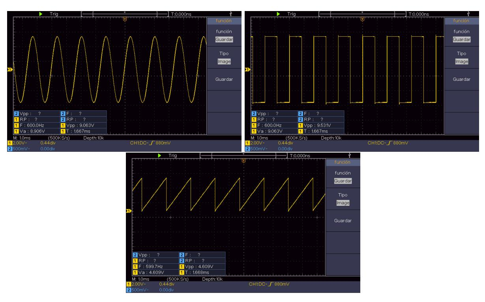

Figure 11: Images of the wave formed with 600 Hz and 9V with waves form of a sine, a square and pos ris ramp.

Finally in figure [11,](#page-8-1) the waves formed have a frequency of 600 Hz and a voltage of 9V and the pos ris ramp has the same Vpp problem.

#### 3.2 Series RC circuit

In this part we will measure the phase shift of 2 different waves with the same frequency and the voltage across the capacitor terminal Vc.

| f (Hz) | u(f)  | Φ (degree º) | u(Φ)   | Vc    | u(Vc) |
|-----------|-------|-----------------|--------|-------|-------|
| 10.000    | 0.011 | 3.6000          | 0.0011 | 8.94  | 0.31  |
| 20.000    | 0.020 | 8.6400          | 0.0017 | 8.63  | 0.30  |
| 40.000    | 0.040 | 20.1600         | 0.0033 | 8.20  | 0.23  |
| 70.000    | 0.060 | 30.2400         | 0.0046 | 7.10  | 0.16  |
| 100.00    | 0.11  | 36.0000         | 0.0078 | 6.02  | 0.11  |
| 1000.0    | 1.1   | 57.600          | 0.011  | 0.800 | 0.084 |
| 2000.0    | 1.8   | 74.8800         | 0.0091 | 0.401 | 0.070 |
| 4000.0    | 6.8   | 83.740          | 0.017  | 0.200 | 0.070 |
| 7000.0    | 20.3  | 93.590          | 0.030  | 0.120 | 0.064 |
| 10000     | 11    | 92.160          | 0.011  | 0.080 | 0.062 |
| 20000     | 18    | 90.7180         | 0.0092 | 0.061 | 0.040 |

Table 2: Frequencies with their phase shift and the Vc.

It is clear that for the lower frequencies the voltage is almost the same as the one supported and the phase shift is low. Nevertheless reaching the 100 Hz the voltage starts decreasing and the phase shift stars increasing at tremendous speed and that is the reason we have made the measurements in the logarithm scale.

Now we will make least squared method for the capacitor voltage divided by the provided one in function of the frequency and the phase shift in function of the frequency.

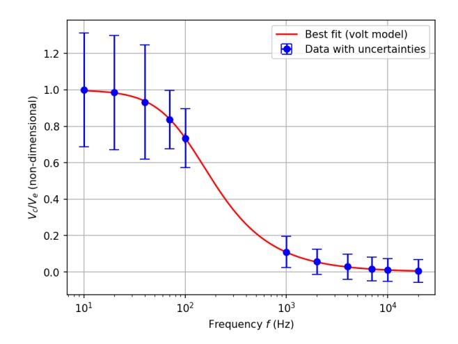

Figure 12: Graph for least squared method for the capacitor voltage divided by the provided one in function of the frequency.

We have started with by doing it for capacitor voltage divided by the provided one in function of the frequency, whose graph is shown in figure [12.](#page-9-0) It gives us a characteristic frequency of 108 ± 36Hz. The r 2 is equal to 0.6342899786, and we will use it in order to obtain the χ 2 and this is due to probably an error of the python fitting code that gives us a ridiculous value of χ 2 , so we will not discuss it. Now we will make the other fitting procedure

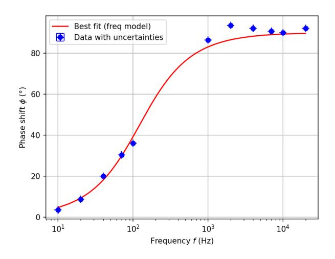

Figure 13: Graph for least squared method for the phase shift in function of the frequency.

The expected frequency obtained is 123.22171 ± 0.00083Hz, which is really similar to the one obtained in the other case, so it means that the expected frequency is inside that interval. Taking the square root, we obtain that r = 0.79 which means that there is a 0.3 % of obtaining a value of r, equal or greater than our value by chance, that means we can be almost sure that our data is correlated, given the similarity of the previous correlation coefficient, we can apply the same logic to both.

#### 3.3 Lissajous figures

Finally we will make some Lissajous figures (figure [8](#page-6-3) by varying the frequency of the waves.

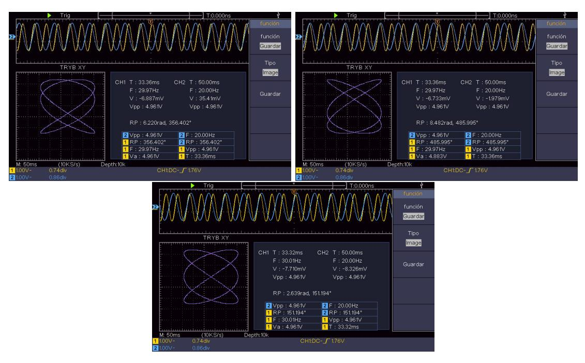

Figure 14: Lissajous figures 2:3.

We have started by doing the figures of 45º, 135º and 90º respectively with a frequency of 2:3 between the waves.

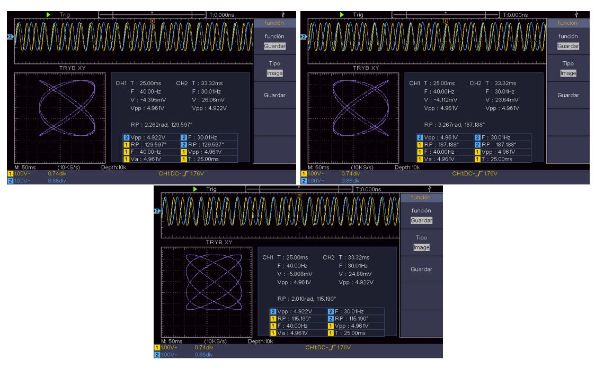

Figure 15: Lissajous figures 3:4.

Then, the figures of 45º, 135º and 90º respectively with a frequency of 3:4 between the waves.

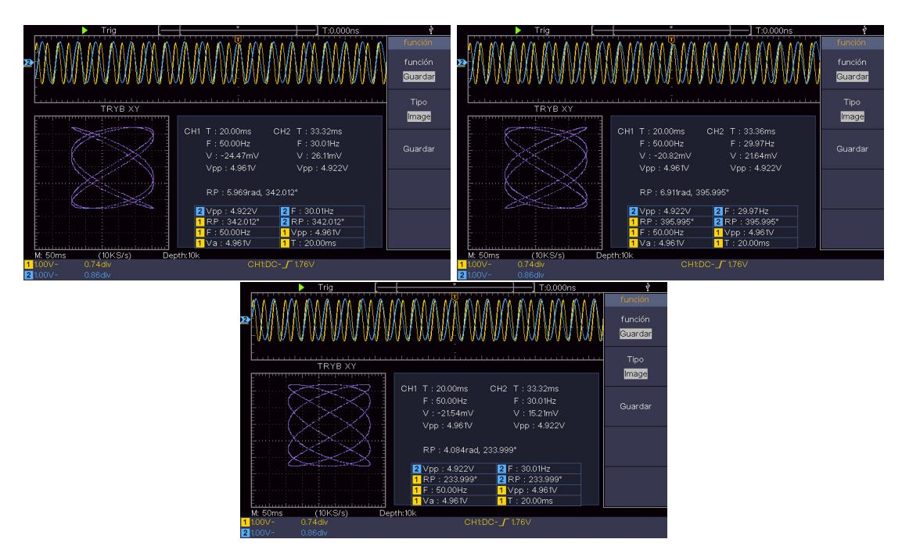

Figure 16: Lissajous figures 3:5.

Now, the figures of 45º, 135º and 90º respectively with a frequency of 3:5 between the waves.

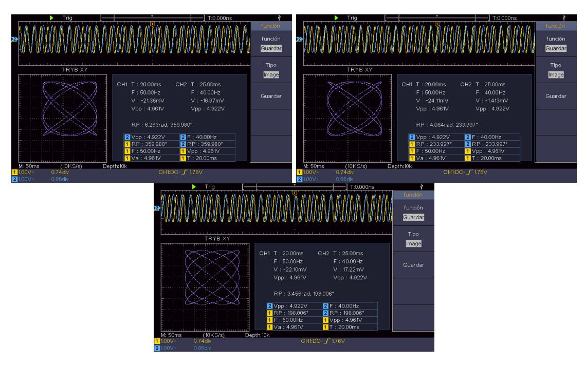

Figure 17: Lissajous figures 4:5.

Finally, the figures of 45º, 135º and 90º respectively with a frequency of 4:5 between the waves. It is worth mentioning that the oscilloscope had some problems with the configuration and the angles that for the oscilloscope was the figures were completely different.

# 4 Conclusions

# Conclusion

The experiment was divided into three main parts, each focused on different aspects of signal behavior on the oscilloscope and in an RC circuit.

### 3.1 Basic Measurements in X-T Mode

Three types of signals were generated: sine, square, and positive rising ramp, for three different frequencies (50 Hz, 100 Hz, and 600 Hz). In general, the measured peak-to-peak voltage values (Vpp) matched the expected ones. However, for the positive ramp waveform, a systematic discrepancy was observed: the measured value was approximately half of the expected voltage. This was attributed to a possible misconfiguration of the oscilloscope.

### 3.2 Series RC Circuit

The phase shift (Φ) and the voltage across the capacitor (VC) were analyzed for a wide range of frequencies. At low frequencies, the capacitor voltage remained high and the phase shift was small. Starting from 100 Hz, the capacitor voltage began to drop significantly, while the phase shift increased rapidly. This justified the use of a logarithmic scale in data representation.

Two least squares fits were performed:

- Capacitor voltage ratio VC/V as a function of frequency: A characteristic frequency of 108 ± 36 Hz was obtained, with a determination coefficient of r 2 = 0.6343. The data shows a moderate correlation, suggesting the model fits reasonably well. However, the chisquare test produced an unexpectedly high value that doesn't align with our expectations, possibly due to experimental uncertainties or data spread. Because of this, we decided not to rely on chi-square for evaluating the fit in this case.
- Phase shift Φ as a function of frequency: A characteristic frequency of 123.22 ± 0.00083 Hz was obtained, which is very close to the value found in the previous analysis, supporting the experiment's consistency. The determination coefficient was r 2 = 0.6222, indicating a fairly good correlation. Similar to the previous case, the chi-square result was not meaningful due to inconsistencies, so we opted not to use it as a criterion for assessing the fit. The same discussion that we applied in the previous subsection for the r value, applies here as well, since the two values are almost identic.

#### 3.3 Lissajous Figures

Lissajous figures were generated with different frequency ratios between the signals (2:3, 3:4, 3:5, and 4:5), producing figures at 45º, 90º, and 135º. Some difficulties were encountered due to oscilloscope configuration issues, which affected the expected representation of angles.

Overall, the results obtained were consistent with theoretical expectations, and the observed deviations could be reasonably explained by systematic errors.

# Appendixes

### Calculation of Uncertainties

For the resistor and the capacitor we used, the tolerance is 10%, so their uncertainty will be their value multiplied by 0.10. We will start by showing the Type B Uncertainties. These type of uncertainties are tied to the resolution of the instruments.

$$u_B(x) = \frac{\delta}{\sqrt{12}}. (5)$$

The value of  $\delta$  is different depending of the instrument we used to measure the data. But we will not use it for the voltage and we will use an uncertainties specifically for the oscilloscope.

$$u_{B,\text{exact}}(V_{pp}) = (x \cdot 0.03) + 0.05 \cdot \text{v.scale.}$$
 (6)

$$u_{B,\text{resol}}(V_{pp}) = \frac{8 \cdot \text{v.scale}}{256 \cdot \sqrt{12}}.$$
 (7)

So the Type C Uncertainty for the voltage would be

$$u_C(V_{pp}) = \sqrt{\left(u_{B,\text{exact}}(V_{pp})\right)^2 + \left(u_{B,\text{resol}}(V_{pp})\right)^2}.$$
 (8)

For the period uncertainty we will use:

$$u_B(T) = u_C(T) = \frac{1}{f_{\text{adq}}} + \frac{10^2}{10^6} \cdot T + 0.6 \,\text{ns.}$$
 (9)

And for the frequency:

$$u_C(f) = \frac{u_C(T)}{T^2}. (10)$$

For the phase shift we will use the indirect uncertainty formula which is:

$$u_C(x) = \sqrt{\left(\frac{\partial x}{\partial x_1}\right)^2 u_c(x_1)^2 + \left(\frac{\partial x}{\partial x_2}\right)^2 u_c(x_2)^2 + \dots}$$
(11)

So particularized for the phase shift will be:

$$u_C(\Phi) = \sqrt{\left(\frac{\partial \Phi}{\partial f}\right)^2 u_c(f)^2}.$$
 (12)

that we can simplify by:

Phase shift is not an indirect measurement

$$u_C(\Phi) = \sqrt{\left(-\frac{2\pi RC}{1 + 4\pi^2 f^2 C^2 R^2}\right)^2 u_c(f)^2}.$$
 (13)

Finally we have the Expanded Uncertainty. This uncertainty is calculated to overestimate the error.

$$U_C(x) = k_p u_C(x) (14)$$

where  $k_p$  is the coverage factor that is selected for convenience. We have chosen to use a 95% confidence interval as it is standard. Since we have 0 degrees of freedom, we have to take inf on the t student table, 1.960.

# References

- [1] Radiomuseum.org. Du Mont Laboratories Inc. - Cathode-Ray Oscillograph 7. Accessed April 27, 2025. n.d. url: [https : / / www . radiomuseum . org / r / dumont \\_ la \\_ cathode \\_ ray \\_](https://www.radiomuseum.org/r/dumont_la_cathode_ray_oscillograph_7.html) [oscillograph\\_7.html](https://www.radiomuseum.org/r/dumont_la_cathode_ray_oscillograph_7.html).
- [2] Juan Miguel Valverde Villegas. The Oscilloscope. Accessed April 27, 2025. n.d. url: [https:](https://www.ugr.es/~juanki/osciloscopio.htm) [//www.ugr.es/~juanki/osciloscopio.htm](https://www.ugr.es/~juanki/osciloscopio.htm).
- [3] Nehemiah Hawkins. Hawkins Electrical Guide. 2nd. Vol. 6. Theo. Audel and Co., 1917. Chap. Chapter 63: Wave Form Measurement.
- [4] Wikipedia contributors. History of the oscilloscope. Accessed: 2025-04-27. 2025. url: [https:](https://en.wikipedia.org/wiki/History_of_the_oscilloscope) [//en.wikipedia.org/wiki/History\\_of\\_the\\_oscilloscope](https://en.wikipedia.org/wiki/History_of_the_oscilloscope).
- [5] Edward Arthur Davis and Isabel Falconer. JJ Thompson and the Discovery of the Electron. CRC Press, 2002.
- [6] ZDNet Editors. LCDs outsell CRTs in Q4 2003. Accedido: 2025-04-27. 2003. url: [https:](https://www.zdnet.com/article/lcds-outsell-crts-in-q4-2003/) [//www.zdnet.com/article/lcds-outsell-crts-in-q4-2003/](https://www.zdnet.com/article/lcds-outsell-crts-in-q4-2003/).
- [7] Antonio Mart´ın Rodr´ıguez, David Blanco Navarro, and Ra´ul Rica Alarc´on. Manual de Pr´acticas de T´ecnicas Experimentales B´asicas. Departamento de f´ısica aplicada, Universidad de Granada, 2025.
- [8] Wikipedia contributors. Lissajous curve. Accessed: 2025-05-20. Wikipedia. 2024. url: [https:](https://en.wikipedia.org/wiki/Lissajous_curve) [//en.wikipedia.org/wiki/Lissajous\\_curve](https://en.wikipedia.org/wiki/Lissajous_curve).