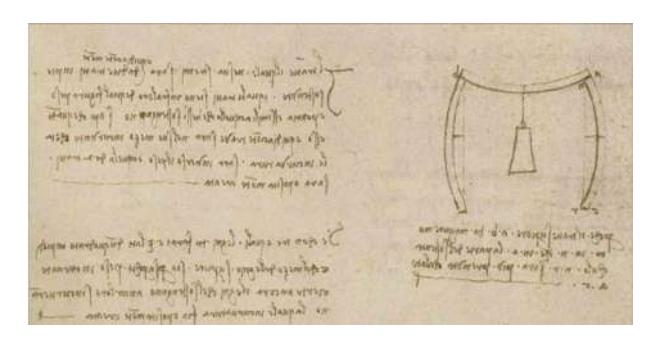
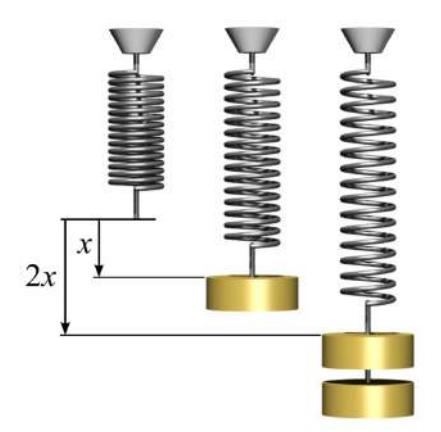
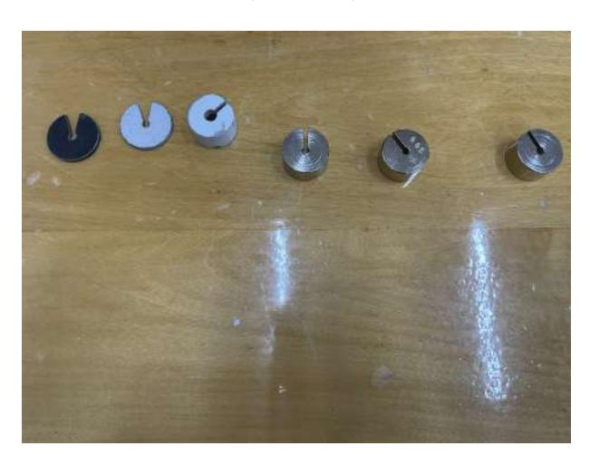
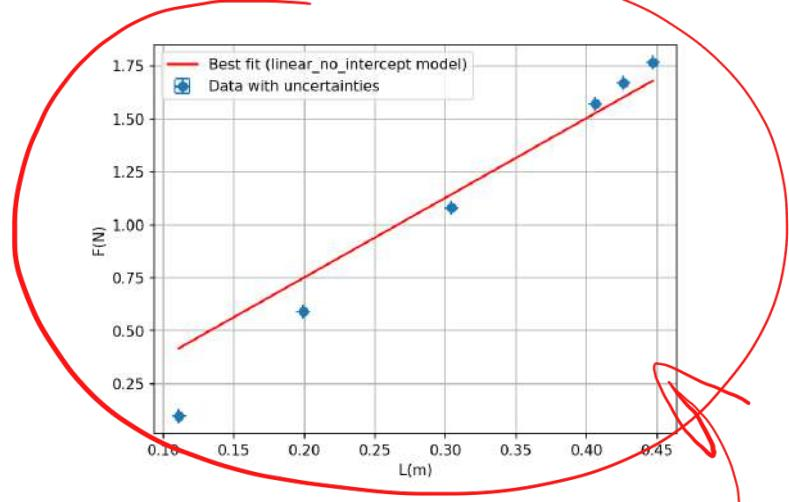
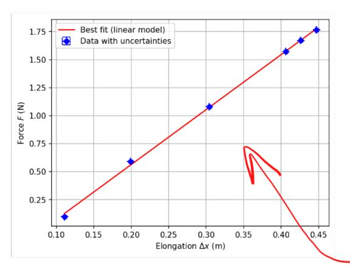
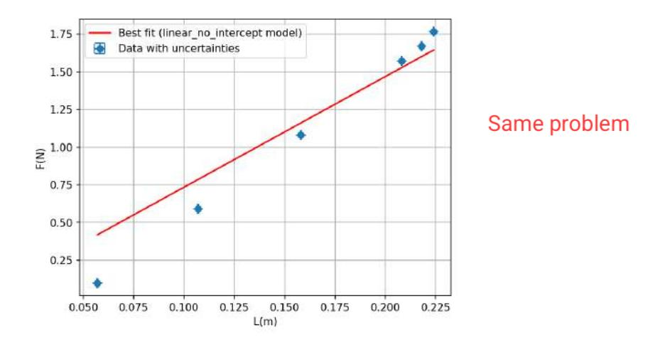
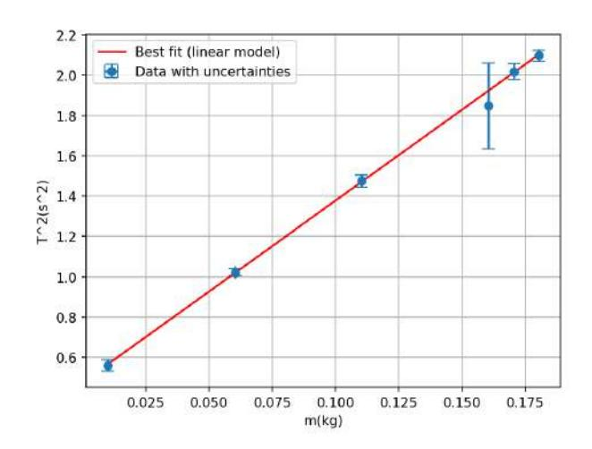
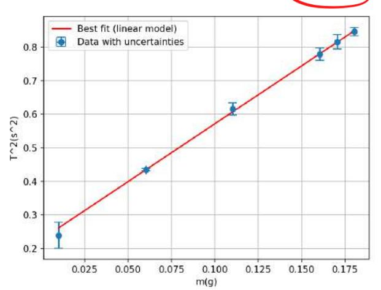

Experiment 5 Elastic constant of a spring

Andr´es Vinuesa Espinosa and Jos´e Mar´ıa Mart´ınez Herrada

Laboratory session 05/05/2025 Report submission 11/05/2025

Group A22

#### Abstract

We verified Hooke's Law and determined the elastic constants (k) of two different springs using both static and dynamic methods. The static method, which analyzes force versus elongation, yielded k1 = 3.7602 ± 0.0012 N/m and k2 = 7.3427 ± 0.0023 N/m, with high coefficients of determination. The dynamic method, based on oscillation periods, resulted in k1 = 3.11 ± 0.20 N/m and k2 = 7.5920 ± 0.0028 N/m. The results a demonstrated reasonable agreement, supporting theoretical predictions and indicating the reliability of the experimental procedures and data.

## Contents

| 1 | Introduction                                       |        |  |  |  |  |
|---|----------------------------------------------------|--------|--|--|--|--|
|   | 1.1 Historical Background                    | 2 2 |  |  |  |  |
|   | 1.2 Theoretical Framework of the Experiment  | 2      |  |  |  |  |
|   | 1.3 Experimental Framework                   | 3      |  |  |  |  |
| 2 | Static Procedure                                   | 3      |  |  |  |  |
| 3 | Dynamic Procedure                                  | 3      |  |  |  |  |
| 4 | Materials and Methods                              | 4      |  |  |  |  |
|   | 4.1 Methods                                  | 4      |  |  |  |  |
|   | 4.1.1 Static Method                          | 4      |  |  |  |  |
|   | 4.1.2 Dynamic Method                         | 4      |  |  |  |  |
|   | 4.2 Materials                                | 5      |  |  |  |  |
| 5 | Results and discussion                             | 6      |  |  |  |  |
|   | 5.1 Static Method                            | 6      |  |  |  |  |
|   | 5.2 Dynamic Method                           | 8      |  |  |  |  |
| 6 | Conclusions                                        | 10     |  |  |  |  |

## 1 Introduction

### 1.1 Historical Background

The study of elasticity has been fundamental to humankind since time immemorial, as this phenomenon is encountered daily in our everyday lives in any material exhibiting even minimal deformation, such as the beams supporting our buildings. In seismic zones, this elasticity is crucial, as it enables buildings to withstand earthquakes without fracturing. [\[1\]](#page-11-0) For this reason, as early as the year 1500, the polymath Leonardo da Vinci investigated elasticity and its importance in codices that were considered lost until their discovery in Madrid in 1967. [\[2\]](#page-11-1)

Da Vinci attempted to study the resistance of materials to tensile stresses. However, as Hooke's law would not be enunciated for another 100 years, he was unable to find mathematical support for his theories. Nonetheless, this scientist laid the foundations of the Renaissance and articulated the sagacious words, "All our knowledge has its origins in our perceptions." This empirical approach would later be employed by Hooke in the enunciation of his law.

### 1.2 Theoretical Framework of the Experiment

From any general physics course, it is known that the force required to extend or compress a spring is proportional to its elongation. This fact is derived from empirical observation, as it is evident that when a spring is stretched, a point is reached where further extension becomes exceedingly difficult.

Figure 1: Excerpt from the Madrid Codex

It should be noted that this law, unlike the Hamiltonian or Lagrangian formulations of mechanics, is not derived from first principles, although more sophisticated definitions of potential [\[3\]](#page-11-2) can be employed for its deduction, but rather from empirical experimentation. While empirical methods may not align with the current zeitgeist, they remain an indispensable tool in the study of physics, yielding significant results. It must be remembered that the fundamental objective of science is to comprehend the world around us. This relationship is described by Hooke's Law, stated in 1678 by the scientist for whom it is named. In mathematical terms, the aforementioned relationship is defined as:

$$F = -k\Delta l. (1)$$

In this equation, k represents the elastic constant of the spring, and

∆l

denotes the displacement from its equilibrium position. The negative sign in the proportionality constant indicates that the force exerted by the spring is a restoring force; that is, it acts to oppose the displacement. However, it must be considered that this law is only valid within specific limits where the material deforms linearly. For each material, an elastic limit, beyond which deformation is no longer linear, can also be determined experimentally.

Figure 2: Deformation experienced by a spring [\[4\]](#page-11-3)

For deformations exceeding this limit, the relationship ceases to be linear, and the material may even lose its restorative capacity. It should be emphasized that these findings are empirical in nature and represent first-order linear approximations; consequently, they do not describe the behavior with absolute precision.

It should be noted that this classical result is not typically employed in its presented form in contemporary applications. Instead, an approach based on tensors—mathematical objects that facilitate the calculation of this force by considering a significantly larger number of variables than elongation alone—is generally preferred.

## 1.3 Experimental Framework

The present experiment aims to determine the elastic constant of two arbitrarily selected springs. To achieve this, two distinct procedures will be implemented: a static method and a dynamic method. The results obtained from both methods will subsequently be compared.

## 2 Static Procedure

In the static procedure, weights, each with a manufacturer-specified mass of 50g, are successively added to the spring, up to a total of six weights. The corresponding elongations ∆l are measured to perform a least-squares fit to determine the spring constant, k.

# 3 Dynamic Procedure

In the dynamic procedure, it must be considered that the weight exerts a force on the spring given by:

$$mg = k\Delta l, \tag{2}$$

Where m is the mass and g is the acceleration due to gravity at the Earth's surface, k the constant we aim to measure, and∆lis the enlargement If an external force is applied, resulting in a further displacement x, the total elongation becomes (∆l +x) .Since we are based in Granada, we used the constant for g provided by the geological institute of Spain, which is 9,796933 [\[5\]](#page-11-4). If the mass is released from this position, the net force is:

$$F = mg - k(\Delta l + x) = -kx. \tag{3}$$

Applying Newton's second law, letting m be the mass of the weight attached to the spring

$$-kx = m\frac{d^2x}{dt^2}. (4)$$

Rearranging, we obtain the equation for simple harmonic motion (SHM):

$$m\frac{d^2x}{dt^2} + kx = 0 \tag{5}$$

Therefore, the period T is given by:

$$T = 2\pi \sqrt{\frac{m}{k}} \quad \bullet \tag{6}$$

However, in a real system, the mass of the spring itself cannot be entirely neglected. If fm represents the effective mass of the spring, the equation of motion becomes:

$$(m+fm)\frac{d^2x}{dt^2} + kx = 0$$

Therefore, taking this consideration into account:

$$T = 2\pi \sqrt{\frac{m + fm}{k}}$$
(8)

Squaring T, we obtain a linear relationship:

$$T^2 = \frac{4\pi^2}{k}M + \frac{4\pi^2}{k}fm$$
 (9)

From the slope of this line, and knowing the effective mass of the spring (fm), the spring constant k can be determined. .

## 4 Materials and Methods

### 4.1 Methods

#### 4.1.1 Static Method

Firstly, the mass of each of the six weights was precisely measured using a high-precision balance. Subsequently, the equilibrium position of the spring, without any attached mass, was recorded. Masses were then added incrementally, one at a time, via a mass hanger (the mass of which must be incorporated into all calculations). The corresponding elongations were measured. These data were subsequently plotted, and a least-squares fitting procedure was applied.

#### 4.1.2 Dynamic Method

It should be clarified that both static and dynamic procedures can be performed consecutively using the same experimental setup, by first conducting the static measurements, followed by the dynamic measurements. For the dynamic method, the suspended mass was displaced vertically from its equilibrium position and allowed to oscillate freely. The time taken for a predetermined number of complete oscillations (in this instance, 20 oscillations, chosen to be sufficiently large to minimize timing errors) was recorded. This measurement was repeated three times for each configuration of added mass, progressively increasing up to the total of six masses. Subsequently, as previously discussed, these data, along with the mass of the spring (m, which contributes to the effective mass fm) determined using the balance, were used to perform a least-squares fit of the period squared.

### 4.2 Materials

• Support with a a metric scale vertical spring: The support where we held the vertical spring fro making the measurements needed for the both parts of the experiment, with a metric scale on it for helping us measuring the elongation of the spring (Figure [3\)](#page-4-1).

Figure 3: Support with a metric scale of the laboratory and a vertical spring on it.

• Set of weights: The weights we used to put them on the spring for measuring both the elongation and the oscillation period (Figure [4\)](#page-4-2).

Figure 4: Set of weights we used at the laboratory.

• Weight scale: The weight scale is what we used for measuring the mass, the weights and springs we used at the time of making the experiment (Figure [5\)](#page-5-2).

Figure 5: The laboratory weight scale we used for measuring the mass of the weights and springs we used, they do all have a mass of 50g.

• Chronometer: The chronometer is what is used in the experiment for measuring the period of oscillation in the dynamic method (Figure [6\)](#page-5-3).

Figure 6: Laboratory chronometer we used for measuring the oscillations.

## 5 Results and discussion

#### 5.1 Static Method

On this part of the experiment what has been measured is the elongation of the springs by adding them some weights and measuring the distance it expanded. For checking Hookes Law with even more veracity we have done it with two different springs. On the following tables are shown the measured data. At table [1](#page-6-0) the mass and force of the different weights are shown and in table [2](#page-6-1) the elongation of the two different springs.

| m (kg) | uC(m) (kg) | F (N) | uC(F) (N) |
|-----------|------------|----------|-----------|
| 0.0101    | 0.00003    | 0.09894  | 0.00098   |
| 0.0604    | 0.00003    | 0.59170  | 0.00098   |
| 0.1103    | 0.00003    | 1.08054  | 0.00098   |
| 0.1604    | 0.00003    | 1.57134  | 0.00098   |
| 0.1705    | 0.00003    | 1.67030  | 0.00098   |
| 0.1803    | 0.00003    | 1.76630  | 0.00098   |

Table 1: The mass used to elongate the vertical spring at kg with their respective force at N.

| ∆x (m) (Spring 1) | uC(∆x) (m) | ∆x (m) (Spring 2) | uC(∆x) (m) |
|----------------------|------------|----------------------|------------|
| 0.11100              | 0.00029    | 0.05700              | 0.00029    |
| 0.19900              | 0.00029    | 0.10700              | 0.00029    |
| 0.30400              | 0.00029    | 0.15800              | 0.00029    |
| 0.40600              | 0.00029    | 0.20800              | 0.00029    |
| 0.42600              | 0.00029    | 0.21800              | 0.00029    |
| 0.44700              | 0.00029    | 0.22400              | 0.00029    |

Table 2: Elongation of both springs for the mass shown for the mass shown in the table [1.](#page-6-0)

Now we have the force of the weights and the elongation of the spring for each weight, we will use the least squared method for checking the elastic constant k for both springs.

Figure 7: Graph made by the least squared python program for the force of the weight in function of the elongation of the first spring.

7

Figure 8: Graph made by the least squared python program for the force of the weight in function of the elongation of the second spring.

The graph [7](#page-6-2) shows the least squared method for the first spring which gives us a result of a k = 3.7602 ± 0.0012 N/m with a r 2 value of 0.9996, which means the error made is minimum. For the other graph [8,](#page-7-1) it is shown by the least squared method the result of a k = 7.3427±0.0023 N/m for the second spring, with a r 2 value of 0.9998, which also means that the error made is minimum. We should also state that by simply looking at the graphs one can tell that this procedure is less consistent than the dynamic method, in spite of the value being similar to the constant obtained in part two, we can see that the some points are relatively far from the line. What is curious is that both of the graphs follow the same distribution of points, which could mean that for smaller weights more precision is needed to accurately determine k..

### 5.2 Dynamic Method

On this second part of the experiment, we will begin by measuring the oscillation period for both springs for each weight.

| m (kg) | uC(m) (kg) | 2 2 T (s ) (Sp1) | 2 2 uC(T )(s ) | 2 2 T (s ) (Sp2) | 2 2 uC(T )(s ) |
|-----------|------------|------------------------------|----------------------------|------------------------------|----------------------------|
| 0.01010   | 0.00003    | 0.560                        | 0.026                      | 0.240                        | 0.043                      |
| 0.06040   | 0.00003    | 1.0230                       | 0.014                      | 0.4394                       | 0.0027                     |
| 0.11030   | 0.00003    | 1.480                        | 0.021                      | 0.620                        | 0.017                      |
| 0.16040   | 0.00003    | 1.850                        | 0.15                       | 0.780                        | 0.015                      |
| 0.17050   | 0.00003    | 2.020                        | 0.026                      | 0.820                        | 0.018                      |
| 0.18030   | 0.00003    | 2.0980                       | 0.018                      | 0.8460                       | 0.0101                     |

Table 3: Period squared in function of the mass.

Now that we have measured the period, in the table [3](#page-7-2) is shown the period squared for each weight for both springs and now we will use the least squared method to calculate the elastic constant k and the effective mass fm, where will deduce the value of f.

Figure 9: Graph of the least square adjust for the period of an oscillation squared in function of the mass of the first spring.

After doing the the least squared adjustment we have obtained a value of k = 3.11±0.20N/m and fm = 0.0480 ± 0.021 with a χ 2 = 0.2535 and a r 2 = 0.9988 and knowing that the mass of the first spring is m = 0.00220 ± 0.00003kg, we deduce that f=21.82.

Figure 10: Graph of the least square adjust for the period of an oscillation squared in function of the mass of the second spring.

For the second spring we have obtained that k = 7.5920 ± 0.0028 N/m and fm = 0.0230 ± 0.0064 with a χ 2 = 0.6208 and a r 2 = 0.9994 and knowing that the mass of this spring is m = 0.0015 ± 0.00003kg, the value of f is f=15.11.

For the first spring, the least squares graph is shown in (Figure [9\)](#page-8-0) and for the second spring, the graph is shown at (Figure [10\)](#page-8-1).

We can clearly see that the elastic constants for both springs are very similar using both methods to calculate them, which means that the results are compatible with the model that we used.

Nevertheless it is remarkable that in figure [10](#page-8-1) we see that the fourth point has a much higher uncertainty, since the medium value almost fits the line, we can assume that this higher degree of error is due to some mispractice on the experimental part, since it only appears in one of the springs, and thus does not mean that the model is inaccurate.

9

## 6 Conclusions

In this experiment, Hooke's law was verified using static and dynamic methods with two different springs. In the static method, the relationship between the applied force and the elongation of the springs was analyzed using least squares fitting. The elastic constants obtained were  $k_1 = 3.7602 \pm 0.0012 \,\mathrm{N/m}$  and  $k_2 = 7.3427 \pm 0.0023 \,\mathrm{N/m}$ , both with very high coefficients of determination  $(r^2)$ , confirming strong linear behavior as expected from Hooke's Law. The small difference between methods could have been caused by damping due to friction with the air, although they are small and depreciable.

In the dynamic method, the period of oscillation for each mass was measured, and the square of the period was plotted against mass. The elastic constants obtained dynamically were  $k_1 = 3.11 \pm 0.20 \,\mathrm{N/m}$  and  $k_2 = 7.5920 \pm 0.0028 \,\mathrm{N/m}$ , which are in reasonable agreement with the static values, particularly for the second spring. Additionally, the effective mass of the spring was determined through the parameter f, resulting in f = 21.82 for the first spring and f = 15.11 for the second.

Overall, the results support the theoretical predictions, and the small uncertainties and high  $r^2$  values indicate a strong reliability of the data and the fitting method used.

## Appendixes

#### Calculation of Uncertainties

As the report was being done some uncertainties were done: spacing

• Type A Uncertainties
We will only use it for the time measurements at the time of measuring the period.

$$u_A(x) = \sqrt{\frac{1}{N(N-1)} \sum_{i=1}^{N} (x_i - \overline{x})^2}$$
 (10)

• Type B Uncertainties

These type of uncertainties are tied to the resolution of the instruments.

$$u_B(x) = \frac{\delta}{\sqrt{12}} , \tag{11}$$

where the precision of the chronometer is  $\delta_t$ =0.001s and the

 $u_{\epsilon}$ 

of the balance given by the manufacturer is 0.0001 kg

• Type C Uncertainties
These uncertainties are calculated with the other two uncertainties, being:

$$u_C(x) = \sqrt{u_A(x)^2 + u_B(x)^2}$$
(12)

• Expanded Uncertainties

This uncertainty is calculated to overestimate the error.

$$U_C(x) = k_p u_C(x) \tag{13}$$

where  $k_p$  is the coverage factor that is selected for convenience. We have chosen to use a 95% confidence interval as it is standard. Since we have 5 degrees of freedom, so we have to take inf on the t student table, 2.5706.

#### • Indirect Uncertainties

In addition to all the above, there are some uncertainties that are calculated with another the formula of the indirect uncertainties which is:

$$u_C(x) = \sqrt{\left(\frac{\partial x}{\partial x_1}\right)^2 u_c(x_1)^2 + \left(\frac{\partial x}{\partial x_2}\right)^2 u_c(x_2)^2 + \dots}$$
 (14)

For the force the uncertainty is:

$$u_C(F) = \sqrt{\left(\frac{\partial F}{\partial m}\right)^2 u_c(m)^2 + \left(\frac{\partial F}{\partial g}\right)^2 u_c(g)^2}$$
(15)

which can be simplified into:

$$u_C(F) = \sqrt{g^2 u_c(m)^2 + m^2 u_c(g)^2}$$
(16)

and we must calculate it for  $T^2$  (note, we multiplied our period obtained for twenty oscillations by the same number, in order to simplify further calculations:

$$u_C(T^2) = \sqrt{\left(\frac{\partial T^2}{\partial t}\right)^2 u_c(t)^2}$$
(17)

which can be simplified into:

$$u_C(T^2) = \sqrt{\frac{t}{200}u_c(t)^2}$$
 (18)

We already spoke about this, you should discuss the goodness of the fit using  $\mathbf{Procedures}^{}_{the}$  r² and the  $\chi^2$  values, not to write all the fit theory

The elastic constant (k) values obtained through the least squares fitting method follow a chisquared  $(\chi^2)$  distribution, defined as follows:

$$\chi^2 = \sum_{i=1}^n \left( \frac{y_i - ax_i - b}{\sigma_i} \right)^2 \tag{19}$$

Here, n is the number of data points used to compute the force F as a function of the elongation  $\Delta L$ , which in this case is n=6, and for the second part what we compute are the period squared  $T^2$  as a function of the mass m.

The least-squares method minimizes this function with respect to the parameters a and b, such that:

$$\frac{\partial \chi^2}{\partial a} = 0 \quad \text{and} \quad \frac{\partial \chi^2}{\partial b} = 0 \tag{20}$$

Taking the derivatives and setting them equal to zero leads to the following system of equations:

$$\sum_{i=1}^{n} \frac{x_i y_i}{\sigma_i^2} = a \sum_{i=1}^{n} \frac{x_i^2}{\sigma_i^2} + b \sum_{i=1}^{n} \frac{x_i}{\sigma_i^2}$$
(21)

$$\sum_{i=1}^{n} \frac{y_i}{\sigma_i^2} = a \sum_{i=1}^{n} \frac{x_i}{\sigma_i^2} + b \sum_{i=1}^{n} \frac{1}{\sigma_i^2}$$
 (22)

Solving this system yields the coefficients:

$$a = \frac{\left(\sum \frac{1}{\sigma_i^2}\right) \left(\sum \frac{x_i y_i}{\sigma_i^2}\right) - \left(\sum \frac{x_i}{\sigma_i^2}\right) \left(\sum \frac{y_i}{\sigma_i^2}\right)}{\left(\sum \frac{1}{\sigma_i^2}\right) \left(\sum \frac{x_i^2}{\sigma_i^2}\right) - \left(\sum \frac{x_i}{\sigma_i^2}\right)^2}$$
(23)

$$b = \frac{\left(\sum \frac{x_i^2}{\sigma_i^2}\right) \left(\sum \frac{y_i}{\sigma_i^2}\right) - \left(\sum \frac{x_i}{\sigma_i^2}\right) \left(\sum \frac{x_i y_i}{\sigma_i^2}\right)}{\left(\sum \frac{1}{\sigma_i^2}\right) \left(\sum \frac{x_i^2}{\sigma_i^2}\right) - \left(\sum \frac{x_i}{\sigma_i^2}\right)^2}$$
(24)

The uncertainty in a, denoted  $\Delta a$ , is given by:

$$\Delta a = \sqrt{\frac{\sum \frac{1}{\sigma_i^2}}{\left(\sum \frac{1}{\sigma_i^2}\right) \left(\sum \frac{x_i^2}{\sigma_i^2}\right) - \left(\sum \frac{x_i}{\sigma_i^2}\right)^2}}$$
 (25)

Similarly, the uncertainty in b, denoted  $\Delta b$ , is:

$$\Delta b = \sqrt{\frac{\sum \frac{x_i^2}{\sigma_i^2}}{\left(\sum \frac{1}{\sigma_i^2}\right) \left(\sum \frac{x_i^2}{\sigma_i^2}\right) - \left(\sum \frac{x_i}{\sigma_i^2}\right)^2}}$$
 (26)

### References

- [1] Albert Tarantola. "Theoretical background for the inversion of seismic waveforms, including elasticity and attenuation". In: Scattering and attenuations of seismic waves, part i (1988), pp. 365–399.
- [2] Andrei C. VASILESCU. "STUDIES OF ELASTIC DEFORMATIONS IN LEONARDO'S MANUSCRIPTS". In: *Romanian Journal of Mechanics* 1.1 (2016), pp. 45–50. ISSN: 2537-5229.
- [3] Jan Rychlewski. "On Hooke's law". In: Journal of Applied Mathematics and Mechanics 48.3 (1984), pp. 303–314.
- [4] Svjo. Own work. https://commons.wikimedia.org/w/index.php?curid=25398333. CC BY-SA 3.0. 2016.
- [5] Enrique Rodríguez Pujol. "Medidas gravimétricas en Madrid y en España". In: Anuario Astronómico del Observatorio de Madrid (2005).