- r^2 does not measure goodness of the fit
- curves A-H not specified
- chi2 discussed but not done

# Experiment M25

Andres Vinuesa Espinosa and Jose Maria Martinez Herrada Group B2.2

> Laboratory session 29/09/2025 Report submission 13/10/2025

#### Abstract

This experiment studied the behavior of streamlines around different bodies inside an air chamber using a Hele-Shaw cell. The flow patterns obtained allowed the identification of highand low-pressure zones, stagnation points, and flow symmetry. Experimental observations were compared with theoretical predictions for potential flow, showing strong agreement. Using Tracker, the relation between y 2 and |x| was analyzed to obtain the parameter a, achieving a high correlation coefficient (r 2 ≈ 1). The final result, vy/v∞ = 1.640 ± 0.081, matched well with the theoretical value, validating the experimental method and confirming the theoretical flow model.

# Contents

| 1 |                            | Introduction                                                 | 2      |  |  |  |  |
|---|----------------------------|--------------------------------------------------------------|--------|--|--|--|--|
|   | 1.1                        | Velocity Field and Streamlines                            | 2      |  |  |  |  |
|   |                            | 1.1.1 Steady Flow                                      | 2      |  |  |  |  |
|   | 1.2                        | Fluid Properties: Homogeneity and Incompressibility       | 2      |  |  |  |  |
|   | 1.3                        | Flow Regimes: Laminar and Turbulent Flow  2            |        |  |  |  |  |
|   | 1.4                        | Conservation Laws and Field Properties                    | 3      |  |  |  |  |
|   |                            | 1.4.1 Conservation of Mass (Continuity Equation)       | 3      |  |  |  |  |
|   |                            | 1.4.2 Irrotational Flow and Potential Fields           | 3      |  |  |  |  |
|   |                            | 1.4.3 Stream Function for 2D Steady Irrotational Flow  | 3      |  |  |  |  |
|   | 1.5                        | Bernoulli's Theorem                                       | 4      |  |  |  |  |
| 2 | Materials and Methods 5 |                                                              |        |  |  |  |  |
|   | 2.1                        | Instrumentation                                           | 5      |  |  |  |  |
|   | 2.2                        | Experimental Setup Overview                               | 6      |  |  |  |  |
|   | 2.3                        | Flow Pattern Generation and Data Acquisition              | 6      |  |  |  |  |
|   |                            |                                                              |        |  |  |  |  |
|   | 2.4                        | Post-Processing and Analysis with Tracker                 | 7      |  |  |  |  |
| 3 | Results and discussion     |                                                              |        |  |  |  |  |
|   | 3.1                        | Streamline diagrams                                       | 7 7 |  |  |  |  |
|   | 3.2                        | Obtaining ψ/v∞, a and the goodness of the fit.   | 10     |  |  |  |  |
|   | 3.3                        | Graphical representation of ψ/v∞                       | 13     |  |  |  |  |
| 4 |                            | Conclusions                                                  | 14     |  |  |  |  |

#### -- r^2 does not measure goodness of the fit curves A-H not specified

# 1 Introduction

The study of fluid dynamics relies on understanding the motion of fluids through various systems. A fundamental aspect of this understanding involves the visualization and analysis of fluid flow patterns, particularly through the concept of streamlines. This section outlines the core principles governing fluid motion, introduces key definitions, and presents the relevant mathematical formulations.

### 1.1 Velocity Field and Streamlines

At any given point in space and time, the motion of a fluid can be described by its velocity vector field, v(r, t). This field quantifies the velocity of the fluid at each location r and instant t. It is crucial to distinguish this from the velocity of individual fluid particles, which may not always coincide with the instantaneous fluid velocity at a fixed point.

A particularly insightful tool for visualizing fluid motion is the concept of a streamline. A streamline is an imaginary line in a fluid flow that is tangent to the velocity vector at every point along its path at a given instant. Mathematically, the condition for a streamline is expressed by v × dr = 0, where dr is an infinitesimal displacement along the streamline.

#### 1.1.1 Steady Flow

In the special case of steady flow, the velocity field does not change with time, i.e., v(r, t) = v(r). Under this condition, streamlines become time-invariant and perfectly coincide with the trajectories of individual fluid particles. It is important to note that a steady velocity field does not preclude the existence of acceleration within the fluid. Specifically, spatial variations in the velocity field can lead to a convective acceleration, given by (v · ∇)v.

#### 1.2 Fluid Properties: Homogeneity and Incompressibility

The behavior of a fluid is significantly influenced by its intrinsic properties. Two critical properties are homogeneity and incompressibility:

- Homogeneous Fluid: A fluid is considered homogeneous if its density ρ is independent of its spatial position.
- Incompressible Fluid: A fluid is deemed incompressible if its density ρ remains constant over time.

It is possible for a fluid to be incompressible yet spatially inhomogeneous. However, for a fluid that is both homogeneous and incompressible, its density ρ will be a constant value, assuming a constant temperature. For the purposes of this investigation, we shall often operate under the idealized assumption of an ideal fluid, wherein tangential viscous forces (viscosity) are neglected.

#### 1.3 Flow Regimes: Laminar and Turbulent Flow

Fluid motion can manifest in distinct patterns, broadly categorized as laminar or turbulent flow:

- Laminar Flow: Characterized by smooth, orderly movement of the fluid along welldefined streamlines. In this regime, fluid particles appear to move in parallel layers that slide past one another without significant mixing.
- Turbulent Flow: In stark contrast, turbulent flow is a disordered motion marked by random fluctuations in velocity and intense mixing of streamlines.

A stagnation point is a singular point within the flow field where the fluid velocity is zero. These points are often significant in analyzing flow around objects.

### 1.4 Conservation Laws and Field Properties

The governing equations of fluid dynamics are founded on fundamental conservation laws.

### 1.4.1 Conservation of Mass (Continuity Equation)

The principle of mass conservation, also known as the Continuity Equation, states that in the absence of sources or sinks, the net mass flux across any closed surface S must equal the rate of decrease of fluid mass contained within the volume V enclosed by S. For a fluid with constant density, this simplifies to:

$$\oint_{S} \mathbf{v} \cdot d\mathbf{S} = 0 = \int_{V} \nabla \cdot \mathbf{v} \, dV \tag{1}$$

The second equality in Equation 1 is Gauss's Theorem. This equation holds for any surface S that does not enclose a source or sink. A velocity field satisfying  $\nabla \cdot \mathbf{v} = 0$  is termed *solenoidal* and can be expressed as the curl of a vector potential,  $\mathbf{v} = \nabla \times \mathbf{A}$ .

#### 1.4.2 Irrotational Flow and Potential Fields

An *irrotational flow* is one where the fluid elements do not experience any net rotation or shear. Mathematically, this is expressed by the condition that the circulation around any closed curve C is zero:

$$\oint_C \mathbf{v} \cdot d\mathbf{r} = 0 = \int_S (\nabla \times \mathbf{v}) \cdot d\mathbf{S}$$
 (2)

The second equality represents Stokes' Theorem. This allows us to identify irrotational fields with  $\nabla \times \mathbf{v} = 0$ . An irrotational field can also be described as a *potential field*, where the velocity is derivable from a scalar potential  $\phi$ , such that  $\mathbf{v} = -\nabla \phi$ . All potential flows are irrotational, and the converse holds for simply connected domains.

#### 1.4.3 Stream Function for 2D Steady Irrotational Flow

For two-dimensional, steady, solenoidal, and irrotational velocity fields, a scalar *stream function*  $\psi(x,y)$  can be introduced. This function is defined such that the velocity components are given by:

$$\mathbf{v}(x,y) = \nabla \times (\psi \mathbf{k}) = \begin{pmatrix} v_x \\ v_y \end{pmatrix} = \begin{pmatrix} \frac{\partial \psi}{\partial y} \\ -\frac{\partial \psi}{\partial x} \end{pmatrix}$$
(3)

The condition for irrotational flow,  $\nabla \times \mathbf{v} = 0$ , implies that the stream function satisfies Laplace's equation,  $\nabla^2 \psi = 0$ . Furthermore, along a streamline,  $\mathbf{v} \times d\mathbf{r} = d\psi \mathbf{k}$ , which means that streamlines are contours of constant  $\psi(x,y)$ . Knowledge of the stream function thus provides a complete description of the velocity field. Where streamlines curve significantly and their spacing decreases, the fluid velocity is maximal. For example, the stream function for a fluid flowing around a disk of radius a centered at the origin is:

$$\psi(x,y) = v_x y \left( 1 - \frac{a^2}{x^2 + y^2} \right) \tag{4}$$

where  $v_x$  is the undisturbed flow velocity far from the disk.

#### 1.5 Bernoulli's Theorem

Bernoulli's Theorem is a statement of energy conservation for ideal fluids. For steady, incompressible, and irrotational flow in the absence of external forces, the total specific mechanical energy remains constant along a streamline:

$$\frac{p}{\rho} + \frac{1}{2}|\mathbf{v}|^2 = \text{constant} \tag{5}$$

Here, p is the static pressure, ρ is the fluid density, and |v| is the magnitude of the fluid velocity. If the pressure and velocity are known at one point along a streamline, this equation allows for the determination of the pressure distribution from the velocity field's magnitude along that same streamline.

This section was too long and too similar to the laboratory guide.

# 2 Materials and Methods

This section outlines the experimental procedure for observing and analyzing streamlines around various objects using a Hele-Shaw cell. The methodology focuses on generating controlled airflow patterns and capturing visual data for subsequent analysis.

### 2.1 Instrumentation

To carry out this experiment, we used the following materials:

• Bodies with different shapes: 1 circular body (105 mm Ø), 1 rectangular body (90 mm x 60 mm), 1 oval body with aerodynamic lines (160 mm x 80 mm), 1 wing profile (150 mm x 60 mm) and 2 aerodynamic bodies to represent a flow constriction (150 mm x 65 mm). (Figure [1\)](#page-4-2)

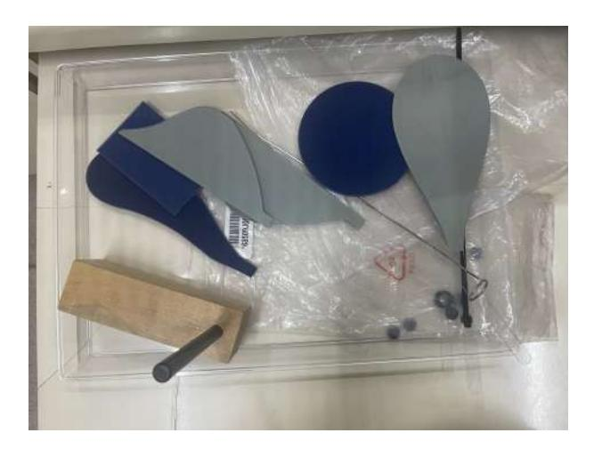

Figure 1: Bodies used in the laboratory session.

• Air blower: Device that produce an air flow to make possible the experiment. (Figure [2\)](#page-4-3)

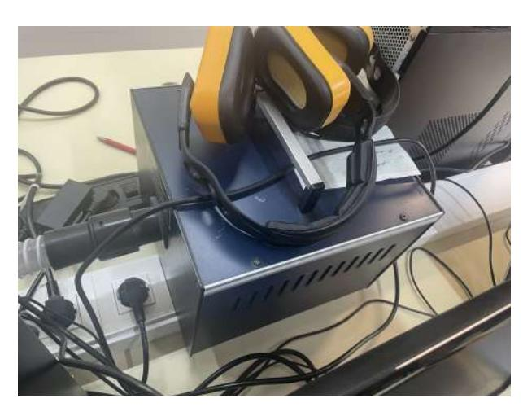

Figure 2: The laboratory air blower.

• Air chamber: Chamber that is made with a couple of thin glasses with strings between them where the air flow comes in. (Figure [3\)](#page-5-2)

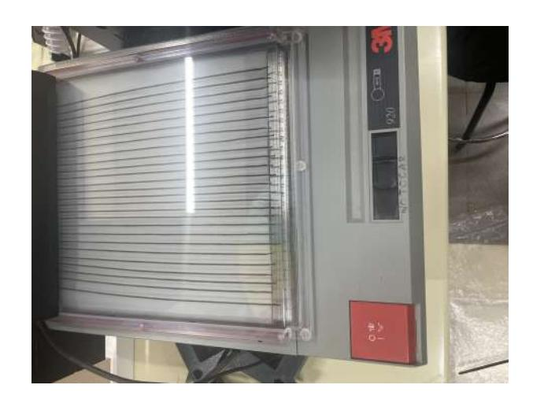

Figure 3: Laboratory air chamber.

### 2.2 Experimental Setup Overview

The core of the experiment involves a Hele-Shaw cell, which consists of two closely spaced glass plates (approximately 1 mm apart). Within this narrow gap, 26 wool threads are secured at one end and equally spaced. Air is introduced into this chamber from an external insufflator through an inlet orifice, creating a broadly homogeneous airflow between the plates. The air exits on the opposite, open side of the chamber. A retention valve is incorporated to prevent reverse flow if the system is inadvertently connected to a fan's suction port.

### 2.3 Flow Pattern Generation and Data Acquisition

Various aerodynamic bodies can be positioned within the airflow to observe the resulting streamline patterns. These objects are inserted from the open side of the cell and positioned centrally within the imaging area, ensuring the velvet side faces downwards. A wooden stop is used to keep the object stationary during observations.

The experimental process involves a series of steps to establish flow conditions and capture visual data:

- 1. Initial Flow Regulation: The air flow rate is adjusted to its maximum possible level without inducing turbulent flow. In the absence of any object, the wool threads should align in parallel, indicating a uniform and steady flow field. Any entangled threads are carefully separated using a wooden stick or cable tie. A short video (maximum 5 seconds) of this uniform and steady streamline pattern is recorded. Subsequently, the flow rate is reduced to its minimum. Protective hearing equipment should be worn during operations at maximum flow. It is worth mentioning that we were aligning the wool threads one by one with a small wire we found in the laboratory which caused us an irritating time. And this was owing to our thought that the external insufflator was creating an air flow and it was not until we figured out it was turned off and no air flow was being created than we repeated everything but this time as it is done.
- 2. Object Insertion and Flow Observation: An aerodynamic object is slowly inserted into the airflow. The air current then divides, flowing around the object, with the wool threads clearly depicting the streamline patterns both upstream and downstream. This forms a steady pattern. A video (maximum 10 seconds) of this pattern is recorded, and the flow rate is again reduced to its minimum.
- 3. Iteration for Multiple Objects: Steps 2-3 are repeated for all available aerodynamic

bodies, including a circular bod, a rectangular body, an oval aerodynamic body, an airfoil profile, and two aerodynamic bodies configured to simulate flow constriction.

4. **Data Review and Storage:** Upon completion of all experimental runs, the quality of the recorded videos is checked using a video player and "Tracker" software. The videos are then saved to a portable storage device. Finally, the fan, lighting, and computer are turned off.

### 2.4 Post-Processing and Analysis with Tracker

For each object, a representative frame from the captured video will be used to generate a streamline diagram. This diagram will then be annotated to identify points of minimum and maximum pressure, as well as potential stagnation points, based on the observed flow patterns. These experimental patterns will be compared against theoretical patterns referenced from established fluid dynamics resources.

Specifically, the video of the disk will be analyzed using the "Tracker" program:

- 1. The video is loaded into Tracker.
- 2. Coordinate axes are defined with the origin at the center of the disk and the +y-axis aligned with the direction of uniform flow.
- 3. A calibration scale is set using the diameter of the disk.
- 4. Using "Trajectories-Mass Point" (non-automatic mode), and while pressing the shift key and the right mouse button (with the crosshair indicator), various points along a single streamline are selected. These points are chosen from the air inlet (-y;a) and particularly around points of maximum curvature (near the obstacle). The selected (x, y) coordinates for each streamline are recorded. This operation is performed for the first four curved streamlines (for x;0).
- 5. This process is repeated for the four streamlines symmetrical to the previously selected ones (for  $x_i^0$ ).
- 6. Using Equation 4, the captured data for each streamline will be fitted to a representation of  $y^2$  as a function of |x| to determine the values of  $\psi/v_x$  and a. These values, along with their associated errors and goodness-of-fit, will be presented in a table.
- 7. A plot of  $\psi/v_x$  versus the maximum value of |x| (extremum) for each streamline will be generated, including the reference streamline  $\psi(a,0)=0$ . Recalling that a derivative can be approximated by finite differences and that  $v_y=-\frac{\partial \psi}{\partial x}$ , the y-component of the velocity field (normalized by  $v_x$ ) will be evaluated as a function of the maximum |x|, starting from x=a. These experimental points will then be graphically compared with the theoretical curve  $v_y(x,0)/v_x$ , using the theoretical value of a.

#### 3 Results and discussion

#### 3.1 Streamline diagrams

We will start the experiment by making captures of each body inside the air chamber to see where the pressure is maximum and minimum. The maximum pressure zones will be the ones where the distance between the string is minimum and the opposite for the minimum pressure zones.

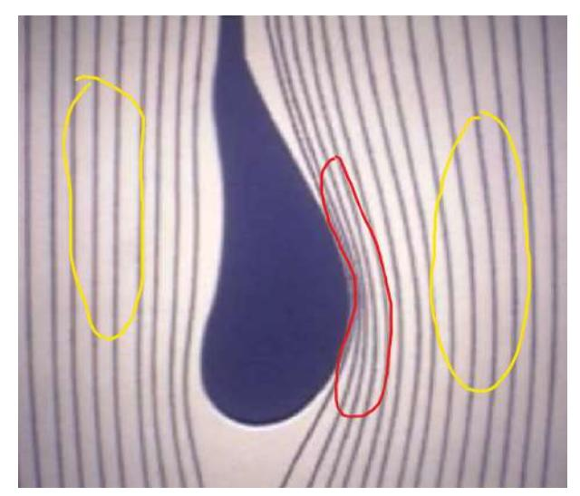

indicate clearly what are each case (e.g., distinguish by colors)

Figure 4: Maximum and minimum pressure zones of the wing profile body.

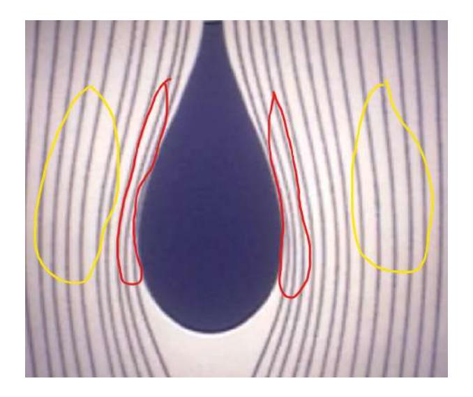

Figure 5: Maximum and minimum pressure zones of the oval body.

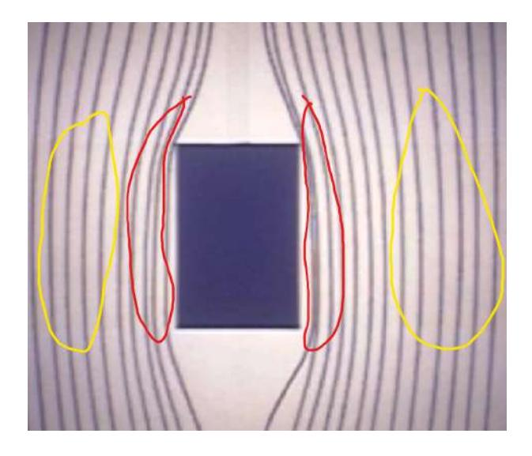

Figure 6: Maximum and minimum pressure zones of the rectangular body.

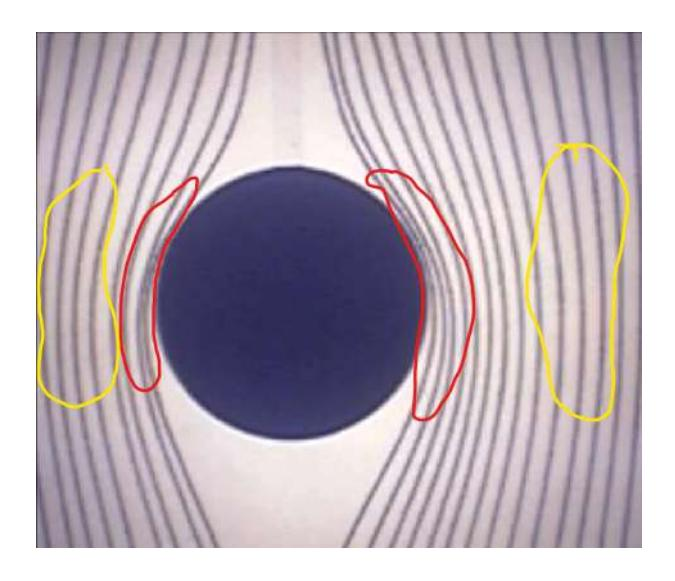

Figure 7: Maximum and minimum pressure zones of circular the body.

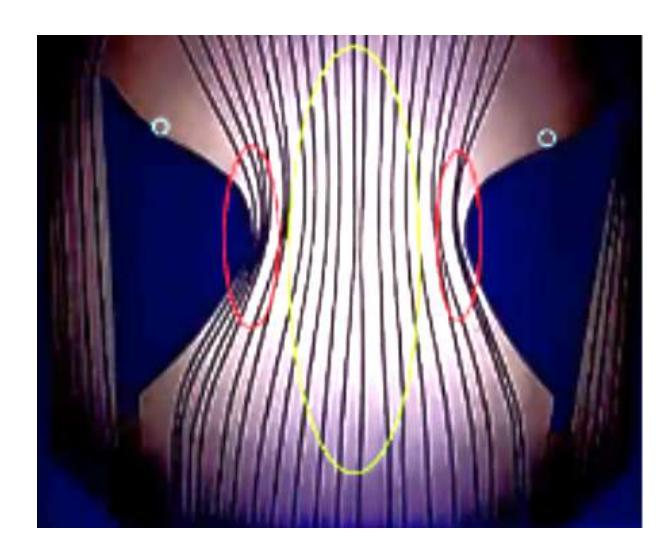

Figure 8: Maximum and minimum pressure zones of the 2 aerodynamic bodies.

Once it is done, we will compare the results with the theoretical ones. We will take the circular body theoretical result as a sample for every body.

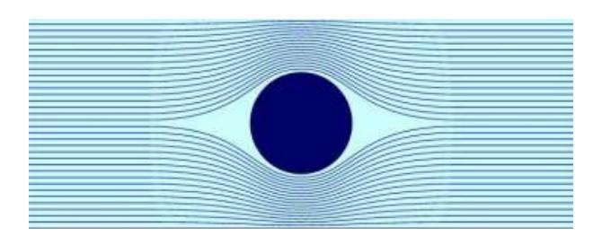

Figure 9: Theoretical result for the circular body.

As you can see the theoretical result is pretty accurate in comparison to the one we obtained, so that means that the results obtained are accurate and could be considered as a success.

### 3.2 Obtaining ψ/v∞, a and the goodness of the fit.

The second part of the session will consist of using the program Tracker. We will put some points as punctual masses on some strings to calculate the radius of the body and once we have done it for each one of the 8 strings, we will calculate the relation ψ/v∞ using the formula [3.](#page-2-6)

| ψ/v∞ (cm) | u(ψ/v∞) (cm) | a (cm) | u(a) (cm) | 2 r |
|--------------|--------------|-----------|-----------|--------|
| -3.923       | 0.042        | 49.66     | 0.92      | 0.95   |
| -2.719       | 0.030        | 51.56     | 0.25      | 0.98   |
| -1.942       | 0.020        | 51.93     | 0.16      | 0.99   |
| -1.031       | 0.022        | 52.76     | 0.32      | 0.98   |
| 1.182        | 0.021        | 50.52     | 0.63      | 0.97   |
| 2.050        | 0.021        | 52.8      | 1.1       | 0.96   |
| 2.978        | 0.030        | 51.42     | 0.18      | 0.99   |
| 3.850        | 0.041        | 50.82     | 0.25      | 0.99   |

briefly indicate here the meaning of the uncertainties

Table 1: The table shows the constant ψ/v∞ with its uncertainty for each one of the 8 strings chosen, the radius a with its uncertainty calculated for each string chosen and the goodness of the fit r 2 for the fits done.

As it is shown in the table above, the fits are pretty accurate as the goodness of the fit r 2 is close to 1. In addition all the radius calculated are similar. If we calculate the mean, the result is 51.43 ± 0.33 cm, being the real result 52.5 cm, being the result obtained an accurate one. Now, we will show the graphs representing y 2 in function of |x| for each string.

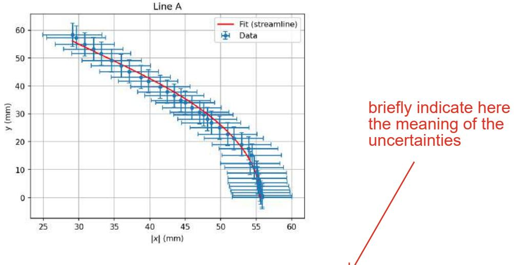

Figure 10: Graph of y 2 in function of |x| for the string A.

# I would do a mosaic of figures

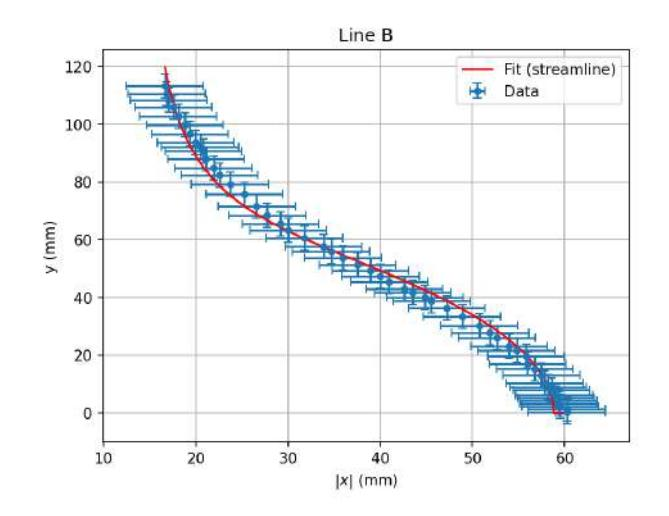

Figure 11: Graph of y 2 in function of |x| for the string B.

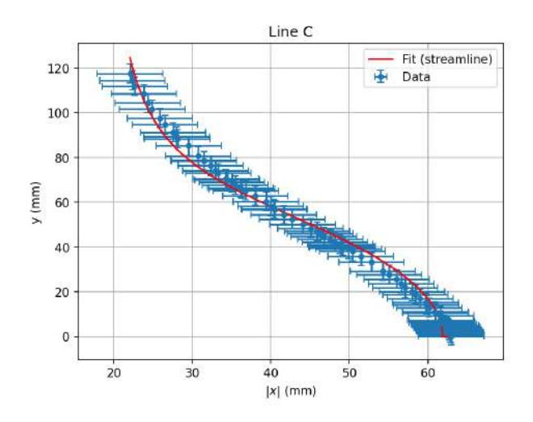

Figure 12: Graph of y 2 in function of |x| for the string C.

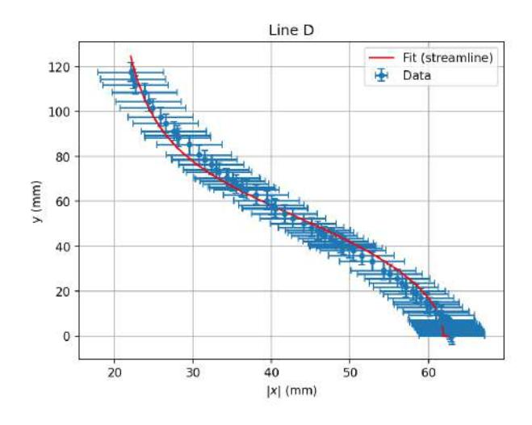

Figure 13: Graph of y 2 in function of |x| for the string D.

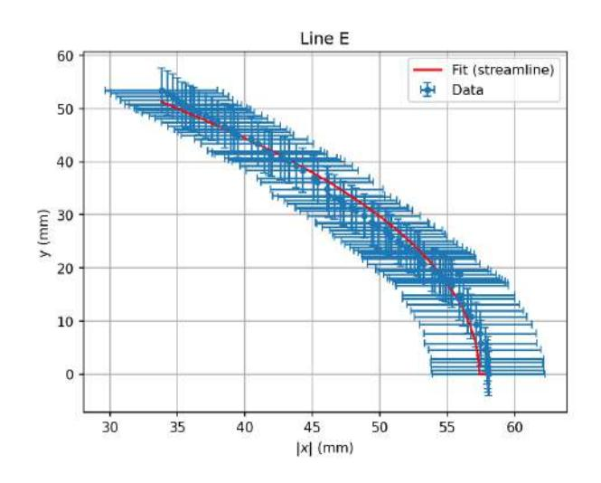

Figure 14: Graph of y 2 in function of |x| for the string E.

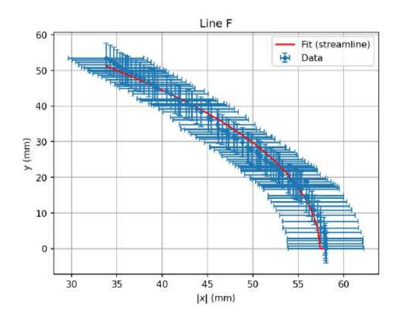

Figure 15: Graph of y 2 in function of |x| for the string F.

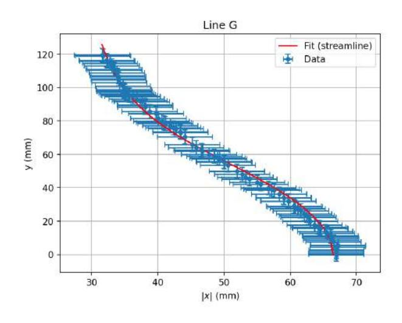

Figure 16: Graph of y 2 in function of |x| for the string G.

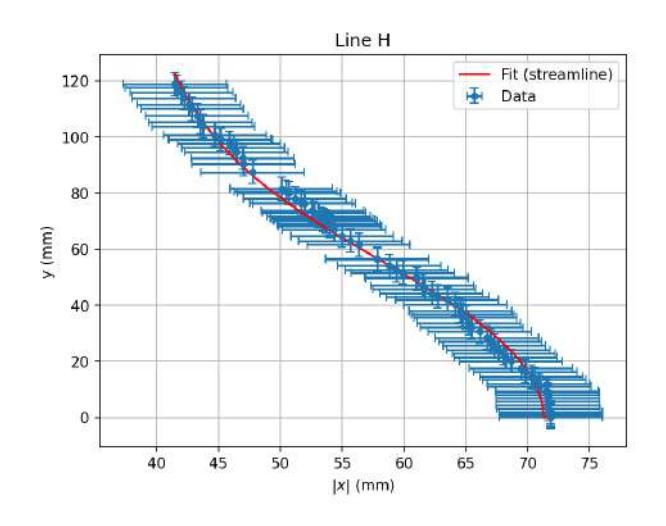

Figure 17: Graph of y 2 in function of |x| for the string H.

# 3.3 Graphical representation of ψ/v∞

In this final part of the experiment, with the data contained in Table [1,](#page-9-1) we will make a graph of ψ/v∞ in function of |x|.

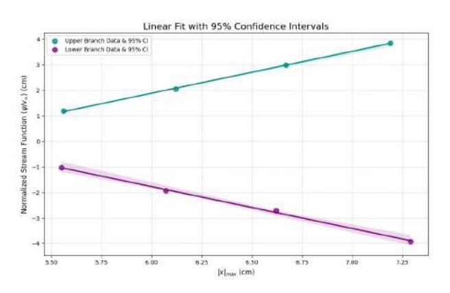

try to increase the resolution of the figure by e.g. increasing the dpi

Figure 18: Graph of ψ/v∞ in function of |x|.

We obtain with the fit done an a=1.640 ± 0.081 and using equation [3,](#page-2-6) we can obtain that vy/v∞ = 1.640 ± 0.081.

Now we will compare the theoretical curve of vy/v∞ in function of —x— with the result obtained.

avoid too many page breaks

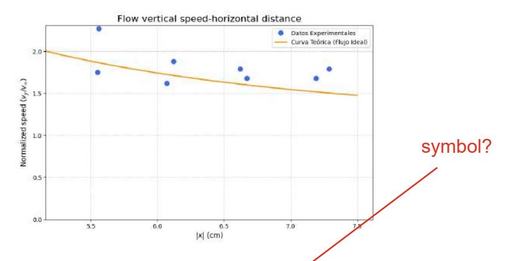

Figure 19: Graph of vy/v∞ in function of |x|.

The experimental result as we obtained before is 1.640 ± 0.081, which is pretty close to the theoretical result obtained, being the result obtained a success.

#### 4 Conclusions we typically do not indicate numerical results in Conclusions section.

The experimental study carried out in this practice allowed us to visualize and analyze the behavior of streamlines around different aerodynamic bodies placed inside an air chamber. By capturing the flow patterns, it was possible to identify the regions of maximum and minimum pressure, which correspond respectively to the zones where the streamlines are closest together and where they are more separated. The experimental results for all bodies, especially for the circular one, showed strong agreement with the theoretical flow model, confirming that the methodology and visualization technique were appropriate and reliable.

In the second part, the linear fits of y 2 versus |x| for the eight selected strings provided values of the constant ψ/v∞ and the radius a for each case. The goodness of fit coefficients (r 2 ) were consistently close to 1, demonstrating excellent linear correlation and low experimental dispersion. Additionally, the χ 2 analysis confirmed that the deviations between the experimental points and the fitted curve were within the expected uncertainties, reinforcing the reliability of the obtained parameters. The mean value of the radius, a = 51.43 ± 0.33 cm, was in very good agreement with the theoretical value of 52.5 cm, thus confirming the validity and precision of the measurements obtained.

However, after evaluating the fitting procedure, we noticed that adjusting directly with respect to y 2 did not provide a clear physical interpretation of the results. Therefore, we decided to consider only the upper half of the data and to perform the fit using p y 2 instead. This approach yielded a more intuitive representation of the relationship between y and |x|, improving the visualization and interpretation of the flow pattern.

Finally, from the graphical representation of ψ/v∞ as a function of |x|, the experimental relationship vy/v∞ = 1.640±0.081 was obtained, which is very close to the theoretical prediction. This demonstrates that both the data acquisition and the subsequent analysis through linear fits were consistent and accurate.

Overall, the experiment successfully reproduced the theoretical flow behavior, verified the expected aerodynamic relationships, and highlighted the usefulness of the linear fit method for determining key parameters of the flow. The low uncertainty, satisfactory χ 2 values, and high correlation of the results indicate that the procedures were carried out with rigor and that the theoretical model adequately represents the physical reality observed in the air chamber.

# Appendixes

#### A2 Calculation of Uncertainties

### Uncertainty of Positional Data from Tracker

The uncertainty for the coordinates of each point  $(x_i, y_i)$  on the streamlines originates from the process of manual data collection in the Tracker software. It is not a statistical error but a measurement uncertainty, which can be attributed to two primary sources:

- 1. Digitalization Error This is the dominant source of random error. It arises from the user's judgment in clicking the exact center of the yarn thread in a digital video frame. The uncertainty is influenced by:
  - The thickness of the yarn thread in the image.
  - The pixel resolution of the video.
  - The stability of the streamline (minor fluctuations).

A common method to estimate this error is to assume it is equivalent 1-5 pixels, depending on the resolution, since ours was low, we decided to use 5 to account for the worst possible case. This pixel uncertainty is then converted to physical units (cm) using the calibration scale factor, k (in cm/pixel), that was defined in Tracker. In our case being the scale factor 150mm/180px.

$$u(x)_{\text{digital}} = (\text{uncertainty in pixels}) \times k$$
 (6)

# Uncertainty of the Mean Stream Function $(\psi/v_{\infty})$

For each streamline, the normalized stream function, denoted here as  $C = \psi/v_{\infty}$ , was calculated for each of the *n* data points  $(x_i, y_i)$ . The final value for the streamline is the mean of these calculations, and its uncertainty is the standard error of the mean.

1. Mean Value  $(\bar{C})$ : The mean is the average of the *n* individual calculations  $C_i$ .

$$\bar{C} = \frac{1}{n} \sum_{i=1}^{n} C_i \tag{7}$$

2. Sample Standard Deviation  $(s_C)$ : This measures the scatter or dispersion of the individual calculations around the mean.

$$s_C = \sqrt{\frac{1}{n-1} \sum_{i=1}^{n} (C_i - \bar{C})^2}$$
 (8)

3. Standard Error of the Mean  $(u(\bar{C}))$ : This is the final reported uncertainty for the mean value. It represents the standard deviation of the sampling distribution of the mean.

$$u(\bar{C}) = \frac{s_C}{\sqrt{n}} \tag{9}$$

# References

- [1] Departamento de F´ısica Aplicada PRADO. Notes for the Calculation of Uncertainties in Laboratory Sessions. Internal laboratory notes. Facultad de Ciencias, Universidad de Granada (UGR). 2024.
- [2] Departamento de F´ısica Aplicada PRADO. M25. Observation of Streamlines. Laboratory experiment guide. Facultad de Ciencias, Universidad de Granada (UGR). 2024.
- [3] Tracker Help: Tape Measure. <https://physlets.org/tracker/help/tape.html>. Accessed: October 2025.
- [4] Departamento de F´ısica Aplicada PRADO. Supporting Document for Error of an Indirect Measurement. Facultad de Ciencias, Universidad de Granada (UGR). 2024.
- [5] Departamento de F´ısica Aplicada PRADO. Estimate Uncertainties in Position and Time with Tracker. Facultad de Ciencias, Universidad de Granada (UGR). 2024.
- [6] Fluid Mechanics. Accessed: October 2025.
- [7] Milton Van Dyke. An Album of Fluid Motion. Stanford University Press, Available online. 1982.