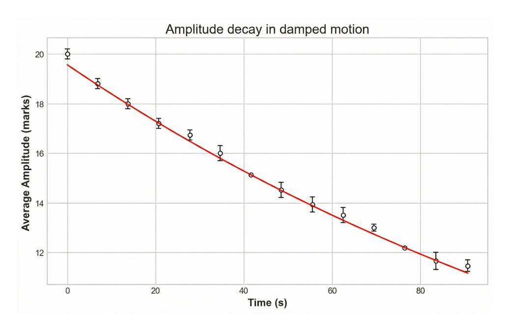
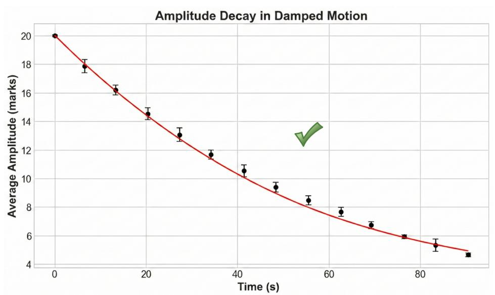
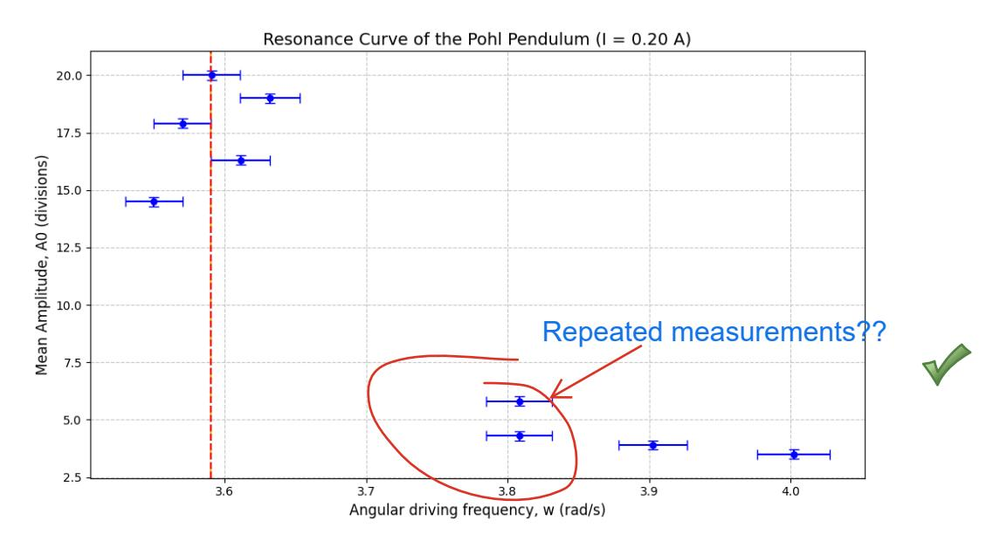
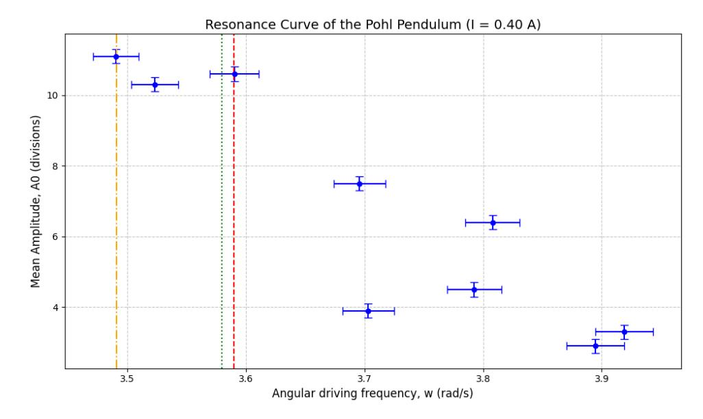

# Experiment M6 bis: Study of oscillatory motion

### Andres Vinuesa Espinosa and Jose Maria Martinez Herrada Group B2.2

Laboratory session: 18/02 Report submission: 09/03

#### Abstract

This report presents an experimental study of a Pohl pendulum in free, damped, and forced oscillation regimes. First, the natural period and natural angular frequency were determined from free oscillations and used as reference parameters for the rest of the analysis. Next, damping was characterized for two magnetic-brake currents by fitting the amplitude decay to an exponential model, obtaining damping coefficients and confirming weak damping conditions (β ≪ ω0). In the forced regime, resonance curves were measured and compared with theoretical predictions, showing good agreement for low damping and the expected reduction and broadening of the resonance peak at higher damping. Finally, the approximation of using the free period instead of the damped period in timing measurements was quantitatively justified, with relative errors far below instrumental uncertainty.

# Contents

| 1 | Results and Discussion |                                          |   |
|---|------------------------|------------------------------------------|---|
|   | 1.1                    | Part A: Period of free oscillations   | 2 |
|   | 1.2                    | Part B: Damped oscillator             | 2 |
|   | 1.3                    | Part C: Forced and damped oscillator  | 3 |
|   | 1.4                    | Part D: Relative error                | 5 |

## 1 Results and Discussion

### 1.1 Part A: Period of free oscillations

To study the Pohl pendulum in its free state (without motor excitation or magnetic brake damping), we proceeded to measure the natural oscillation period T0. Starting from the equilibrium position, the pendulum was displaced to the end of the scale and released. The time for five oscillations was measured with a stopwatch to reduce reaction-time uncertainty and obtain a representative average period.

Based on the experimental data, the following mean period was obtained, with an instrumental uncertainty of the laboratory stopwatch of ∆T0 = 0.01 s. We consider that applying a rectangular-distribution correction (i.e., dividing by √ 12) would underestimate the practical measurement uncertainty in this experiment.

$$T_0 = 1.75 \pm 0.01 \text{ s.}$$
 (1)

Once the period of the free oscillations is known, the theoretical natural angular frequency ω0 of the system is defined by the fundamental kinematic relationship:

$$\omega_0 = \frac{2\pi}{T_0}. (2)$$

Substituting the measured value:

$$\omega_0 = 3.59 \pm 0.02 \text{ rad/s}.$$
 (3)

To verify that the period does not depend on amplitude, the measurement was repeated under the same conditions but with half-scale amplitude. The same value was obtained, T = 1.75 s, with an instrumental uncertainty of 0.01 s.

### 1.2 Part B: Damped oscillator

To study the damped oscillatory motion, the maximum amplitudes in successive oscillations were recorded for two different intensities of the magnetic brake (I = 0.20 A and I = 0.40 A). According to the theoretical background, the amplitude in a damped oscillator decays exponentially over time according to the following equation:

$$\theta_{max}(t) = \theta_0 \exp(-\beta t),\tag{4}$$

where θ0 is the initial amplitude and β is the damping parameter, attributable in this system to energy dissipation by eddy currents and other non-ideal effects.

To obtain a precise value of β, a non-linear fit of amplitude versus time was performed for both current intensities, as shown in Figures [1](#page-2-1) and [2](#page-2-2) for 0.2A and 0.4A, respectively. The obtained results, including statistical uncertainties and goodness-of-fit parameters (reduced χ 2 ), are summarized in Table [1.](#page-1-3)

| Intensity     | θ0 (div)        | (s−1 β )            | 2 χ red |
|---------------|--------------------|---------------------------|---------------|
| I = 0.20 A | 19.56 ± 0.02 | 0.006176 ± 0.000017 | 1.03          |
| I = 0.40 A | 19.99 ± 0.06 | 0.01603 ± 0.00011   | 1.056         |

Table 1: Parameters of the exponential fit for the amplitude decay.

The results show that the damping coefficient β increases significantly with electromagnetic current, confirming the direct relationship between the applied magnetic field and the braking force. The chi test corrroborates that the model describes the experiment with precision.

Figure 1: Amplitude as a function of time for the damped oscillator at I = 0.2A. Indicate here the meaning of error bars

Figure 2: Amplitude as a function of time for the damped oscillator at I = 0.4A.

Finally, it is necessary to verify whether the pendulum is in the weak-damping regime, i.e., whether the theoretical condition β ≪ ω0 is satisfied. Considering the highest damping case (I = 0.40 A):

$$\beta^2 = (0.01603)^2 \approx 0.00026 \text{ s}^{-2},$$
 (5)

$$\omega_0^2 = (3.59)^2 \approx 12.89 \text{ rad}^2/\text{s}^2.$$
 (6)

Given that β 2 is several orders of magnitude lower than ω 2 0 , the pendulum is clearly in a very weak damping regime under the experimental conditions evaluated.

### 1.3 Part C: Forced and damped oscillator

In this section, the behavior of the driven harmonic oscillator was analyzed by activating the electric motor. The amplitude of the steady-state oscillations (A0) was recorded for different values of the driving angular frequency ( $\omega$ ), while keeping the magnetic brake at constant intensities of I = 0.20 A and I = 0.40 A.

Theoretically, the resonance frequency ( $\omega_{R,teo}$ ), at which the forced-oscillation amplitude reaches its maximum, depends on both the natural frequency and the damping parameter according to:

$$\omega_{R,teo} = \sqrt{\omega_0^2 - 2\beta^2}. (7)$$

The uncertainty of this theoretical frequency  $(\Delta \omega_{R,teo})$  is obtained by error propagation from  $\omega_0$  and  $\beta$ . Given that the damping is very weak  $(2\beta^2 \ll \omega_0^2)$ , the uncertainty is dominated by  $\Delta \omega_0$ . Using the values obtained in previous sections ( $\omega_0 = 3.59 \pm 0.02 \text{ rad/s}$ ,  $\beta_{0.20A} = 0.00618 \pm 0.00002 \text{ s}^{-1}$ , and  $\beta_{0.40A} = 0.0160 \pm 0.0001 \text{ s}^{-1}$ ), the theoretical resonance frequencies with their respective uncertainties were calculated:

$$\omega_{R,teo}(0.20 \text{ A}) = \sqrt{3.59^2 - 2(0.00618)^2} = 3.59 \pm 0.02 \text{ rad/s},$$
 (8)

$$\omega_{R,teo}(0.40 \text{ A}) = \sqrt{3.59^2 - 2(0.0160)^2} = 3.58 \pm 0.02 \text{ rad/s}.$$
 (9)

As observed, the theoretical resonance frequency remains practically identical to the natural frequency  $\omega_0$  in both cases due to the weak damping regime.

Figure 3: Resonance curve for I = 0.20 A. Discrete markers represent experimental amplitudes with instrumental uncertainties. The red, yellow, and green lines indicate  $\omega_0$ ,  $\omega_{R,exp}$ , and  $\omega_{R,teo}$ , respectively; in this case, they overlap within experimental resolution.

Experimentally, the resonance curves (shown in Figures 3 and 4 for 0.2A and 0.4A, respectively) show the following behavior, considering an instrumental uncertainty of  $\pm 0.2$  divisions for amplitude and a propagated uncertainty of  $\pm 0.02$  rad/s for the driving frequency:

- For I=0.20 A, a sharp resonance peak was observed experimentally at  $\omega_{R,exp}=3.59\pm0.02$  rad/s with a maximum amplitude of  $20.0\pm0.2$  divisions. This shows excellent agreement with the theoretical prediction.
- For I=0.40 A, the maximum observed amplitude was significantly lower (11.1  $\pm$  0.2 divisions) and the experimental peak was recorded at  $\omega_{R,exp}=3.49\pm0.02$  rad/s.

Although theory predicts that  $\omega_R$  should not deviate significantly from  $\omega_0$ , an apparent shift was observed in the 0.40 A case. This discrepancy can be explained by the physical nature of

Figure 4: Resonance curve for I = 0.40 A. Discrete markers represent experimental amplitudes with instrumental uncertainties. The red, yellow, and green lines indicate  $\omega_0$ ,  $\omega_{R,exp}$ , and  $\omega_{R,teo}$ , respectively.

resonance under increased damping: as  $\beta$  increases, the resonance peak not only decreases in height but also becomes significantly broader and flatter. Due to this flattening, along with the discrete intervals of data collection (discrete voltage steps in the driving motor) and the visual uncertainty in reading the amplitude, locating the exact maximum becomes experimentally challenging. Therefore, the observed maximum at  $3.49 \pm 0.02$  rad/s is most likely a consequence of experimental resolution rather than a breakdown of the theoretical model.

#### 1.4 Part D: Relative error

In the experimental methodology for the damped oscillations, the free oscillation period  $(T_0)$  was used to measure the elapsed time instead of the actual damped period  $(T_1)$ . The purpose of this section is to mathematically justify this approximation and calculate the relative error introduced by it.

Theoretically, the angular frequency of a damped oscillator  $(\omega_1)$  is slightly lower than its natural angular frequency  $(\omega_0)$ , which implies that the damped period  $(T_1)$  is slightly longer than the free period  $(T_0)$ . The relationship is given by:

$$\omega_1 = \sqrt{\omega_0^2 - \beta^2},\tag{10}$$

$$T_1 = \frac{2\pi}{\omega_1}. (11)$$

Using the values obtained in previous sections ( $\omega_0 = 3.59 \pm 0.02 \text{ rad/s}$ ,  $\beta_{0.20A} = 0.00618 \text{ s}^{-1}$ , and  $\beta_{0.40A} = 0.0160 \text{ s}^{-1}$ ), the theoretical values for the damped frequency and period were calculated. Subsequently, the relative error ( $E_{rel}$ ) of approximating  $T_1 \approx T_0$  was evaluated using:

$$E_{rel}(\%) = \left| \frac{T_1 - T_0}{T_1} \right| \times 100.$$
 (12)

The results, alongside their propagated uncertainties, are summarized in Table 2.

| Parameter                    | Value (I = 0.20 A)    | Value (I = 0.40 A)  |
|------------------------------|-----------------------------|---------------------------|
| Natural Period, T0        | 1.75 ± 0.01 s         | 1.75 ± 0.01 s       |
| Natural Freq., ω0         | 3.59 ± 0.02 rad/s     | 3.59 ± 0.02 rad/s   |
| Damping, β                | 0.00002 s−1 0.00618 ± | 0.0001 s−1 0.0160 ± |
| Damped Freq., ω1          | 3.59 ± 0.02 rad/s     | 3.59 ± 0.02 rad/s   |
| Damped Period, T1         | ± 1.75 0.01 s         | ± 1.75 0.01 s       |
| Theoretical T1 (exact) | 1.750003 s                  | 1.750017 s                |
| Relative Error               | ∼ 0.00015%               | ∼ 0.00100%             |

Table 2: Comparison between free and damped oscillation parameters and their relative errors.

As shown in the calculations, the theoretical difference between the damped period and the free period (T1 −T0 ≈ 10−5 s) is three orders of magnitude smaller than the instrumental uncertainty of the stopwatch (∆T = 0.01 s). Because the system operates in a highly underdamped regime (β ≪ ω0), the slight deceleration caused by the magnetic brake is fully absorbed by experimental uncertainty. Therefore, using T0 as the time interval is not only a valid approximation but also the most consistent approach given the sensitivity of the measuring instruments.